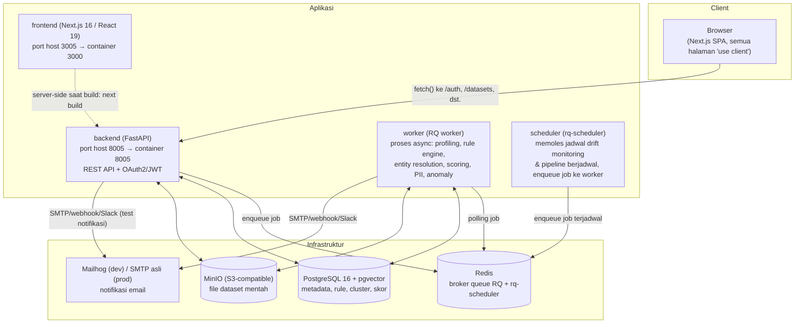
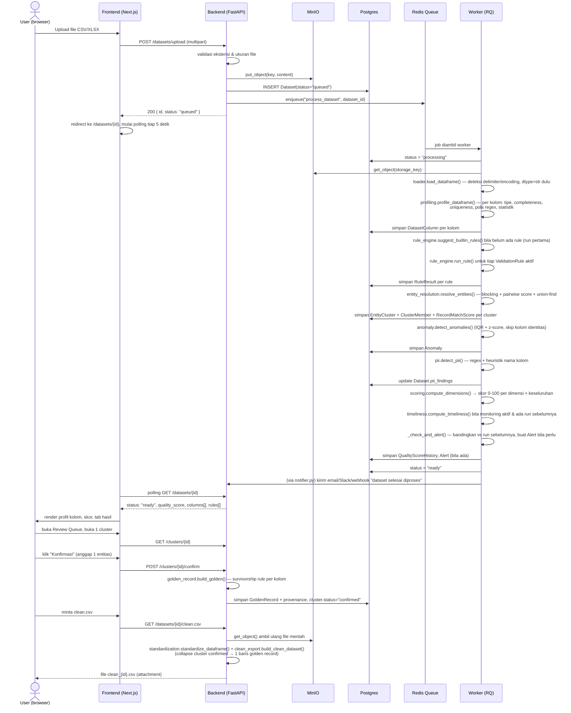

# Dokumentasi Teknis — Dataklin (dataqc)

> Dokumen ini dibuat dengan membaca **seluruh kode sumber** di repository ini (bukan
> hanya README/dokumen perencanaan). Ditulis awal di branch
> `feature/VD-310-comprehensive-data-profiling` (commit `eff44a3`), lalu diperbarui
> menyusul **VD-314 "Advanced Configurable Entity Resolution Algorithms"** di branch
> `feature/VD-314-advance-entity-resolution` (commit `150baf0`, status kanban:
> *in review*). Tujuannya adalah referensi teknis lengkap: apa yang dilakukan tiap
> file, tiap fungsi, dan bagaimana semuanya saling terhubung menjadi satu alur
> aplikasi. Nomor baris yang dirujuk (`file.py:L10`) mengacu ke isi file per tanggal
> dokumen ini ditulis/diperbarui terakhir — bila file berubah lagi, nomor baris bisa
> bergeser.

## Daftar Isi

- [1. Ringkasan Produk](#1-ringkasan-produk)
  - [1.1 Positioning inti](#11-positioning-inti)
  - [1.2 Siapa penggunanya (role)](#12-siapa-penggunanya-role)
  - [1.3 Status implementasi](#13-status-implementasi)
- [2. Arsitektur Sistem](#2-arsitektur-sistem)
  - [2.1 Komponen](#21-komponen)
  - [2.2 Kenapa ada worker + scheduler terpisah dari backend?](#22-kenapa-ada-worker-scheduler-terpisah-dari-backend)
  - [2.3 Pengecualian: operasi sinkron di backend](#23-pengecualian-operasi-sinkron-di-backend)
- [3. Tech Stack Lengkap](#3-tech-stack-lengkap)
  - [3.1 Backend](#31-backend)
  - [3.2 Frontend](#32-frontend)
  - [3.3 Infrastruktur & DevOps](#33-infrastruktur-devops)
  - [3.4 Catatan lingkungan pengembangan & jejak migrasi](#34-catatan-lingkungan-pengembangan-jejak-migrasi)
- [4. Struktur Direktori Proyek](#4-struktur-direktori-proyek)
- [5. Alur Data End-to-End](#5-alur-data-end-to-end)
- [6. Backend — Deep Dive](#6-backend-deep-dive)
  - [6.1 app/db.py](#61-appdbpy)
  - [6.2 app/config.py](#62-appconfigpy)
  - [6.3 app/models.py](#63-appmodelspy)
  - [6.4 app/security.py](#64-appsecuritypy)
  - [6.5 app/main.py](#65-appmainpy)
  - [6.6 Routers (app/routers/)](#66-routers-approuters)
    - [6.6.1 routers/auth.py](#661-routersauthpy)
    - [6.6.2 routers/datasets.py](#662-routersdatasetspy)
    - [6.6.3 routers/rules.py](#663-routersrulespy)
    - [6.6.4 routers/clusters.py](#664-routersclusterspy)
    - [6.6.5 routers/scorecard.py](#665-routersscorecardpy)
    - [6.6.6 routers/monitoring.py](#666-routersmonitoringpy)
    - [6.6.7 routers/pipelines.py](#667-routerspipelinespy)
    - [6.6.8 routers/api_keys.py](#668-routersapi_keyspy)
    - [6.6.9 routers/connections.py](#669-routersconnectionspy)
    - [6.6.10 routers/cross_dataset.py](#6610-routerscross_datasetpy)
  - [6.7 Services (app/services/) — logika bisnis inti](#67-services-appservices-logika-bisnis-inti)
    - [6.7.1 services/loader.py — Ingestion (F1)](#671-servicesloaderpy-ingestion-f1)
    - [6.7.2 services/profiling.py — Automated Data Profiling (F2 + VD-310)](#672-servicesprofilingpy-automated-data-profiling-f2-vd-310)
    - [6.7.3 services/rule_engine.py — Rule Engine (F3)](#673-servicesrule_enginepy-rule-engine-f3)
    - [6.7.4 services/entity_resolution.py — Entity Resolution (F5, dirombak besar oleh VD-314)](#674-servicesentity_resolutionpy-entity-resolution-f5-dirombak-besar-oleh-vd-314)
    - [6.7.5 services/scoring.py — Skor Kualitas (bagian dari F2/F9)](#675-servicesscoringpy-skor-kualitas-bagian-dari-f2f9)
    - [6.7.6 services/golden_record.py — Golden Record (F7)](#676-servicesgolden_recordpy-golden-record-f7)
    - [6.7.7 services/standardization.py — Standardization & Parsing (backlog #4)](#677-servicesstandardizationpy-standardization-parsing-backlog-4)
    - [6.7.8 services/anomaly.py — Anomaly/Outlier Detection (F8)](#678-servicesanomalypy-anomalyoutlier-detection-f8)
    - [6.7.9 services/pii.py — PII Detection & Masking (F11)](#679-servicespiipy-pii-detection-masking-f11)
    - [6.7.10 services/clean_export.py — Clean Dataset Export (deliverable inti downstream)](#6710-servicesclean_exportpy-clean-dataset-export-deliverable-inti-downstream)
    - [6.7.11 services/cross_dataset_checks.py — Referential Integrity & Consistency (backlog #10, #11)](#6711-servicescross_dataset_checkspy-referential-integrity-consistency-backlog-10-11)
    - [6.7.12 services/timeliness.py — Timeliness/Freshness Check (backlog #5)](#6712-servicestimelinesspy-timelinessfreshness-check-backlog-5)
    - [6.7.13 services/notifier.py — Notifikasi Multi-Channel (backlog #29)](#6713-servicesnotifierpy-notifikasi-multi-channel-backlog-29)
    - [6.7.14 services/db_connector.py — Koneksi Database Langsung (backlog #2)](#6714-servicesdb_connectorpy-koneksi-database-langsung-backlog-2)
    - [6.7.15 services/storage.py — Object Storage (MinIO/S3)](#6715-servicesstoragepy-object-storage-minios3)
    - [6.7.16 services/llm.py — LLM Gateway Provider-Agnostic (F4)](#6716-servicesllmpy-llm-gateway-provider-agnostic-f4)
  - [6.8 Worker (app/worker/)](#68-worker-appworker)
    - [6.8.1 worker/queue.py](#681-workerqueuepy)
    - [6.8.2 worker/scheduler.py](#682-workerschedulerpy)
    - [6.8.3 worker/tasks.py](#683-workertaskspy)
  - [6.9 Tests (backend/tests/)](#69-tests-backendtests)
- [7. Frontend — Deep Dive](#7-frontend-deep-dive)
  - [7.1 Konfigurasi & tooling](#71-konfigurasi-tooling)
  - [7.2 lib/ — Utilitas Bersama](#72-lib-utilitas-bersama)
    - [lib/api.ts](#libapits)
    - [lib/utils.ts](#libutilsts)
  - [7.3 hooks/use-mobile.ts](#73-hooksuse-mobilets)
  - [7.4 Komponen Bersama (components/*.tsx, di luar ui/)](#74-komponen-bersama-componentstsx-di-luar-ui)
    - [Shell.tsx](#shelltsx)
    - [app-sidebar.tsx](#app-sidebartsx)
    - [widgets.tsx](#widgetstsx)
    - [LineChart.tsx](#linecharttsx)
  - [7.5 Komponen Primitif shadcn/ui (components/ui/*)](#75-komponen-primitif-shadcnui-componentsui)
  - [7.6 Halaman (app/**/page.tsx)](#76-halaman-apppagetsx)
    - [7.6.1 /login — app/login/page.tsx](#761-login-apploginpagetsx)
    - [7.6.2 / (Dashboard) — app/page.tsx](#762-dashboard-apppagetsx)
    - [7.6.3 /datasets/upload — app/datasets/upload/page.tsx](#763-datasetsupload-appdatasetsuploadpagetsx)
    - [7.6.4 /datasets/[id] — app/datasets/[id]/page.tsx](#764-datasetsid-appdatasetsidpagetsx)
    - [7.6.5 /datasets/[id]/rules/[ruleId]/violations — halaman baru (commit d1714d3)](#765-datasetsidrulesruleidviolations-halaman-baru-commit-d1714d3)
    - [7.6.6 /rules — app/rules/page.tsx](#766-rules-apprulespagetsx)
    - [7.6.7 /review — app/review/page.tsx](#767-review-appreviewpagetsx)
    - [7.6.8 /review/[id] — app/review/[id]/page.tsx](#768-reviewid-appreviewidpagetsx)
    - [7.6.9 /golden/[id] — app/golden/[id]/page.tsx](#769-goldenid-appgoldenidpagetsx)
    - [7.6.10 /integrity — app/integrity/page.tsx](#7610-integrity-appintegritypagetsx)
    - [7.6.11 /monitoring — app/monitoring/page.tsx](#7611-monitoring-appmonitoringpagetsx)
    - [7.6.12 /sources — app/sources/page.tsx](#7612-sources-appsourcespagetsx)
    - [7.6.13 /runs — app/runs/page.tsx](#7613-runs-apprunspagetsx)
    - [7.6.14 /pipelines — app/pipelines/page.tsx](#7614-pipelines-apppipelinespagetsx)
    - [7.6.15 /pipelines/create — app/pipelines/create/page.tsx](#7615-pipelinescreate-apppipelinescreatepagetsx)
    - [7.6.16 /pipelines/[id] — app/pipelines/[id]/page.tsx](#7616-pipelinesid-apppipelinesidpagetsx)
    - [7.6.17 /settings/api-keys — app/settings/api-keys/page.tsx](#7617-settingsapi-keys-appsettingsapi-keyspagetsx)
    - [7.6.18 /settings/connections — app/settings/connections/page.tsx](#7618-settingsconnections-appsettingsconnectionspagetsx)
- [8. Infrastruktur & Deployment](#8-infrastruktur-deployment)
  - [8.1 docker-compose.yml (stack development)](#81-docker-composeyml-stack-development)
  - [8.2 docker-compose.prod.yml (override produksi)](#82-docker-composeprodyml-override-produksi)
  - [8.3 CI/CD (GitHub Actions)](#83-cicd-github-actions)
  - [8.4 Dockerfile](#84-dockerfile)
  - [8.5 DEPLOY_PROD_AGENT.md](#85-deploy_prod_agentmd)
- [9. Keamanan](#9-keamanan)
- [10. Pemetaan Fitur (PRD) → Kode](#10-pemetaan-fitur-prd-kode)
- [11. Observasi & Catatan Teknis](#11-observasi-catatan-teknis)
  - [11.1 Field frontend yang tidak ada di respons backend](#111-field-frontend-yang-tidak-ada-di-respons-backend)
  - [11.2 Tombol "Export Golden Record" tidak berfungsi](#112-tombol-export-golden-record-tidak-berfungsi)
  - [11.3 StatusPill tidak cocok dengan nilai status dataset sesungguhnya](#113-statuspill-tidak-cocok-dengan-nilai-status-dataset-sesungguhnya)
  - [11.4 Inkonsistensi penanganan zona waktu timestamp](#114-inkonsistensi-penanganan-zona-waktu-timestamp)
  - [11.5 Tab "Sambungkan Database" di halaman Upload tidak ada](#115-tab-sambungkan-database-di-halaman-upload-tidak-ada)
  - [11.6 Halaman /sources mengklaim koneksi database "belum tersedia"](#116-halaman-sources-mengklaim-koneksi-database-belum-tersedia)
  - [11.7 Klaim "AES-256" di UI Koneksi Database tidak sesuai implementasi Fernet](#117-klaim-aes-256-di-ui-koneksi-database-tidak-sesuai-implementasi-fernet)
  - [11.8 Observasi tambahan (ringkas)](#118-observasi-tambahan-ringkas)
  - [11.9 Perubahan default `prior_probability` secara diam-diam memengaruhi konfigurasi dedup lama](#119-perubahan-default-prior_probability-secara-diam-diam-memengaruhi-konfigurasi-dedup-lama)
- [12. Lampiran](#12-lampiran)
  - [Lampiran A — Ringkasan Jumlah Baris Kode](#lampiran-a-ringkasan-jumlah-baris-kode)
  - [Lampiran B — Glosarium Istilah Domain](#lampiran-b-glosarium-istilah-domain)
  - [Lampiran C — Skrip Utilitas Dev Frontend](#lampiran-c-skrip-utilitas-dev-frontend)
  - [Lampiran D — Artefak Non-Kode di Root Repo](#lampiran-d-artefak-non-kode-di-root-repo)

---

## 1. Ringkasan Produk

**Dataklin** (nama kode repo: `dataqc`) adalah implementasi MVP dari
`PRD_DataQuality_SaaS.docx` — sebuah **platform Data Quality & Entity Resolution**
berbasis AI. Judul resminya "AI-Powered Data Quality & Entity Resolution Platform",
tapi kata "AI" di situ merujuk pada dua fitur opsional spesifik (generate rule dari
bahasa natural, dan auto-suggest rule) — bukan inti dari apa yang dilakukan sistem.
Mayoritas mesin di baliknya (profiling, rule engine, entity resolution, scoring,
anomaly detection, PII detection) adalah **logika deterministik berbasis statistik,
regex, dan heuristik** — bukan model machine learning.

### 1.1 Positioning inti

Dataklin bukan sekadar dashboard monitoring kualitas data untuk business user.
Fungsi utamanya adalah **alat bantu data engineer** untuk melakukan *data
preparation* — supaya data yang di-*serve* ke role data lain (terutama data
scientist yang butuh data bersih untuk membangun model) sudah berkualitas baik.
Ini terlihat jelas dari fitur-fitur yang secara khusus melayani *konsumen hilir*,
bukan cuma pelaporan ke manajemen:

- **Clean Dataset Export** (`clean.csv`) — dataset siap pakai, sudah distandardisasi
  & duplikat digabung ke golden record.
- **Data Dictionary Export** (`dictionary.csv`) — skema + statistik profiling + rule
  aktif per kolom, supaya konsumen tidak perlu *re-derive* statistik dari nol.
- **API Key per organisasi** — akses programatik tanpa login JWT interaktif, untuk
  dipanggil dari notebook/pipeline data scientist.
- **PII masking saat export** — supaya data sensitif tidak lolos begitu saja ke
  konsumen hilir yang tidak berwenang.

### 1.2 Siapa penggunanya (role)

Sistem punya 3 role (`users.role`): **admin**, **analyst**, **viewer**. Pembagian hak
akses cukup sederhana dan diterapkan di level dependency FastAPI (lihat
[`security.py`](#64-appsecuritypy)):

| Role | Bisa baca data | Bisa mengubah data (upload, buat rule, konfirmasi cluster, dst.) |
|---|---|---|
| `admin` | ✅ | ✅ |
| `analyst` | ✅ | ✅ |
| `viewer` | ✅ | ❌ (`require_writer` menolak dengan HTTP 403) |

Tidak ada perbedaan hak antara `admin` dan `analyst` di kode saat ini — keduanya
identik di `require_writer`. Perbedaan admin/analyst tampaknya disiapkan untuk
kebutuhan mendatang (mis. manajemen user, lihat backlog "Kolaborasi Multi-User" di
`docs/ENHANCEMENTS.md`) tapi belum diberi arti berbeda di kode.

### 1.3 Status implementasi

`README.md` mencantumkan daftar fitur MVP yang sudah selesai, dan
`docs/ENHANCEMENTS.md` mencatat fitur lanjutan (Fase 2 & 3) yang sudah dikerjakan
lebih awal karena selaras dengan positioning inti. Dua tiket kanban terbaru yang
melandasi kondisi kode saat ini:

- **VD-310: Comprehensive Data Profiling** (profiling diperluas dari sekadar
  completeness/uniqueness dasar menjadi analisis *structure, content, dan
  relationship discovery* — lihat
  [§6.7.2 `services/profiling.py`](#672-servicesprofilingpy-automated-data-profiling-f2-vd-310))
  dan halaman detail pelanggaran rule per baris (lihat
  [§7.6.5](#765-datasetsidrulesruleidviolations-halaman-baru-commit-d1714d3)).
- **VD-314: Advanced Configurable Entity Resolution Algorithms** (status kanban
  saat dokumen ini diperbarui: **in review**) — perombakan besar mesin entity
  resolution (F5): candidate generation (blocking) dipisah dari matching,
  normalisasi per tipe data, deteksi duplikat exact-row/identity-key sebagai
  jalur cepat deterministik, algoritma Jaro-Winkler & phonetic khusus Indonesia,
  kolom komposit (`composite_exact`), bukti negatif/veto (`required`), validasi
  cluster berbasis representative/medoid untuk mencegah *transitive chaining*
  yang lemah, serta kalibrasi threshold otomatis dari hasil review manusia
  (`confirmed`/`split`). Lihat [§6.7.4](#674-servicesentity_resolutionpy-entity-resolution-f5-dirombak-besar-oleh-vd-314),
  [§6.6.3](#663-routersrulespy), dan [§7.6.6](#766-rules-apprulespagetsx).

---

## 2. Arsitektur Sistem

Dataklin adalah aplikasi 3-tingkat klasik (frontend SPA + REST API + async worker)
dengan 4 dependensi infrastruktur (Postgres, Redis, MinIO, SMTP). Semua service
dijalankan sebagai container Docker terpisah, didefinisikan di
[`docker-compose.yml`](#81-docker-composeyml-stack-development).



### 2.1 Komponen

| Komponen | Teknologi | Tanggung jawab |
|---|---|---|
| `frontend` | Next.js 16 App Router, seluruhnya client-rendered | UI, tidak menyimpan state server — semua data diambil lewat `fetch` ke backend saat komponen mount |
| `backend` | FastAPI + Uvicorn | REST API, autentikasi, validasi request, baca/tulis Postgres, *enqueue* job berat ke Redis, tidak pernah memproses dataset besar secara sinkron (kecuali endpoint export yang memang butuh baca file — lihat §2.3) |
| `worker` | RQ (Redis Queue) worker, image Docker sama dengan backend | Menjalankan seluruh pipeline berat: parsing file, profiling, rule engine, entity resolution, anomaly/PII detection, scoring, kirim notifikasi |
| `scheduler` | `rq-scheduler` (`rqscheduler` command), image sama | Proses terpisah yang *polling* registry job berjadwal di Redis dan meng-*enqueue*-nya ke queue `dataqc` yang sama dipakai worker, tepat pada waktunya (drift monitoring per dataset, pipeline berjadwal hourly/daily/weekly) |
| `postgres` | `pgvector/pgvector:pg16` (Postgres 16 + ekstensi pgvector pre-installed) | Database utama. pgvector **disiapkan** (ekstensi diaktifkan saat startup) tapi **belum dipakai** di query manapun saat ini — disiagakan untuk fitur *golden record embedding similarity* yang masih di backlog |
| `redis` | Redis 7 alpine | Broker antrian kerja (RQ) sekaligus registry job terjadwal (rq-scheduler) |
| `minio` | MinIO (S3-compatible object storage) | Menyimpan file dataset mentah (CSV/XLSX asli, dan snapshot CSV hasil tarik dari koneksi database) |
| `mailhog` | Mailhog (dev only) | SMTP palsu untuk menguji notifikasi email tanpa provider asli; punya web UI di `:8025` |

### 2.2 Kenapa ada worker + scheduler terpisah dari backend?

Pemrosesan dataset (parsing file besar, entity resolution `O(n²)` di dalam block,
dsb.) bisa memakan waktu lama — tidak boleh memblokir *request-response cycle*
HTTP. Maka pola yang dipakai konsisten di seluruh backend:

1. Endpoint FastAPI menerima request, melakukan validasi ringan, menulis baris ke
   Postgres dengan status `queued`, lalu memanggil `enqueue_*` dari
   [`worker/queue.py`](#681-workerqueuepy) — **tidak menunggu hasilnya**.
2. RQ worker (proses Python terpisah, lihat perintah
   `rq worker dataqc --url redis://redis:6379/0` di `docker-compose.yml`) mengambil
   job dari antrian Redis dan menjalankan fungsi Python yang sama persis (import
   path string, mis. `"app.worker.tasks.process_dataset"`) di proses worker.
3. Frontend melakukan **polling** (interval 3–10 detik, lihat `setInterval` di
   berbagai halaman) ke endpoint status (`GET /datasets/{id}`) sampai
   `status` berubah dari `queued`/`processing` menjadi `ready` atau `error`.

Tidak ada WebSocket atau Server-Sent Events di sistem ini — semua *real-time-ish*
update di UI adalah **polling**, bukan push.

### 2.3 Pengecualian: operasi sinkron di backend

Beberapa endpoint sengaja **tidak** lewat worker meski membaca seluruh isi file
dataset dari MinIO, karena sifatnya *on-demand* / *preview* dan pemanggilnya
menunggu hasil langsung (bukan bagian pipeline background):

- `clean.csv`, `clean/preview`, `dictionary.csv`, `standardized.csv`,
  `standardize/preview` di [`routers/datasets.py`](#662-routersdatasetspy)
- Cross-dataset check (`POST /cross-dataset-rules/{id}/run`) di
  [`routers/cross_dataset.py`](#6610-routerscross_datasetpy)
- Scorecard PDF/CSV di [`routers/scorecard.py`](#665-routersscorecardpy)

Ini konsisten — dicatat eksplisit di `docs/ENHANCEMENTS.md` sebagai keputusan
desain, bukan kelalaian.

---

## 3. Tech Stack Lengkap

### 3.1 Backend

| Layer | Teknologi | Versi (dari `requirements.txt`) | Dipakai untuk |
|---|---|---|---|
| Bahasa & runtime | Python | 3.12 (`python:3.12-slim`, image Docker) — catatan: mesin dev lokal memakai Python 3.9, sehingga modul `services/*` memakai `from __future__ import annotations` supaya sintaks type hint modern (`str \| None`) tetap bisa di-*parse* di 3.9 | Semua kode backend |
| Web framework | FastAPI | 0.115.6 | Routing REST API, dependency injection (`Depends`), validasi request via Pydantic |
| ASGI server | Uvicorn | 0.34.0 (`[standard]`) | Menjalankan FastAPI, dengan `--reload` di dev |
| ORM | SQLAlchemy | 2.0.36 (gaya *typed* `Mapped`/`mapped_column`, bukan `Column` klasik) | Semua model tabel di `models.py` |
| Driver Postgres | psycopg2-binary | 2.9.10 | `postgresql+psycopg2://...` |
| Driver MySQL | PyMySQL | 1.1.1 | Untuk fitur Koneksi Database (`mysql+pymysql://...`) |
| Konfigurasi | pydantic-settings | 2.7.0 | `config.py` — baca env var / file `.env` |
| Upload file | python-multipart | 0.0.20 | Dibutuhkan FastAPI untuk parsing `UploadFile`/`multipart/form-data` |
| Data processing | pandas | 2.2.3 | **Jantung** dari profiling, rule engine, standardization, entity resolution, dsb. Semua dataset dimuat sebagai `DataFrame` |
| Baca Excel | openpyxl | 3.1.5 | Backend untuk `pd.read_excel` |
| Fuzzy matching | rapidfuzz | 3.11.0 | `fuzz.ratio`, `fuzz.token_sort_ratio`, `fuzz.token_set_ratio` — inti algoritma entity resolution |
| Antrian job | redis + rq | 5.2.1 / 2.1.0 | Broker & job queue async |
| Penjadwal | rq-scheduler | 0.14.0 (**wajib** versi ini, bukan 0.13.1 — lihat catatan kendala di §3.4) | Jadwal berulang (drift monitoring, pipeline hourly/daily/weekly) |
| Object storage client | boto3 | 1.35.90 | Klien S3 generik, dipakai untuk bicara dengan MinIO |
| JWT | python-jose[cryptography] | 3.3.0 | Encode/decode token akses |
| Hash password | passlib + bcrypt | 1.7.4 / 4.0.1 | `CryptContext(schemes=["bcrypt"])` |
| PDF generation | reportlab | 4.2.5 | Scorecard PDF |
| HTTP client | httpx | 0.28.1 | Panggil LLM gateway, kirim webhook/Slack, test koneksi |
| Deteksi encoding | charset-normalizer | 3.4.1 | Deteksi encoding file CSV yang diunggah |
| Enkripsi simetris | `cryptography` (Fernet) | *(transitive, terbawa dari `python-jose[cryptography]`, tidak di-pin langsung di requirements.txt)* | Enkripsi password koneksi database at-rest |
| Jaro-Winkler similarity | `rapidfuzz.distance.JaroWinkler` | *(bagian dari `rapidfuzz` 3.11.0 yang sudah ada — tidak ada dependency baru)* | Skor kemiripan Jaro-Winkler & phonetic Indonesia di entity resolution v2 (VD-314, lihat §6.7.4) |
| Test runner (dev only) | pytest | 8.3.5, dari file **baru** `backend/requirements-dev.txt` (`-r requirements.txt` + `pytest==8.3.5`) | Menjalankan `backend/tests/`. Sebelum VD-314, `pytest` tidak pernah dipin di file requirements manapun meski `backend/tests/` sudah ada — file ini pertama kali membakukan dependency dev. **Catatan**: `backend/Dockerfile` tidak diubah untuk meng-install file ini, jadi image Docker backend/worker/scheduler tetap tidak menyertakan `pytest` — test hanya bisa dijalankan di lingkungan Python lokal yang meng-install `requirements-dev.txt` secara manual |

### 3.2 Frontend

| Layer | Teknologi | Versi (`package.json`) | Dipakai untuk |
|---|---|---|---|
| Framework | Next.js | ^16.2.11 (App Router) | Routing berbasis folder `app/`, seluruh halaman diberi direktif `"use client"` — **tidak ada** React Server Component / data-fetching di server yang dipakai; app ini pada dasarnya SPA yang di-*hosting* lewat Next.js |
| UI library | React | ^19.2.8 | — |
| Bahasa | TypeScript | 5.7.2 | `strict: true` di `tsconfig.json` |
| Styling | Tailwind CSS | ^4.3.3 (v4, konfigurasi CSS-first via `@theme` di `globals.css`, bukan lagi `theme.extend` penuh di JS) | Utility-first styling, palet warna dalam ruang warna **OKLCH** |
| Komponen dasar | shadcn/ui (CLI `shadcn` ^4.14.1) | preset `style: "base-nova"` (lihat `components.json`) | Sumber untuk seluruh file di `components/ui/*` — komponen di-*generate*/disalin ke repo (bukan dependency npm yang di-*import*), lalu dikustomisasi manual |
| Primitif headless | `@base-ui/react` ^1.6.0 | Pengganti Radix UI di ekosistem shadcn terbaru; API-nya pakai pola **`render` prop** (`<Button render={<Link href="..." />} />`) alih-alih `asChild` ala Radix | Button, Select, Sidebar, Tooltip, dsb. |
| Primitif headless (sisa lama) | `@radix-ui/react-checkbox`, `@radix-ui/react-switch` | ^1.3.11 / ^1.3.7 | Checkbox & Switch — dua komponen ini **belum** dimigrasikan ke `@base-ui/react`, sisa dari sebelum migrasi (lihat §3.4) |
| Variant styling | class-variance-authority (cva) | ^0.7.1 | Definisi varian (`variant`, `size`) tiap komponen `ui/*` |
| Utility class merge | tailwind-merge + clsx | ^3.6.0 / ^2.1.1 | Fungsi `cn()` di `lib/utils.ts` |
| Ikon | lucide-react | ^1.26.0 | Semua ikon di seluruh halaman |
| Grafik | *(tidak ada library)* | — | `components/LineChart.tsx` digambar manual di atas `<canvas>` — tidak memakai Chart.js/Recharts/dsb. |
| Font | `next/font/google` (Geist) | — | Diset di `app/layout.tsx` sebagai CSS variable `--font-sans` |

### 3.3 Infrastruktur & DevOps

| Komponen | Teknologi |
|---|---|
| Orkestrasi lokal/prod | Docker Compose (`docker-compose.yml` + override `docker-compose.prod.yml`) |
| Reverse proxy produksi | Tidak ada file konfigurasi Nginx/Traefik di repo ini — `DEPLOY_PROD_AGENT.md` menyebutkan reverse proxy sebagai tanggung jawab eksternal (arahkan port 3000/8000 host) |
| CI/CD | 1 workflow GitHub Actions (`.github/workflows/deploy.yml`) — **auto-deploy on push ke `main`** lewat SSH, **tanpa** menjalankan test suite (`backend/tests/`) sebagai gate |
| Domain produksi (dari `docker-compose.prod.yml`) | `https://dataklin.raffs.biz.id` |

### 3.4 Catatan lingkungan pengembangan & jejak migrasi

Beberapa hal ini bukan bagian dari "cara kerja" aplikasi, tapi penting dipahami
siapa pun yang akan menyentuh kode ini:

- **Docker runtime** di mesin dev = OrbStack (bukan Docker Desktop asli).
- **Port 9000** host dipakai container ClickHouse proyek lain → MinIO diremap ke
  host `9010`/`9011` (lihat komentar di `docker-compose.yml:38`).
- **`rq-scheduler` wajib `==0.14.0`**, bukan `0.13.1` — versi lama gagal *import*
  `rq.connections.resolve_connection` yang sudah dihapus di `rq` seri 2.x.
  Jangan downgrade selama `rq` tetap di seri 2.x.
- Tiga service (`backend`, `worker`, `scheduler`) semuanya `build: ./backend` dari
  Dockerfile yang sama, tapi **masing-masing jadi image Docker terpisah**
  (`dataqc-backend`, `dataqc-worker`, `dataqc-scheduler`). `docker compose build
  backend` **tidak** ikut merebuild `worker`/`scheduler` — kalau
  `requirements.txt`/`Dockerfile` berubah, ketiganya harus disebut eksplisit atau
  jalankan `docker compose build` tanpa argumen.
- **Frontend sudah dua kali migrasi desain**, jejaknya masih terlihat jelas di
  kode:
  1. **Dari CSS class manual bertema "VS Code dark"** (`className="btn"`,
     `"wire"`, `"panel"`, dst., variabel warna `--vsbg`, `--vssid`, `--vsblue` —
     masih ada residunya di `tailwind.config.js:9-17` dan `globals.css:7-15`) →
     ke **Tailwind + shadcn/ui**. Skrip `test_tailwind.py` di root `frontend/`
     adalah skrip *codemod* satu-kali yang melakukan pencarian-ganti massal
     `className` lama ke kelas Tailwind.
  2. **Dari pola Radix `asChild`** → ke **pola `render` prop `@base-ui/react`**
     (`fix_buttons.js`, `fix_button_native.js`, `fix_syntax.js`, `fix_select.js`,
     `fix_select2.js` — semuanya skrip regex satu-kali untuk migrasi massal
     `<Button asChild><Link>...</Link></Button>` menjadi
     `<Button render={<Link .../>} nativeButton={false}>...</Button>`).
  3. `fix_backend_api.py` bahkan pernah dipakai untuk menyunting **backend**
     langsung dari direktori frontend: menghapus field `weight` dari model
     `DedupRule` dan validasi "total bobot harus 100%" di
     `routers/rules.py` — jejak kenapa endpoint dedup-config sekarang tidak
     punya konsep bobot manual per kolom lagi (bobot dihitung otomatis lewat
     pendekatan mirip Splink, lihat [§6.7.4](#674-servicesentity_resolutionpy-entity-resolution-f5-dirombak-besar-oleh-vd-314)).

  **Semua skrip `fix_*.py`, `fix_*.js`, `update_rules*.py`, `test_tailwind.py`,
  `kill_nodes.sh` di root `frontend/` adalah alat migrasi/dev satu-kali** —
  dijalankan manual lewat `node`/`python` dari terminal, **bukan** bagian dari
  proses build (`npm run build`/`dev`) dan **bukan** dipanggil di CI. Aman
  diabaikan saat mempelajari alur aplikasi; dibahas detail di
  [Lampiran C](#lampiran-c-skrip-utilitas-dev-frontend) murni untuk kelengkapan.
- Nama tema di `components.json` adalah preset shadcn resmi **`"base-nova"`**;
  komentar di `globals.css:118` menyebutnya **"Tema DataNova"** — kemungkinan
  cuma parafrase nama preset, bukan penamaan resmi produk, kebetulan mirip nama
  produk "Dataklin".

## 4. Struktur Direktori Proyek

```
dataqc/
├── backend/
│   ├── Dockerfile                 # image Python 3.12-slim untuk backend/worker/scheduler
│   ├── requirements.txt
│   ├── app/
│   │   ├── main.py                 # entrypoint FastAPI: setup app, CORS, startup, migrasi ringan, seed admin
│   │   ├── config.py                # Settings (pydantic-settings) — semua env var
│   │   ├── db.py                    # engine SQLAlchemy, SessionLocal, Base, get_db()
│   │   ├── models.py                # 15 model ORM (tabel Postgres)
│   │   ├── security.py              # JWT, password hashing, API key, dependency Actor/get_org_reader
│   │   ├── routers/                 # 10 file — satu per grup endpoint REST
│   │   ├── services/                # 16 file — logika bisnis murni (fungsi, sedikit/tanpa I/O)
│   │   └── worker/                  # queue.py, scheduler.py, tasks.py — proses async
│   └── tests/                       # 2 file test (pytest, tanpa fixture DB — murni unit test fungsi)
├── frontend/
│   ├── Dockerfile                    # image node:20-alpine, `npm run dev` (dev) / `npm run build && start` (prod)
│   ├── package.json / tsconfig.json / next.config.js / tailwind.config.js / postcss.config.js
│   ├── components.json               # konfigurasi CLI shadcn/ui (preset "base-nova")
│   ├── app/                          # Next.js App Router — 1 folder = 1 rute
│   │   ├── layout.tsx                 # root layout (font, <html>, <body>)
│   │   ├── globals.css                # Tailwind v4 + token warna OKLCH + sisa tema lama
│   │   ├── login/page.tsx
│   │   ├── page.tsx                   # "/" — Dashboard
│   │   ├── datasets/upload/page.tsx
│   │   ├── datasets/[id]/page.tsx
│   │   ├── datasets/[id]/rules/[ruleId]/violations/page.tsx
│   │   ├── rules/page.tsx             # Rule Builder + Dedup Builder (2 tab)
│   │   ├── review/page.tsx            # antrian review cluster
│   │   ├── review/[id]/page.tsx       # halaman review 1 cluster
│   │   ├── golden/[id]/page.tsx       # (lihat catatan §11 — belum terhubung penuh ke backend)
│   │   ├── integrity/page.tsx         # cek lintas dataset (referential integrity & consistency)
│   │   ├── monitoring/page.tsx        # histori skor, drift monitoring, alert, notifikasi
│   │   ├── sources/page.tsx           # daftar dataset ("Data Sources")
│   │   ├── runs/page.tsx              # daftar dataset sebagai "riwayat eksekusi"
│   │   ├── pipelines/page.tsx, pipelines/create/page.tsx, pipelines/[id]/page.tsx
│   │   └── settings/api-keys/page.tsx, settings/connections/page.tsx
│   ├── components/
│   │   ├── Shell.tsx, app-sidebar.tsx, widgets.tsx, LineChart.tsx   # komponen custom milik app
│   │   └── ui/                        # 23 file — primitif shadcn/ui (Button, Select, Table, dst.)
│   ├── lib/api.ts, lib/utils.ts
│   ├── hooks/use-mobile.ts
│   └── fix_*.py, fix_*.js, update_rules*.py, test_tailwind.py, kill_nodes.sh   # skrip migrasi dev, lihat §3.4
├── docker-compose.yml                # stack dev lengkap (8 service)
├── docker-compose.prod.yml           # override produksi (matikan hot-reload, build produksi)
├── .github/workflows/deploy.yml      # CI/CD: auto-deploy ke VPS saat push ke main
├── .env.example
├── docs/ENHANCEMENTS.md              # backlog fitur Should/Could + histori bug ditemukan
├── project-docs/                     # dokumen perencanaan (PRD, arsitektur, tech stack, dst. — lihat 00-README.md di dalamnya)
├── samples/                          # 2 dataset contoh untuk uji coba manual
├── Architecture_Diagram.svg, Data_Flow_Diagram.svg, Wireframes.html, Feature_Backlog.xlsx, PRD_DataQuality_SaaS.docx
│                                      # artefak desain asli (non-kode), acuan awal pembangunan MVP
├── DEPLOY_PROD_AGENT.md               # SOP deployment produksi step-by-step
└── README.md
```

Direktori `docker_data/` (bind-mount data Postgres/MinIO/Redis lokal) sengaja tidak
dibahas isinya di sini — itu murni data runtime container dev, bukan kode.

---

## 5. Alur Data End-to-End

Ini adalah alur utama yang menyatukan hampir semua fitur — mengikuti struktur di
`Data_Flow_Diagram.svg` dan dikonfirmasi lewat kode di
[`worker/tasks.py`](#683-workertaskspy).



Beberapa cabang tambahan dari alur inti di atas:

- **Dataset dari koneksi database** (bukan upload file): `POST
  /datasets/from-connection` langsung men-*dispatch* `refresh_dataset` yang
  mendeteksi `dataset.source_type == "database"` lalu memanggil
  `refresh_from_database` (tarik data via `db_connector.fetch_dataframe`, simpan
  sebagai snapshot CSV ke MinIO di `storage_key` yang sama, baru panggil
  `process_dataset` seperti biasa). Jadi setelah snapshot pertama dibuat, dataset
  jenis ini diperlakukan identik dengan dataset upload oleh sisa pipeline.
- **Drift monitoring terjadwal**: `scheduler` (proses `rqscheduler` terpisah)
  meng-*enqueue* `refresh_dataset` tiap `monitoring_interval_minutes` — ini
  memicu ulang seluruh alur di atas dari titik "Worker mengambil job", termasuk
  deteksi drift (`_check_and_alert` membandingkan skor run ini vs run
  sebelumnya) dan timeliness (apakah run terjadi tepat waktu sesuai jadwal).
- **Pipeline granular**: `POST /pipelines/{id}/run` memanggil `run_pipeline` yang
  menerjemahkan `enable_profiling`/`enable_deduplication` (dari model
  `Pipeline`) menjadi flag `process_dataset(run_profiling=..., run_rules=...,
  run_dedup=...)` — mode "hanya salah satu" sengaja **melewati** rule
  engine/anomaly/PII/scoring (lihat komentar di `worker/tasks.py:129-136` —
  `run_rules` hanya aktif bila **kedua** opsi menyala).
- **Rerun rule saja** (tombol "Jalankan Ulang Validasi" di halaman Rules, atau
  dataset upload yang di-refresh via jadwal): memanggil `rerun_rules` yang
  mengulang profiling + rule engine + anomaly + PII + scoring, **tanpa**
  mengulang entity resolution (cluster/golden record yang sudah direview
  dipertahankan).

## 6. Backend — Deep Dive

### 6.1 `app/db.py`

File terkecil tapi paling fundamental — mendefinisikan koneksi database.

```python
engine = create_engine(settings.database_url, pool_pre_ping=True)
SessionLocal = sessionmaker(bind=engine, autoflush=False, expire_on_commit=False)
class Base(DeclarativeBase): pass
def get_db():
    db = SessionLocal()
    try:
        yield db
    finally:
        db.close()
```

- **`engine`** (baris 6): satu `Engine` SQLAlchemy dibuat sekali saat modul
  di-*import*, memakai `settings.database_url` dari `config.py`.
  `pool_pre_ping=True` membuat SQLAlchemy mengirim `SELECT 1` ringan sebelum
  memakai koneksi dari pool — mencegah error "server closed the connection
  unexpectedly" bila koneksi idle terlalu lama diputus oleh Postgres/jaringan.
- **`SessionLocal`** (baris 7): *factory* untuk membuat `Session` baru.
  - `autoflush=False` — perubahan pending **tidak** otomatis di-*flush* ke DB
    setiap kali ada query baru dijalankan dalam sesi yang sama; harus eksplisit
    lewat `db.commit()` atau `db.flush()`. Ini konsisten dipakai di seluruh
    codebase (banyak router memanggil `db.flush()` manual untuk mendapatkan
    `id` auto-increment sebelum `commit()`, mis. `clusters.py: db.flush()`
    setelah `db.add(cluster)`).
  - `expire_on_commit=False` — setelah `commit()`, atribut objek Python yang
    sudah di-load **tidak** ditandai *expired* (yang memaksa re-query saat
    diakses lagi). Ini penting karena banyak endpoint melakukan `db.commit()`
    lalu langsung mengembalikan atribut objek yang sama sebagai respons JSON
    tanpa query ulang (mis. `return {"id": rule.id}` setelah `db.commit()`).
- **`class Base(DeclarativeBase)`** (baris 10-11): kelas dasar deklaratif
  SQLAlchemy 2.0 — semua model di `models.py` mewarisi dari `Base` ini.
  `Base.metadata.create_all(engine)` (dipanggil di `main.py` saat startup)
  memakai `Base` ini untuk tahu tabel apa saja yang perlu dibuat.
- **`get_db()`** (baris 14-19): *dependency generator* FastAPI standar — pola
  "buka sesi, `yield`, tutup di `finally`". Dipakai lewat `Depends(get_db)` di
  hampir setiap endpoint. Karena ini generator (bukan context manager biasa),
  FastAPI otomatis memanggil bagian setelah `yield` (`db.close()`) setelah
  response selesai dikirim, apa pun yang terjadi di dalam endpoint (termasuk
  exception) — memastikan koneksi selalu dikembalikan ke pool.

### 6.2 `app/config.py`

Satu kelas `Settings(BaseSettings)` dari `pydantic-settings` — semua
konfigurasi environment terpusat di sini, dengan nilai default yang masuk akal
untuk dev lokal (lihat tabel lengkap di §3.1 `.env.example`). Poin desain
penting:

- `class Config: env_file = ".env"` (baris 46-47): pydantic-settings otomatis
  membaca file `.env` di *working directory* proses (root `backend/` di dalam
  container) selain environment variable asli — jadi urutan prioritas standar
  pydantic-settings berlaku: env var asli > `.env` file > default di kelas.
- **Pola "kosong = fitur nonaktif graceful"** dipakai konsisten untuk 3 fitur
  opsional:
  - `llm_base_url`/`llm_api_key`/`llm_model` kosong → `services/llm.py:
    llm_available()` return `False` → endpoint AI balas HTTP 503, tombol UI
    nonaktif (bukan crash).
  - `smtp_host` kosong → `services/notifier.py: _send_email()` langsung
    `return` tanpa mengirim apa pun.
  - `encryption_key` kosong → `services/db_connector.py: encryption_available()`
    `False` → endpoint `POST /connections` balas HTTP 503.
- `settings = Settings()` (baris 50) — instance **singleton** dibuat sekali saat
  modul pertama kali di-*import*, lalu di-*import* ulang (`from .config import
  settings`) di seluruh file lain. Karena Python meng-cache modul, semua
  pemanggil berbagi objek `Settings` yang sama persis.
- Parameter tuning entity resolution (`er_max_rows=200_000`,
  `er_pair_threshold=0.8`, `er_max_block_size=60`, `er_max_pairs=200_000`)
  didefinisikan di sini supaya bisa diubah tanpa deploy ulang kode — dipakai
  langsung di `services/entity_resolution.py` (lihat §6.7.4).

### 6.3 `app/models.py`

15 kelas model SQLAlchemy (gaya *typed* `Mapped[...]`/`mapped_column(...)`,
bukan `Column(...)` klasik SQLAlchemy 1.x). Semua tabel punya `id: Mapped[int] =
mapped_column(primary_key=True)` auto-increment. Ringkasan tiap tabel:

| Model / tabel | Baris | Kolom kunci | Relasi | Catatan |
|---|---|---|---|---|
| `Organization` | 22-35 | `alert_threshold`, `webhook_url`, `slack_webhook_url`, `notify_emails` | `users: list[User]` | Multi-tenant sederhana — 1 baris = 1 organisasi. Kolom notifikasi (31-33) ditambahkan belakangan (lihat migrasi ringan di `main.py`) |
| `User` | 38-49 | `email` (unique), `password_hash`, `role` (`admin`\|`analyst`\|`viewer`) | `org_id → Organization` | Autentikasi berbasis 1 tabel user, tanpa tabel session terpisah (JWT stateless) |
| `DataConnection` | 52-67 | `db_type` (`postgresql`\|`mysql`), `password_encrypted` (Fernet, **bukan hash** — harus bisa didekripsi untuk dipakai konek ulang) | `org_id → Organization` | Password *tidak pernah* dikembalikan lewat API (lihat `routers/connections.py: _dict()` yang sengaja tidak menyertakan field ini) |
| `Dataset` | 70-105 | `source_type` (`upload`\|`database`), `status` (`queued`\|`processing`\|`ready`\|`error`), `dedup_config` (JSON), `survivorship_config` (JSON), `pii_findings` (JSON), `monitoring_*` | `columns: list[DatasetColumn]` (cascade delete) | Entitas sentral — hampir semua fitur berputar di sekitar 1 baris `Dataset` |
| `DatasetColumn` | 108-126 | `inferred_type`, `completeness`, `uniqueness`, `validity`, `consistency`, `top_values` (JSON), `stats` (JSON, berisi struktur hasil profiling lengkap) | `dataset_id → Dataset` | Dihapus & ditulis ulang total setiap kali profiling dijalankan (`db.query(DatasetColumn).filter_by(...).delete()` di `tasks.py`) — bukan diperbarui per baris |
| `ValidationRule` | 129-140 | `rule_type`, `params` (JSON), `source` (`builtin`\|`manual`\|`ai`), `enabled` | `dataset_id → Dataset` | Definisi rule statis; hasil eksekusinya di tabel terpisah `RuleResult` |
| `RuleResult` | 143-152 | `checked`, `violations`, `sample_violations` (JSON list) | `rule_id`, `dataset_id` | **Setiap** kali rule dijalankan ulang, baris **baru** ditambahkan (bukan update) — riwayat hasil rule tersimpan penuh, endpoint mengambil yang `order_by(desc(run_at))` terbaru |
| `RecordMatchScore` | 155-164 | `record_a`, `record_b` (index baris di DataFrame asli, bukan id tabel), `score`, `features` (JSON — rincian skor per sinyal) | `dataset_id`, `cluster_id` (nullable) | Menyimpan skor *pairwise* hasil entity resolution untuk ditampilkan di UI review ("Detail Kemiripan Pasangan") |
| `EntityCluster` | 167-183 | `cluster_key` (format `ec_00001`), `cohesion`, `status` (`pending`\|`confirmed`\|`split`) | `members: list[ClusterMember]` (cascade delete) | Satu baris = satu kelompok kandidat duplikat |
| `ClusterMember` | 186-194 | `record_index`, `record_data` (JSON — **salinan penuh** baris asli, bukan referensi) | `cluster_id → EntityCluster` | Data disalin ke JSON supaya tetap bisa ditampilkan di UI review meski file dataset asli berubah/dihapus |
| `GoldenRecord` | 197-206 | `data` (JSON hasil survivorship), `provenance` (JSON — kolom mana diambil dari record mana & aturan apa) | `cluster_id → EntityCluster` (**unique** — 1 cluster maksimal 1 golden record) | `created_by` dicatat untuk audit trail |
| `ApiKey` | 209-223 | `key_prefix` (12 karakter pertama, ditampilkan di UI), `key_hash` (SHA-256, **unique**), `revoked` | `org_id → Organization` | Kunci mentah **tidak pernah disimpan** — hanya hash |
| `Anomaly` | 226-237 | `anomaly_type` (`outlier_iqr`\|`outlier_zscore`), `severity` (`rendah`\|`sedang`\|`tinggi`) | `dataset_id → Dataset` | Dihapus & ditulis ulang total tiap kali `_refresh_anomalies` jalan |
| `QualityScoreHistory` | 240-247 | `score`, `dimensions` (JSON) | `dataset_id → Dataset` | **Selalu** baris baru (append-only) — sumber data untuk grafik tren skor & deteksi drift |
| `Alert` | 250-260 | `alert_type`, `severity`, `status` (`open`\|`resolved`) | `org_id`, `dataset_id` (nullable) | 6 jenis `alert_type` yang benar-benar dibuat di kode: `skor_rendah`, `drift_skor`, `kolom_kosong_naik`, `data_terlambat`, `integritas_referensial`, `konsistensi_lintas_sistem` |
| `CrossDatasetRule` | 263-292 | `check_type` (`referential_integrity`\|`consistency`), `last_checked_*`/`last_violations`/`last_samples` | `primary_dataset_id`, `reference_dataset_id → Dataset` | **Hanya simpan hasil TERBARU** — tidak ada tabel histori terpisah untuk cek lintas dataset (beda dari `RuleResult` yang append-only) |
| `Pipeline` | 295-318 | `enable_profiling`, `enable_deduplication`, `schedule` (`manual`\|`hourly`\|`daily`\|`weekly`), `last_run_status` | `org_id`, `dataset_id → Dataset` | Konfigurasi run granular per dataset — beda konsep dari `Dataset.monitoring_*` (lihat komentar di baris 296-300 dan §5) |
| `ActivityLog` | 321-327 | `message` (teks bebas siap tampil) | `org_id → Organization` | Log aktivitas generik untuk feed "Aktivitas Terbaru" di Dashboard — **bukan** audit trail terstruktur (tidak ada kolom `actor_id`/`action_type` terpisah, semua sudah dirangkai jadi satu kalimat sebelum disimpan) |

Fungsi pembantu `utcnow()` (baris 18-19) dipakai sebagai `default=utcnow` di
hampir semua kolom `DateTime` — dipanggil **tanpa tanda kurung** di definisi
kolom (`default=utcnow`, bukan `default=utcnow()`) supaya SQLAlchemy memanggil
ulang fungsinya setiap kali baris baru dibuat (timestamp saat insert), bukan
membekukan satu nilai waktu saat modul pertama kali di-*import*.

### 6.4 `app/security.py`

Modul otentikasi & otorisasi — dua jalur paralel (JWT untuk user interaktif, API
key untuk akses programatik) yang **konvergen** di satu titik: `Actor`.

- **`hash_password()` / `verify_password()`** (baris 21-26): pembungkus tipis
  `passlib.CryptContext(schemes=["bcrypt"])`. Dipakai saat seed admin
  (`main.py`) dan (secara implisit — tidak ada endpoint *register* self-service
  di sistem ini, user hanya dibuat lewat seed).
- **`create_access_token(user)`** (baris 29-36): membuat JWT HS256 berisi claim
  `sub` (user id sebagai string), `email`, `role`, dan `exp` (waktu sekarang +
  `settings.jwt_expire_minutes`, default 720 menit = 12 jam). Ditandatangani
  dengan `settings.jwt_secret` — **satu secret shared** untuk semua user/org
  (bukan per-tenant).
- **`get_current_user()`** (baris 39-52): dependency FastAPI standar untuk
  endpoint yang **wajib** JWT (tidak menerima API key). Alurnya: ambil header
  `Authorization: Bearer <token>` lewat `HTTPBearer(auto_error=False)` →
  `credentials is None` → 401 "Token tidak ditemukan" → `jwt.decode()` gagal →
  401 "Token tidak valid" → `db.get(User, int(payload["sub"]))` tidak ketemu →
  401 "Pengguna tidak ditemukan" → sukses, kembalikan objek `User` penuh.
- **`require_writer()`** (baris 55-58): dependency turunan dari
  `get_current_user` — menambah satu pengecekan: `user.role not in ("admin",
  "analyst")` → 403 "Role viewer tidak boleh mengubah data". Dipakai sebagai
  pengganti `get_current_user` di **setiap** endpoint yang mengubah state
  (upload, buat/hapus rule, konfirmasi cluster, dst.) — pola *deny-by-default*
  untuk role viewer diterapkan di titik ini, bukan tersebar di tiap fungsi
  endpoint.
- **`hash_api_key()` / `generate_api_key()`** (baris 61-69): API key mentah
  berformat `vd_<43 karakter urlsafe base64>` (`secrets.token_urlsafe(32)`
  menghasilkan ~43 karakter). Fungsi mengembalikan **tuple 3 elemen**: kunci
  lengkap (ditunjukkan ke user **sekali**, tidak pernah disimpan), 12 karakter
  pertama sebagai `key_prefix` (disimpan plain untuk ditampilkan di UI daftar
  key — mis. `vd_AbCdEfGh12…`), dan SHA-256 hash penuh (`key_hash`, disimpan
  sebagai satu-satunya cara memverifikasi key di masa depan). Prefiks `vd_`
  adalah sisa penamaan dari nama produk sebelumnya, "VeriData" (lihat memori
  proyek — produk sempat berganti nama ke "Dataklin" tapi prefiks key belum
  ikut diubah).
- **`class Actor`** (baris 72-78, `@dataclass`): representasi identitas
  pemanggil yang **generik** — bisa mewakili user asli (JWT) maupun pipeline
  eksternal (API key). Field `label` diisi `user.email` untuk user biasa, atau
  `f"api_key:{record.name}"` untuk pemanggil API key — dipakai di pesan
  `ActivityLog` dsb. supaya jelas siapa yang melakukan aksi.
- **`get_org_reader()`** (baris 81-96): dependency dual-mode untuk endpoint
  **baca/export saja** (`GET /datasets`, `clean.csv`, `dictionary.csv`,
  `scorecard`, `history`, `anomalies`, `standardize/preview`). Logikanya:
  1. Cek header `X-API-Key` lebih dulu. Bila ada: cari `ApiKey` dengan
     `key_hash` cocok **dan** `revoked=False`. Tidak ketemu → 401. Ketemu →
     update `last_used_at = utcnow()`, `db.commit()`, kembalikan
     `Actor(org_id=record.org_id, label=f"api_key:{record.name}")`.
  2. Bila header `X-API-Key` **tidak ada**: jatuh kembali ke
     `get_current_user(credentials, db)` (JWT biasa), bungkus hasilnya jadi
     `Actor(org_id=user.org_id, label=user.email)`.

  Desain ini secara sengaja **tidak** memberi endpoint mutasi apa pun akses
  lewat `get_org_reader` — endpoint yang mengubah data selalu memakai
  `require_writer` (JWT-only), supaya `ActivityLog`/audit trail selalu mencatat
  nama pengguna manusia yang sebenarnya, bukan label API key generik. Ini
  ditulis eksplisit sebagai keputusan desain di `docs/ENHANCEMENTS.md`.

### 6.5 `app/main.py`

Entrypoint aplikasi FastAPI.

- **Inisialisasi app** (baris 25-34): `FastAPI(title="Dataklin API", ...)` +
  `CORSMiddleware` dengan `allow_origins` diambil dari
  `settings.cors_origins.split(",")` (bisa banyak origin dipisah koma),
  `allow_credentials=True`, semua method & header diizinkan (`["*"]"`) — cukup
  longgar, wajar untuk API yang dipanggil dari 1 frontend tepercaya (bukan
  publik multi-origin arbitrary).
- **Registrasi router** (baris 36-45): 9 modul router di-*mount* ke `app`
  (catatan: `pipelines` masuk lewat `pipelines.router`, jadi total 9
  `include_router` untuk 10 file router — cek ulang: `auth`, `datasets`,
  `rules`, `clusters`, `scorecard`, `monitoring`, `api_keys`, `connections`,
  `cross_dataset`, `pipelines` = genap 10). Tidak ada prefix global `/api` —
  semua path langsung di root (`/datasets`, `/auth/login`, dst.), sesuai yang
  dipanggil `frontend/lib/api.ts` lewat `API_URL` (env
  `NEXT_PUBLIC_API_URL`, default `http://localhost:8000`, di-*override* jadi
  `http://localhost:8005` di `docker-compose.yml` karena port host backend
  diremap ke `8005`).
- **`_wait_for_db(retries=30)`** (baris 48-57): dipanggil sebelum apa pun lain
  saat startup — mencoba `SELECT 1` sampai 30 kali dengan jeda 2 detik antar
  percobaan (~60 detik total). Ini mengatasi *race condition* klasik Docker
  Compose: meski `depends_on: postgres: condition: service_healthy` sudah
  dipasang, container backend kadang tetap start sebelum Postgres benar-benar
  siap menerima koneksi aplikasi (healthcheck `pg_isready` bisa lolos sedikit
  lebih awal dari kesiapan penuh).
- **`_seed()`** (baris 60-80): dipanggil sekali tiap startup. Membuat 1
  `Organization` ("Dataklin Demo") **hanya jika belum ada organisasi sama
  sekali** (`db.query(Organization).first() is None`), lalu membuat user admin
  dari `settings.admin_email/admin_password/admin_name` **hanya jika** email
  itu belum terdaftar. Idempoten — aman dipanggil ulang setiap kali container
  restart tanpa membuat duplikat.
- **`startup()`** (baris 83-136, `@app.on_event("startup")`): urutan lengkap
  saat aplikasi FastAPI mulai:
  1. `_wait_for_db()`.
  2. `CREATE EXTENSION IF NOT EXISTS vector` — dibungkus `try/except` dengan
     `rollback()` senyap bila gagal (mis. image Postgres tanpa pgvector, atau
     user DB tanpa privilege `CREATE EXTENSION`) — pgvector bersifat opsional,
     belum ada query yang benar-benar bergantung padanya.
  3. `Base.metadata.create_all(engine)` — membuat semua tabel yang **belum
     ada**. Ini **bukan** sistem migrasi (tidak ada Alembic) — hanya membuat
     tabel baru; tidak bisa mengubah kolom pada tabel yang sudah ada.
  4. **Migrasi ringan manual** (baris 94-129): serangkaian `ALTER TABLE ... ADD
     COLUMN IF NOT EXISTS` dijalankan setiap startup untuk kolom-kolom yang
     ditambahkan **setelah** rilis awal (`survivorship_config`, `pii_findings`,
     `monitoring_*` di `datasets`; `webhook_url`/`slack_webhook_url`/
     `notify_emails` di `organizations`; `source_type`/`connection_id`/
     `source_query` di `datasets`; `check_type`/`primary_value_column`/
     `reference_value_column` di `cross_dataset_rules`). Pola `IF NOT EXISTS`
     membuatnya aman dijalankan berulang-ulang tanpa efek samping pada
     database yang sudah punya kolom tersebut — ini adalah pengganti Alembic
     yang sangat minimal, cukup untuk skala proyek ini tapi tidak
     mendukung migrasi mundur (*rollback*) atau perubahan tipe kolom.
  5. `_seed()`.
  6. `storage.ensure_bucket()` — dicoba sampai 10 kali dengan jeda 2 detik,
     mengantisipasi MinIO yang mungkin belum sepenuhnya siap meski container
     sudah "running".
- **`GET /health`** (baris 139-141): *health check* sederhana, mengembalikan
  `{"status": "ok", "app": "dataklin"}` tanpa menyentuh database sama sekali —
  hanya menandakan proses FastAPI hidup, bukan bahwa dependensinya sehat.

### 6.6 Routers (`app/routers/`)

Setiap file di `routers/` adalah satu `APIRouter` yang di-*mount* di `main.py`.
Pola yang konsisten di semua router: fungsi endpoint menerima `db:
Session = Depends(get_db)` dan salah satu dari `User = Depends(get_current_user)`
/ `User = Depends(require_writer)` / `Actor = Depends(get_org_reader)` tergantung
apakah endpoint itu baca-saja-boleh-API-key, atau wajib-JWT-baca, atau
wajib-JWT-tulis.

#### 6.6.1 `routers/auth.py`

Paling sederhana — 2 endpoint, tanpa endpoint *register* (user hanya dibuat
lewat seed `main.py` atau langsung di database; tidak ada UI/endpoint untuk
membuat user baru dari sistem ini sendiri).

| Endpoint | Fungsi | Perilaku |
|---|---|---|
| `POST /auth/login` | `login()` (baris 17-25) | `body.email.lower().strip()` — email dicocokkan case-insensitive & tanpa spasi liar. `verify_password()` gagal atau user tidak ada → **satu pesan generik** "Email atau password salah" (tidak membedakan "email tidak ada" vs "password salah" — mencegah *user enumeration*). Sukses → `{token, user: {id, email, name, role}}` |
| `GET /auth/me` | `me()` (baris 28-30) | Butuh JWT valid (`Depends(get_current_user)`), mengembalikan profil user yang sedang login — dipakai frontend untuk validasi token/ambil identitas saat ini (meski pada praktiknya `frontend/lib/api.ts` menyimpan `user` langsung di `localStorage` saat login dan tidak terlihat memanggil `/auth/me` ulang di halaman manapun yang terbaca) |

#### 6.6.2 `routers/datasets.py`

Router terbesar dari sisi jumlah tanggung jawab — mencakup upload, sumber
koneksi database, semua endpoint export (`clean.csv`, `dictionary.csv`,
`standardized.csv`), PII, anomali, dan ringkasan dashboard.

- **`_dataset_dict(ds, pending_clusters=None)`** (baris 34-54): fungsi
  serialisasi bersama — mengubah objek `Dataset` jadi `dict` siap-JSON.
  Parameter `pending_clusters` opsional supaya fungsi ini bisa dipakai baik di
  konteks yang sudah menghitung jumlah cluster pending (list/detail) maupun
  yang tidak (respons ringkas lain).
- **`POST /datasets/upload`** (`upload_dataset`, baris 57-79): Menerima
  `UploadFile`. Validasi berurutan: ekstensi harus `.csv`/`.xlsx`/`.xls` → 400;
  baca seluruh isi file ke memori (`await file.read()`) → cek ukuran melebihi
  `settings.max_upload_mb` (default 200MB) → 400; file kosong → 400. Lolos
  semua validasi: buat *key* unik `datasets/{uuid4().hex}/{filename}`, simpan
  ke MinIO (`storage.put_object`), buat baris `Dataset(status="queued")`,
  catat `ActivityLog`, `db.commit()`, lalu `enqueue_process_dataset(dataset.id)`
  — **baru setelah** commit, supaya worker yang mengambil job pasti menemukan
  baris `Dataset`-nya di DB (tidak ada race condition job jalan sebelum row
  tersimpan).
- **`POST /datasets/from-connection`** (`create_from_connection`, baris 88-112):
  Alur sama seperti upload tapi sumbernya `DataConnection` + query SQL bebas
  dari user (`body.query`) — **tidak ada validasi/sanitasi terhadap isi query
  ini di endpoint** (mis. tidak memeriksa apakah query itu `SELECT` saja).
  Karena query dijalankan dengan kredensial koneksi milik organisasi itu
  sendiri (bukan kredensial internal Dataklin), risikonya setara dengan risiko
  yang sudah diterima user saat menyimpan kredensial database eksternal ke
  Dataklin — tapi tetap berarti user dengan role `analyst` (bukan hanya
  `admin`) bisa menjalankan query apa pun (termasuk potensi
  `DELETE`/`UPDATE`/`DROP` bila driver & user DB mengizinkan) terhadap database
  eksternal itu, sejauh koneksinya sudah tersimpan. Dataset baru dibuat dengan
  `source_type="database"`, lalu **`enqueue_refresh_dataset`** dipanggil
  (bukan `enqueue_process_dataset`) — sesuai dengan `refresh_dataset` yang
  mendeteksi `source_type` dan menariknya lewat `refresh_from_database` dulu
  sebelum masuk `process_dataset`.
- **`GET /datasets`** (`list_datasets`, baris 115-126): Mengembalikan semua
  dataset milik `user.org_id`, diurutkan `updated_at` terbaru dulu. Query
  kedua (`pending`) menghitung jumlah `EntityCluster` berstatus `pending` per
  `dataset_id` **dalam satu query GROUP BY** (bukan N+1 query per dataset) —
  hasilnya di-*merge* ke tiap dataset lewat `_dataset_dict(ds,
  pending.get(ds.id, 0))`.
- **`GET /datasets/{dataset_id}`** (`get_dataset`, baris 129-190): Endpoint
  paling "berat" dari sisi jumlah query — mengumpulkan kolom (`DatasetColumn`),
  jumlah cluster pending & total, ringkasan hasil rule (`func.count` +
  `func.coalesce(func.sum(...), 0)` dalam 1 query agregat), daftar rule beserta
  **hasil terakhirnya saja** (bukan histori penuh — dikumpulkan lewat dict
  `latest_results` yang di-*populate* dengan `setdefault` sambil iterasi hasil
  yang sudah diurutkan `desc(run_at)`, sehingga entry pertama yang masuk untuk
  tiap `rule_id` otomatis yang paling baru). Field yang dikembalikan mencakup
  `total_clusters`, `rule_runs`, `rule_violations`, `rules[]` (dengan
  `rule_label` hasil lookup ke `RULE_TYPES` dari `rule_engine.py`), dan
  `columns[]`. **Catatan penting**: respons ini **tidak** memiliki field
  `total_rows` atau `total_anomalies` — field itu memakai nama `row_count` (ada
  di `_dataset_dict`); lihat [§11.1](#111-field-frontend-yang-tidak-ada-di-respons-backend)
  untuk dampaknya di frontend.
- **`_load_ready_dataset_df()`** (baris 193-202): helper privat — memuat ulang
  dataset dari MinIO sebagai `DataFrame` **hanya jika** `status == "ready"`,
  else 409. Dipakai oleh semua endpoint export/preview di bawahnya (pola DRY).
- **`POST /datasets/{id}/standardize/preview`** (baris 205-216) &
  **`GET /datasets/{id}/standardized.csv`** (baris 219-233): preview
  menampilkan `total_changes` + `total_rows` + rincian `report` per kolom
  (dari `standardization.standardize_dataframe`), tanpa menyimpan apa pun;
  versi `.csv` mengulang standardisasi yang sama lalu langsung stream sebagai
  file — **kedua endpoint memproses ulang dari nol setiap dipanggil** (tidak
  ada caching), wajar karena `standardize_dataframe` adalah fungsi murni yang
  relatif cepat (operasi per-baris regex/string, bukan `O(n²)`).
- **`POST /datasets/{id}/standardize/apply`** (baris 236-264): Beda dari 2
  endpoint di atas — ini **membuat dataset baru** (bukan mengubah dataset
  lama): standardisasi dijalankan, hasilnya ditulis ke CSV baru, disimpan ke
  MinIO dengan key baru, dibuat baris `Dataset` baru berstatus `queued`, lalu
  `enqueue_process_dataset` — dataset baru ini akan diprofilkan ulang dari nol
  (termasuk entity resolution) seakan-akan file baru diunggah manusia.
- **`_fetch_cluster_payload()`** (baris 267-282): helper yang menyiapkan
  representasi `[{status, cluster_key, members: [index,...], golden}]` untuk
  seluruh cluster 1 dataset — dipakai `clean_export.build_clean_dataset`.
- **`GET /datasets/{id}/clean/preview`** (baris 285-292) &
  **`GET /datasets/{id}/clean.csv`** (baris 305-328, `?mask_pii=true` opsional):
  gabungan standardisasi + collapse cluster confirmed ke golden record (lihat
  [§6.7.10](#6710-servicesclean_exportpy-clean-dataset-export-deliverable-inti-downstream)). Bila `mask_pii=true` **dan**
  `dataset.pii_findings` tidak kosong, `pii.mask_dataframe()` dipanggil
  **setelah** `build_clean_dataset` — urutan ini penting: masking terjadi di
  langkah terakhir sebelum di-stream, supaya kolom `_dq_status` dkk. (yang
  bukan data asli) tidak ikut disamarkan secara tidak sengaja.
- **`GET /datasets/{id}/pii`** (baris 295-302): mengembalikan
  `dataset.pii_findings` apa adanya (list kosong bila belum ada/tidak
  terdeteksi) — data ini **statis**, hasil dari profiling terakhir, bukan
  dihitung ulang saat endpoint dipanggil.
- **`GET /datasets/{id}/dictionary.csv`** (baris 331-380, `dictionary_csv`):
  Menyusun CSV manual dengan modul `csv` bawaan Python (bukan `pandas.to_csv`)
  — baris pertama ringkasan dataset, baris kosong pemisah, lalu 1 baris per
  kolom berisi seluruh statistik profiling + rule aktif (digabung jadi satu
  string `"; "`-separated lewat `rules_by_column`) + indikator PII. **Untuk
  kolom PII, nilai `top_values` asli TIDAK ditulis** — diganti string
  `f'[PII: {label}] contoh: {sample_masked}'` (baris 366) — supaya file
  metadata (dictionary) tidak pernah membocorkan nilai asli kolom sensitif,
  bahkan sebagai "nilai contoh".
- **`GET /datasets/{id}/anomalies`** (baris 383-401): daftar `Anomaly`
  diurutkan per `column_name` lalu `record_index` — data statis hasil deteksi
  terakhir (sama seperti PII, bukan dihitung ulang saat dipanggil).
- **`GET /dashboard/summary`** (baris 404-438, `dashboard_summary`): Dipakai
  halaman Dashboard (`frontend/app/page.tsx`). Menghitung `total_datasets`,
  `avg_quality_score` (rata-rata dari dataset yang **punya** skor — dataset
  yang belum selesai diproses tidak menggeser rata-rata ke bawah), total
  cluster **lintas semua dataset organisasi**, jumlah `Alert` berstatus
  `"open"`, 5 dataset ter-update terakhir, dan 8 `ActivityLog` terbaru. Catatan
  performa: query jumlah cluster & alert dilakukan terpisah per organisasi,
  bukan per dataset — cukup efisien untuk skala organisasi kecil-menengah.

#### 6.6.3 `routers/rules.py`

Rule Engine (F3) + NL Rule Generation & Auto-Suggest (F4) + konfigurasi
deduplikasi (dedup-config, bagian dari Entity Resolution/F5).

- **`_get_dataset()` / `_column_info()`** (baris 40-52): helper validasi
  kepemilikan dataset (404 bila bukan milik org user) dan memastikan dataset
  **sudah pernah diprofilkan** (409 bila belum ada `DatasetColumn` sama
  sekali) — dipakai sebelum operasi apa pun yang butuh tahu daftar kolom valid.
- **`_validate_proposal()`** (baris 55-82): validator bersama untuk proposal
  rule dari LLM (dipakai baik oleh NL generation maupun auto-suggest). Urutan
  cek: `proposal` harus `dict` → `rule_type` harus salah satu dari
  `RULE_TYPES` (`rule_engine.py`) → `params` (bila ada) harus `dict` →
  `_validate_rule_params()` (validasi skema per `rule_type`, lihat §6.7.3) →
  khusus `cross_column`, `params.left`/`params.right` harus ada di
  `valid_columns` (kolom asli dataset) → untuk tipe lain, `column_name` harus
  ada di `valid_columns`. Semua kegagalan melempar `HTTPException(502, ...)` —
  kode 502 (bukan 400) dipakai sengaja karena ini kesalahan **respons LLM**,
  bukan kesalahan input user manusia.
- **`GET /rule-types`** (baris 92-94): daftar statis `RULE_TYPES` dari
  `rule_engine.py`, dipakai mengisi dropdown "Jenis Rule" di UI.
- **`GET /datasets/{id}/rules`** (baris 97-124, `list_rules`): mirip pola
  `latest_results` di `datasets.py` — daftar rule + hasil eksekusi terakhir
  saja per rule.
- **`GET /datasets/{id}/rules/{rule_id}/violations`** (baris 127-187,
  `list_rule_violations`, **fitur baru di branch ini**, ditambahkan commit
  `d1714d3`): Endpoint paginasi (`page`, `page_size` maks 200) untuk menampilkan
  **seluruh baris pelanggaran**, bukan cuma beberapa contoh. Alurnya: ambil
  `RuleResult` terbaru untuk rule ini → bila belum pernah dijalankan, balas
  struktur kosong (`total: 0`, dst.) → bila ada, muat ulang **seluruh
  DataFrame** dataset dari MinIO (`storage.get_object` + `load_dataframe`),
  potong `result.sample_violations` sesuai `offset`/`page_size`, lalu untuk
  tiap baris yang tersisa, ambil `dataframe.loc[row_index]` penuh (semua
  kolom, bukan hanya kolom yang di-*rule*-kan) supaya UI bisa menampilkan
  konteks lengkap baris tersebut. **Batasan penting**: `result.sample_violations`
  sendiri dibatasi jumlahnya saat rule dijalankan (lihat `rule_engine.run_rule`
  — *tidak* dibatasi eksplisit di kode saat ini, tapi field `stored_total` di
  respons secara eksplisit membedakan `total` pelanggaran sesungguhnya vs
  `stored_total` yang benar-benar tersimpan di `sample_violations`, untuk
  mengantisipasi hasil lama yang dibuat sebelum penyimpanan penuh diaktifkan —
  lihat pesan peringatan di respons `stored_total < total`, tercermin juga di
  UI `frontend/.../violations/page.tsx`).
- **`POST /datasets/{id}/rules`** (baris 190-219, `create_rule`): Membuat
  `ValidationRule` baru. Validasi `rule_type` valid, `_validate_rule_params()`
  (kode 400 di jalur ini, beda dari 502 di jalur LLM — karena ini input
  manual), dan untuk `cross_column` kolom `left`/`right` harus ada di dataset.
  `source` disimpan `"ai"` **hanya jika** `body.source == "ai"` persis (default
  `"manual"` untuk nilai lain) — jadi frontend harus eksplisit mengirim
  `source: "ai"` saat mengaktifkan proposal AI (lihat `rules/page.tsx:
  activateProposal`/`activateSuggestion` yang melakukan `{...proposal, source:
  "ai"}`).
- **`GET /llm-status`** (baris 222-224): membungkus `llm_available()` —
  dipakai UI untuk menonaktifkan tombol AI secara graceful.
- **`POST /datasets/{id}/rules/generate`** (baris 227-252, `generate_rule_nl`,
  F4): Kirim `instruction` (bahasa natural) + info kolom (nama, tipe, 3 sample
  value teratas) ke `services/llm.generate_rule()`. Hasilnya **tidak langsung
  disimpan** — hanya divalidasi (`_validate_proposal`) dan dikembalikan ke
  frontend untuk ditinjau user. `LLMNotConfigured` → 503; exception lain
  (jaringan, parsing JSON gagal, dst.) → 502.
- **`POST /datasets/{id}/rules/suggest`** (baris 255-285,
  `suggest_rules_from_schema`, F4 bagian auto-suggest): Kirim skema kolom +
  daftar `(column_name, rule_type)` rule yang **sudah aktif** (supaya LLM tidak
  menyarankan duplikat) ke `services/llm.suggest_rules()`. Proposal yang gagal
  validasi **dilewati satu per satu** (`try/except HTTPException: continue`,
  baris 281-284) — beda dari `generate_rule_nl` yang mengembalikan error keras
  bila 1 proposal gagal, karena di sini bisa ada banyak proposal dan satu yang
  jelek tidak boleh menjatuhkan semuanya.
- **`PATCH /rules/{rule_id}`** (baris 288-297) & **`DELETE
  /rules/{rule_id}`** (baris 300-310): toggle `enabled` dan hapus rule
  (`DELETE` juga menghapus seluruh `RuleResult` terkait lebih dulu, mencegah
  baris yatim piatu — tidak ada `ON DELETE CASCADE` di level DB untuk relasi
  ini, jadi harus dihapus manual di kode).
- **`POST /datasets/{id}/rules/rerun`** (baris 313-357, `rerun`): Endpoint
  paling rumit di file ini dari sisi *error handling*. Alur: cari/`Pipeline`
  terbaru untuk dataset ini — bila belum ada, **buat baru secara implisit**
  ("Validasi {nama}", `enable_profiling=True`, `enable_deduplication=True`,
  `schedule="manual"`) supaya status jalannya bisa dilacak seperti pipeline
  biasa. Simpan status lama (`previous_status`,
  `previous_pipeline_status`, `previous_pipeline_run_at`) **sebelum**
  mengubah apa pun, set `dataset.status="queued"` & `pipeline.last_run_status
  = "running"`, `db.commit()`. **Baru setelah commit**, coba
  `enqueue_refresh_dataset()` — bila `enqueue` sendiri melempar exception
  (mis. Redis down), **rollback status secara manual** ke nilai yang disimpan
  tadi dan balas 503 "Gagal menjadwalkan validasi". Pola ini (commit dulu,
  baru enqueue, rollback manual bila enqueue gagal) berulang persis sama di
  `pipelines.py: run_pipeline_now` — mengantisipasi kegagalan Redis tanpa
  meninggalkan dataset "nyangkut" selamanya berstatus `queued`/`processing`
  padahal tidak ada job yang benar-benar berjalan.
- **Konfigurasi Dedup v2 (VD-314, baris 368-461)** — perombakan besar dari
  bentuk lama `{threshold, rules: [{column, method}]}` menjadi skema
  bertingkat yang memisahkan **candidate generation (blocking)**, **matching**,
  **deterministic identity key**, dan **validasi cluster** sebagai 4 konsep
  terpisah, sejalan dengan cara `services/entity_resolution.py` sekarang
  bekerja (lihat [§6.7.4](#674-servicesentity_resolutionpy-entity-resolution-f5-dirombak-besar-oleh-vd-314)).
  - **`MATCH_METHODS`** (baris 368-371): 9 metode matching yang diizinkan —
    `exact`, `fuzzy_ratio`, `token_sort`, `token_set`, `jaro_winkler`,
    `phonetic`, `phone`, `email`, `composite_exact`.
  - **`BLOCK_METHODS`** (baris 372-375): 8 metode blocking — `exact`,
    `composite_exact`, `prefix`, `token_prefix`, `phonetic`, `ngram`,
    `email_local`, `phone_suffix`. **Bukan** himpunan yang sama persis dengan
    `MATCH_METHODS` — blocking punya metode berbasis truncation/n-gram yang
    tidak masuk akal sebagai skor similarity (`prefix`, `ngram`, dst.),
    sedangkan `fuzzy_ratio`/`token_sort`/`token_set`/`jaro_winkler` (metode
    matching berbasis skor kontinu) memang **tidak** ada versi blocking-nya
    sendiri — kalau dipilih sebagai metode matching, blocking-nya diturunkan
    otomatis lewat `_derived_blocking_rules()` (lihat §6.7.4).
  - **`NORMALIZER_TYPES`** (baris 376): 7 normalizer — `basic`, `name`,
    `phone`, `email`, `address`, `identifier`, `date`.
  - **`DedupRule`** (matching, baris 379-403): `column` **atau** `columns`
    (untuk `composite_exact`), `method` (default `"exact"`), **`weight`**
    (0-5, default **2.0** — bukan lagi bobot persentase yang harus berjumlah
    100% seperti versi lama sebelum dibuang lewat `fix_backend_api.py`
    (§3.4); sekarang jadi eksponen penguat *log-Bayes-factor* per rule, lihat
    §6.7.4), `normalizers` (list, diterapkan berurutan), `mismatch_penalty`
    (0-1, default 0 = nonaktif), `mismatch_threshold` (0-1, default 0.2),
    `required` (bool, default `False` — jadikan rule ini **veto keras**),
    `required_threshold` (0-1, default 0.999), `m_probability` (0.5-1
    eksklusif, default 0.95 — override per-rule dari asumsi "m probability"
    Fellegi-Sunter). `@model_validator` menolak `method` di luar
    `MATCH_METHODS`, mewajibkan minimal 1 kolom terpilih, mewajibkan minimal
    2 kolom untuk `composite_exact`, dan menolak nama normalizer tak dikenal.
  - **`DedupBlockingRule`** (baris 406-425): struktur serupa `DedupRule` tapi
    tanpa field probabilistik — `column`/`columns`, `method` (divalidasi ke
    `BLOCK_METHODS`), `normalizers`, `length` (1-20, default 3 — panjang
    truncation untuk `prefix`/`ngram`/`email_local`/`phone_suffix`). Validasi
    sama (kolom wajib ada, `composite_exact` butuh ≥2 kolom, normalizer
    dikenal).
  - **`ExactMatchRule`** (identity key, baris 428-437): `columns` (wajib,
    minimal 1), `normalizers` (default `["basic"]`). Kombinasi kolom ini
    dipakai sebagai kunci "duplikat pasti" — kecocokan penuh langsung
    dianggap 1 entitas tanpa melalui skor probabilistik sama sekali.
  - **`ClusterValidationConfig`** (baris 440-450): `enabled` (default
    `True`), `method` (`"representative"` default, atau `"connected"` untuk
    perilaku union-find polos ala versi lama — divalidasi hanya 2 nilai ini
    yang diterima), `min_cohesion` (0-1, default 0.7), `min_representative_score`
    (0-1, default 0.75).
  - **`DedupConfigUpdate`** (baris 453-461, body `PUT`): `version` (default
    `2` — **murni informatif**, tidak pernah dibaca/dicabangkan di mana pun
    di kode; sekadar penanda bentuk skema, lihat observasi
    [§11.9](#119-perubahan-default-prior_probability-secara-diam-diam-memengaruhi-konfigurasi-dedup-lama)),
    `threshold` (0.1-1, default 0.8), `prior_probability` (0 eksklusif s.d.
    0.5, default **0.05**), `exact_row_match` (bool, default `True`), lalu 4
    daftar: `rules`, `blocking_rules`, `exact_match_rules`,
    `cluster_validation`.
  - **Kompatibilitas mundur**: bukan karena API menerima format ambigu,
    melainkan karena **dua sisi** dijaga konsisten secara terpisah — (a) jalur
    tulis (`PUT`) selalu menormalisasi payload apa pun yang dikirim (baik
    bentuk lama `{threshold, rules:[{column,method}]}` maupun bentuk baru
    lengkap) menjadi struktur v2 penuh lewat `body.model_dump()` (Pydantic
    otomatis mengisi semua field baru dengan default saat validasi), dan (b)
    setiap fungsi di `entity_resolution.py` mengakses field konfigurasi
    lewat `dict.get(key, default)` di mana pun, bukan mengasumsikan key pasti
    ada — jadi `dedup_config` lama yang sudah tersimpan di database
    **sebelum** VD-314 (bentuk mentah tanpa field baru) tetap terbaca benar
    tanpa perlu migrasi data apa pun.
  - **`GET /datasets/{id}/dedup-config`** (baris 463-466): tidak berubah —
    tetap mengembalikan `dataset.dedup_config` apa adanya (`{}` bila kosong).
  - **`GET /datasets/{id}/dedup-config/calibration`** (baris 469-483,
    `dedup_threshold_calibration`, **endpoint baru VD-314**): Mengambil
    seluruh `RecordMatchScore.score` yang clusternya sudah berstatus
    `confirmed` atau `split` (join ke `EntityCluster`) — cluster yang masih
    `pending` diabaikan (belum ada label kebenaran). `confirmed` diberi label
    "ini pasangan duplikat sungguhan" (`True`), `split` diberi label "ini
    **bukan** duplikat" (`False`) untuk **setiap** pasangan skor dalam
    cluster tersebut (bukan hanya 1 keputusan per cluster). Hasil
    dikembalikan langsung dari `calibrate_threshold()` (lihat §6.7.4).
  - **`PUT /datasets/{id}/dedup-config`** (baris 485-511,
    `update_dedup_config`): 2 perubahan besar dari versi lama:
    1. **Validasi kolom eksplisit** (baris 488-497): kumpulkan **union**
       semua kolom yang direferensikan dari `rules`, `blocking_rules`
       (`.column`/`.columns`), dan `exact_match_rules` (`.columns`) sekaligus
       — baru dibandingkan **sekali** terhadap kolom dataset yang benar-benar
       ada (`_column_info`). Bila ada yang tidak ditemukan, **seluruh** nama
       kolom bermasalah dilaporkan dalam 1 pesan 400 (bukan berhenti di
       kesalahan pertama) — pengganti langsung untuk baris kosong "sisa kode
       terhapus" yang didokumentasikan di versi dokumen sebelumnya; celah itu
       sekarang **sudah tertutup**.
    2. **Rollback otomatis bila enqueue gagal** (baris 499-510): simpan
       `previous_config` sebelum menimpa, `commit()` konfigurasi baru, lalu
       coba `enqueue_refresh_dataset()` — bila gagal (mis. Redis mati),
       `dataset.dedup_config` dikembalikan ke `previous_config` dan
       di-`commit()` ulang, baru melempar 503 "Konfigurasi tidak disimpan
       karena kalkulasi ulang gagal dijadwalkan". Pola *commit-lalu-enqueue-
       dengan-rollback-manual* ini sama persis dengan yang sudah dipakai di
       `rerun()` (§6.6.3) dan `run_pipeline_now()` (§6.6.7) — sekarang
       diterapkan juga di endpoint ini.

#### 6.6.4 `routers/clusters.py`

Human Review Queue (F6) + Golden Record (F7).

- **`_members_payload()` / `_get_cluster()` / `_cluster_dict()`** (baris
  28-80): helper serialisasi & otorisasi bersama. `_cluster_dict(...,
  with_members=True)` (dipakai endpoint detail) menghitung **`diff_columns`**
  secara *on-the-fly* (baris 64-73): kumpulkan semua nama kolom dari seluruh
  member, lalu untuk tiap kolom, kumpulkan `{str(m.record_data.get(col)) for m
  in members}` sebagai set — bila `len(values) > 1`, kolom itu punya nilai
  berbeda antar anggota cluster, ditandai sebagai `diff_columns` (dipakai UI
  untuk menyorot sel berwarna kuning "kolom berbeda").
- **`GET /review-queue`** (baris 83-91): semua `EntityCluster` berstatus
  `pending` milik organisasi user, join ke `Dataset` untuk *scoping*
  organisasi, diurutkan `cohesion` **tertinggi dulu** — asumsi desainnya:
  cluster dengan skor kemiripan tertinggi paling "jelas" duplikatnya, jadi
  lebih layak direview lebih dulu (meski UI sendiri tidak memaksakan urutan
  pengerjaan, hanya urutan tampil).
- **`GET /datasets/{id}/clusters`** (baris 94-103): daftar cluster 1 dataset,
  filter opsional `status` dan `with_members` (boolean) untuk memilih apakah
  perlu detail penuh (dipakai halaman detail dataset, tab "Hasil Temuan
  Cluster", yang selalu memanggil dengan `with_members=true`).
- **`GET /clusters/{id}`** (baris 106-110): detail 1 cluster, selalu dengan
  members penuh — dipakai halaman review 1 cluster.
- **`POST /clusters/{id}/confirm`** (baris 113-138, `confirm_cluster`): Hanya
  bisa dijalankan pada cluster `status == "pending"` (409 bila sudah
  direview) dan minimal 2 member (409 bila kurang — seharusnya tidak mungkin
  terjadi karena `resolve_entities` hanya membuat cluster untuk grup `len >=
  2`, tapi tetap dijaga sebagai *invariant* eksplisit). Memanggil
  `golden_record.build_golden()` dengan `dataset.survivorship_config` (bisa
  `None` — `build_golden` menerima `None` dan pakai strategi default). Hasil
  disimpan sebagai `GoldenRecord` baru, `cluster.status = "confirmed"`,
  `reviewed_by`/`reviewed_at` dicatat, `ActivityLog` ditambahkan.
- **`POST /clusters/{id}/split`** (baris 141-154): tandai cluster sebagai
  bukan-entitas-sama (`status = "split"`) — **tidak menghapus** cluster atau
  anggotanya, hanya mengubah status (dipakai `clean_export.py` untuk
  menampilkan baris-baris ini sebagai `reviewed_distinct`, bukan digabung).
- **`POST /clusters/{id}/exclude-member`** (baris 161-191,
  `exclude_member`): Menghapus **1 anggota** dari cluster pending (bukan
  seluruh cluster). Setelah hapus: bila sisa anggota `< 2`, cluster otomatis
  ditandai `split` (tidak masuk akal lagi menyebutnya "cluster duplikat"
  dengan 1 anggota) — bila masih `>= 2`, `cohesion` **dihitung ulang** dari
  rata-rata skor `RecordMatchScore` yang **kedua anggotanya** masih tersisa di
  cluster (baris 180-186, filter `record_a in indices and record_b in
  indices`). Baris `RecordMatchScore` milik anggota yang dikeluarkan **tidak
  dihapus** dari tabel — hanya tidak lagi ikut dihitung rata-rata karena
  filter di atas.
- **`POST /clusters/{id}/merge`** (baris 198-219, `merge_clusters`):
  Menggabungkan 2 cluster **pending** yang berasal dari **dataset yang sama**
  (400 bila beda dataset) menjadi 1 — memindahkan semua `ClusterMember` dan
  `RecordMatchScore` milik cluster kedua (`other`) ke cluster pertama, lalu
  menghapus baris `EntityCluster` milik `other`. `cohesion` cluster gabungan
  **tidak dihitung ulang** setelah merge (tetap nilai cohesion cluster
  pertama sebelum digabung) — catatan teknis, bukan bug fatal, tapi berarti
  angka cohesion yang ditampilkan setelah merge tidak benar-benar
  merepresentasikan kemiripan rata-rata seluruh anggota gabungan.
- **`GET /survivorship-strategies`** (baris 222-224): daftar statis
  `STRATEGY_LABELS` dari `golden_record.py`, mengisi dropdown strategi di UI.
- **`GET /clusters/{id}/golden`** (baris 227-243, `get_golden`): detail golden
  record — 404 bila cluster belum pernah dikonfirmasi (`GoldenRecord` belum
  ada). Mengembalikan juga `config` (survivorship config dataset saat ini) dan
  daftar `strategies` supaya UI langsung punya semua data untuk render
  dropdown tanpa panggilan terpisah.
- **`POST /clusters/{id}/golden/preview`** (baris 246-255, `preview_golden`):
  Menjalankan `build_golden()` dengan konfigurasi dari `body.config` **tanpa
  menyimpan apa pun** — dipakai UI untuk pratinjau langsung (*live preview*)
  saat user mengganti strategi per kolom sebelum menekan simpan.
- **`PUT /clusters/{id}/golden`** (baris 258-279, `rebuild_golden`): Beda dari
  `preview` — ini **menyimpan** hasil baru ke `GoldenRecord` yang sudah ada
  (bukan membuat baru) **dan** menyimpan `body.config` sebagai
  `dataset.survivorship_config` baru (jadi default untuk konfirmasi cluster
  *berikutnya*, bukan hanya cluster ini).

#### 6.6.5 `routers/scorecard.py`

3 format output untuk data yang sama — F9.

- **`_scorecard_data()`** (baris 24-40): helper pengumpul data mentah (bukan
  format akhir) — dipakai ketiga endpoint di bawah supaya logika query tidak
  diduplikasi 3 kali.
- **`GET /datasets/{id}/scorecard`** (baris 43-71): format JSON untuk
  dikonsumsi frontend/API programatik.
- **`GET /datasets/{id}/scorecard.csv`** (baris 74-107): dibangun manual pakai
  modul `csv` bawaan Python (pola sama seperti `dictionary.csv`) — cocok untuk
  dibuka di Excel/Sheets.
- **`GET /datasets/{id}/scorecard.pdf`** (baris 110-171, `scorecard_pdf`):
  Memakai `reportlab` untuk menyusun dokumen PDF *proper* (bukan sekadar
  screenshot HTML) — `SimpleDocTemplate` + `Table`/`TableStyle` manual dengan
  warna brand (`#4f46e5`) di header tabel, baris selang-seling
  (`ROWBACKGROUNDS`). Fungsi lokal `pct()` (baris 140-141) memformat rasio
  0-1 jadi persentase bulat atau `"—"` bila `None`. Import `reportlab.*`
  dilakukan **di dalam fungsi** (bukan di top-level file) — pola *lazy
  import* yang konsisten dipakai di banyak tempat lain di codebase ini untuk
  dependency yang "berat"/jarang dipakai (lihat juga *lazy import*
  `services.standardization`, `services.clean_export`, dst. di dalam
  `routers/datasets.py`) — mengurangi waktu *startup* modul dan memisahkan
  *blast radius* bila salah satu dependency opsional gagal di-*import*.
  `DIMENSION_LABELS` (baris 15-21) memetakan key teknis (`completeness`, dst.)
  ke label tampilan berbahasa Inggris — sedikit tidak konsisten dengan
  mayoritas UI/pesan lain di sistem ini yang berbahasa Indonesia.

#### 6.6.6 `routers/monitoring.py`

Histori skor (bagian dari F10) + pengaturan threshold & notifikasi + endpoint
alert.

- **`GET /datasets/{id}/history`** (baris 13-27): seluruh `QualityScoreHistory`
  (append-only, jadi ini benar-benar riwayat lengkap, bukan hanya entry
  terakhir) diurutkan waktu naik (`order_by(created_at)`, bukan `desc`) — pas
  untuk dipakai langsung sebagai data grafik garis waktu maju.
- **`PUT /datasets/{id}/monitoring`** (baris 35-60, `update_monitoring`, F10):
  Validasi interval **hanya bila** `body.enabled=True` (5 menit s.d. 30 hari =
  43200 menit) — bila `enabled=False`, interval tidak divalidasi/dipakai sama
  sekali. Selalu memanggil `cancel_monitoring(dataset.monitoring_job_id)` lebih
  dulu (aman dipanggil dengan `None`/job yang sudah tidak ada — dibungkus
  `try/except` senyap di `worker/scheduler.py`), **baru kemudian** menjadwalkan
  ulang bila `enabled=True`. Pola ini (cancel dulu, baru schedule ulang bila
  perlu) memastikan tidak pernah ada 2 job terjadwal aktif bertumpuk untuk 1
  dataset yang sama, termasuk saat user hanya mengubah interval (bukan
  mematikan lalu menyalakan).
- **`GET /alerts`** (baris 63-79): 50 alert terbaru **lintas semua dataset**
  organisasi (bukan per-dataset), dengan `dataset_name` di-*lookup* lewat 1
  dict tambahan (bukan N+1 query).
- **`POST /alerts/{id}/resolve`** (baris 82-90): ubah status jadi
  `"resolved"` — **tidak ada** cara untuk membuka kembali alert yang sudah
  di-*resolve* (tidak ada endpoint kebalikannya).
- **`GET`/`PUT /settings`** (baris 113-127) & **`PUT
  /settings/notifications`** (baris 130-138): pengaturan level-organisasi
  (bukan per-user) — `alert_threshold` (0-100, divalidasi) dan 3 channel
  notifikasi. Nilai string kosong dari form disimpan sebagai `None` di DB
  (`body.webhook_url.strip() or None`, dst.) — konsisten dengan pola "kosong =
  channel nonaktif" yang dicek ulang di `notifier.py: _dispatch()`.
- **`POST /settings/notifications/test`** (baris 141-163,
  `test_notification`): 400 bila **tidak ada satupun** channel terisi (baris
  149). Memanggil `_dispatch()` (fungsi privat `notifier.py`, di-*import*
  langsung dengan nama ber-*underscore* — akses ke "internal" module lain,
  bukan lewat fungsi publik `notify_alert`/`notify_dataset_processed`, karena
  pesan uji ini bukan representasi `Alert`/`Dataset` sungguhan). Hasil
  `_dispatch()` (`dict[channel, True | str | None]`) diterjemahkan jadi
  pesan Indonesia yang jujur: `True` → `"berhasil"`, `None` → `"tidak
  dikonfigurasi"`, string lain (pesan exception) → `f"gagal: {status}"` — ini
  adalah fitur yang secara eksplisit memperbaiki bug lama (lihat
  `docs/ENHANCEMENTS.md`: `httpx.post()` tidak melempar exception untuk
  4xx/5xx, jadi tanpa `.raise_for_status()` di `_send_webhook`/`_send_slack`,
  endpoint ini akan berbohong melaporkan "berhasil" meski request sebenarnya
  gagal).

#### 6.6.7 `routers/pipelines.py`

CRUD + eksekusi `Pipeline` (konfigurasi run granular per dataset).

- **`SCHEDULE_INTERVAL_MINUTES`** (baris 17): `{"hourly": 60, "daily": 1440,
  "weekly": 10080}` — `"manual"` sengaja **tidak** ada di dict ini (dicek
  lewat `.get(schedule)` yang mengembalikan `None` untuk `"manual"`, yang
  berarti tidak ada job dijadwalkan).
- **`_pipeline_dict()`** (baris 20-35): serialisasi + satu normalisasi kecil:
  `last_run_status == "error"` ditampilkan sebagai `"failed"` ke frontend
  (baris 21) — **kompatibilitas ke belakang**: nilai lama yang mungkin masih
  tersimpan `"error"` di database (dari versi kode sebelumnya) tetap
  ditampilkan konsisten dengan nilai baru yang dipakai kode saat ini
  (`"failed"`, lihat `worker/tasks.py`).
- **`_apply_schedule()`** (baris 38-43): helper — batalkan job lama, hitung
  interval baru dari `SCHEDULE_INTERVAL_MINUTES`, jadwalkan ulang **hanya
  jika** ada interval (`schedule_pipeline(...) if interval else None`). Dipakai
  baik saat `create_pipeline` maupun `update_pipeline` (hanya bila
  `schedule` benar-benar berubah, dicek di baris 122).
- **`POST /pipelines`** (baris 62-83, `create_pipeline`): validasi nama tidak
  kosong, minimal 1 dari 2 opsi pemrosesan aktif (400 bila keduanya mati —
  pipeline yang tidak melakukan apa-apa tidak masuk akal), `schedule` harus
  salah satu nilai valid, dataset harus ada & milik organisasi user.
- **`POST /pipelines/{id}/run`** (baris 139-163, `run_pipeline_now`): Pola
  *commit-dulu-baru-enqueue-dengan-rollback-manual* yang sama persis seperti
  `routers/rules.py: rerun()` (lihat §6.6.3) — set `dataset.status="queued"`,
  `pipeline.last_run_status="running"`, commit, baru `enqueue_run_pipeline`;
  bila enqueue gagal, kembalikan semua nilai ke sebelumnya dan balas 503.

#### 6.6.8 `routers/api_keys.py`

CRUD sederhana untuk `ApiKey` — F12 / backlog #28.

- **`POST /api-keys`** (baris 36-48, `create_api_key`): satu-satunya endpoint
  di seluruh sistem yang mengembalikan **rahasia mentah** (`out["key"] =
  raw_key`, baris 47) — komentar di kode menegaskan ini **hanya muncul di
  respons ini**, tidak pernah lagi setelahnya (konsisten dengan UI
  `settings/api-keys/page.tsx` yang menampilkan peringatan "salin sekarang").
- **`DELETE /api-keys/{id}`** (`revoke_api_key`, baris 51-59): **tidak
  benar-benar menghapus baris** — hanya `key.revoked = True`. Ini penting
  untuk *audit trail*: histori key yang pernah dibuat (termasuk yang sudah
  dicabut) tetap terlihat di `GET /api-keys`.

#### 6.6.9 `routers/connections.py`

CRUD `DataConnection` — bagian dari backlog #2 (Koneksi Database Langsung).

- **`GET /connections/available`** (baris 37-39): mengembalikan
  `encryption_available()` (apakah `ENCRYPTION_KEY` terisi) + daftar
  `DB_TYPES` yang didukung (`postgresql`, `mysql`) — dipakai UI untuk
  menampilkan banner peringatan graceful bila fitur belum dikonfigurasi.
- **`POST /connections`** (baris 49-69, `create_connection`): **Test koneksi
  dulu, baru simpan** — `test_connection()` (lihat §6.7.14) dipanggil sebelum
  `db.add()`; kegagalan apa pun (host salah, kredensial salah, timeout)
  ditangkap generik dan pesan exception aslinya diteruskan ke user (`f"Gagal
  terhubung ke database: {exc}"`) — ini berarti pesan error driver
  `psycopg2`/`pymysql` mentah bisa sampai ke UI, cukup informatif untuk
  debugging tapi berpotensi membocorkan detail internal (mis. nama host
  internal) ke user front-end — dianggap dapat diterima karena hanya user
  dengan hak `require_writer` di organisasi yang sama yang bisa memicu ini.
- **`DELETE /connections/{id}`** (baris 72-84, `delete_connection`): Menolak
  (409) bila masih ada `Dataset` yang memakai `connection_id` ini — mencegah
  koneksi dihapus padahal dataset masih bergantung padanya untuk *refresh*
  terjadwal (yang akan gagal senyap di background bila koneksinya hilang).

#### 6.6.10 `routers/cross_dataset.py`

Referential Integrity Check (backlog #10) + Consistency Check (backlog #11) —
satu-satunya bagian arsitektur yang melibatkan **dua** dataset sekaligus.

- **`CHECK_TYPES`** (baris 18-21): 2 jenis cek, dipetakan ke label deskriptif.
- **`_get_ready_dataset()` / `_column_exists()`** (baris 59-69): validasi
  kepemilikan + status `ready` + eksistensi kolom — dipakai 2 kali: saat
  **membuat** rule (respons cepat, error jelas ke user) dan saat
  **menjalankan** rule (jaga-jaga kolom sudah dihapus sejak rule dibuat,
  karena rule ini tidak terikat *foreign key* DB ke definisi kolom).
- **`POST /cross-dataset-rules`** (baris 90-128, `create_cross_dataset_rule`):
  Validasi bercabang tergantung `check_type` — untuk `consistency`,
  **wajib** mengisi `primary_value_column`/`reference_value_column` (400 bila
  kosong) dan keduanya harus ada di dataset masing-masing; untuk
  `referential_integrity`, kedua field itu **dipaksa `None`** meski dikirim
  di body (baris 121-123, `if body.check_type == "consistency" else None`) —
  mencegah data residu yang tidak relevan untuk jenis cek itu tersimpan.
- **`POST /cross-dataset-rules/{id}/run`** (baris 142-205,
  `run_cross_dataset_rule`): Memuat **kedua** dataset penuh dari MinIO (bukan
  query database langsung — ingat, dataset yang sudah diproses selalu berupa
  snapshot CSV/file di MinIO, terlepas dari sumber aslinya upload atau
  koneksi database), panggil `check_consistency()` atau
  `check_referential_integrity()` sesuai `check_type`, simpan hasil terbaru
  ke kolom `last_*` di `CrossDatasetRule` (menimpa hasil sebelumnya — **tidak
  ada tabel histori** untuk jenis cek ini, beda dari `RuleResult` yang
  append-only). Bila ada pelanggaran: `severity` ditentukan dari **rasio**
  pelanggaran (`> 10%` → `"tinggi"`, else `"sedang"`) — beda dari rule
  engine biasa yang severity-nya ditentukan langsung di `anomaly.py`. `Alert`
  dibuat & `notify_alert()` dipanggil (dibungkus `try/except` — kegagalan
  notifikasi tidak boleh menggagalkan hasil cek yang sudah berhasil
  dihitung). Respons untuk `referential_integrity` mendapat tambahan
  `relationship_profile` (`matched`, `key_overlap`, `orphan_count`,
  `orphan_rate`) — bagian dari fitur "Relationship Discovery" yang
  ditambahkan bersamaan dengan VD-310 (lihat commit `8edef92`), dipakai tab
  "Relasi Data" di halaman detail dataset.

### 6.7 Services (`app/services/`) — logika bisnis inti

Ini adalah lapisan paling penting untuk dipahami: hampir semua file di sini
adalah **fungsi murni** (menerima `DataFrame`/`dict`, mengembalikan
`dict`/`DataFrame` baru, tanpa akses database/network) — memudahkan pengujian
unit (lihat `backend/tests/`) dan dipakai ulang baik dari router (operasi
sinkron/preview) maupun dari worker (`tasks.py`, operasi async).

#### 6.7.1 `services/loader.py` — Ingestion (F1)

Satu tanggung jawab: mengubah `bytes` mentah hasil upload/tarik-database
menjadi `pd.DataFrame` yang bersih, dengan deteksi otomatis delimiter &
encoding.

- **`_LEADING_ZERO_RE`** (baris 11): regex `^0\d` — mendeteksi string yang
  diawali `0` diikuti digit lain (mis. `"0812..."`, `"007"`). Ini adalah
  fondasi dari perbaikan bug berulang "kolom ID numerik tampil `...001.0`"
  (lihat memori proyek `dataklin-numeric-id-display-bug` — ditemukan 3 kali
  di jalur berbeda selama pengembangan).
- **`_coerce_numeric_columns(df)`** (baris 14-28): Untuk **setiap** kolom:
  ambil nilai non-null (`dropna()`), lewati kolom yang **seluruhnya**
  kosong. Bila **ada satu saja** nilai yang cocok `_LEADING_ZERO_RE` →
  `continue` (kolom ini **tidak** dikonversi ke numerik — dibiarkan sebagai
  string apa adanya, supaya nol di depan tidak hilang). Bila tidak ada nilai
  berawalan nol: coba `pd.to_numeric(non_null, errors="coerce")` — bila
  **semua** nilai berhasil dikonversi (`numeric.notna().all()`), baru kolom
  itu ditulis ulang jadi numerik (`df[col] = pd.to_numeric(series,
  errors="coerce")`, kali ini pada `series` asli termasuk nilai kosong, yang
  otomatis jadi `NaN`).
- **`load_dataframe(content, filename)`** (baris 31-55): fungsi publik utama.
  - Bila `.xlsx`/`.xls`: `pd.read_excel(..., dtype=str)` — **seluruh kolom
    dipaksa dibaca sebagai string dulu**, supaya `pandas` tidak sempat
    meng-*infer* tipe numerik/tanggal secara otomatis sebelum kode ini punya
    kesempatan memeriksa pola nol-di-depan.
  - Bila CSV: deteksi encoding lewat `charset_normalizer.from_bytes()` pada
    200KB pertama file (`best().encoding`, fallback `"utf-8"` bila deteksi
    gagal), lalu deteksi delimiter lewat `csv.Sniffer().sniff()` pada 100KB
    pertama teks yang sudah di-*decode* (kandidat delimiter dibatasi
    `,;\t|` — koma, titik-koma, tab, pipe; fallback koma bila `Sniffer`
    gagal menebak). Baru kemudian `pd.read_csv(..., sep=sep,
    encoding=encoding, encoding_errors="replace", low_memory=False,
    dtype=str)` — sekali lagi, `dtype=str` di seluruh kolom untuk alasan yang
    sama seperti Excel. `encoding_errors="replace"` berarti byte yang tidak
    valid untuk encoding terdeteksi diganti karakter pengganti (`�`), bukan
    membuat proses gagal total.
  - Validasi pasca-baca: `df.empty` → `ValueError("File tidak berisi baris
    data")`. Nama kolom di-*strip* spasi (`str(c).strip()`). Bila **semua**
    kolom 100% kosong → `ValueError("... file kemungkinan corrupt atau salah
    format")` — deteksi kasar untuk file yang gagal ter-*parse* dengan benar
    (mis. delimiter salah tebak sehingga semua "kolom" sebenarnya 1 kolom
    gabungan yang isinya di tempat lain).
  - `df.reset_index(drop=True)` — memastikan index selalu `0..n-1` rapat
    tanpa celah (penting karena index ini dipakai sebagai `record_index` di
    seluruh sistem — entity resolution, rule violations, dst.).
  - `_coerce_numeric_columns(df)` dipanggil **di akhir**, mengonversi kolom
    yang aman dikonversi (tanpa nol di depan) ke tipe numerik asli.

#### 6.7.2 `services/profiling.py` — Automated Data Profiling (F2 + VD-310)

File ini yang paling banyak berubah di branch aktif ini (VD-310: "memperluas
profil dataset menjadi structure, content, dan relationship discovery").

- **`_missing_mask(series)`** (baris 13-18): definisi "kosong" yang lebih
  ketat dari `pandas` default — bukan cuma `NaN`/`None` (`series.isna()`),
  tapi **juga** string yang isinya cuma spasi kosong (untuk kolom
  bertipe objek/string: `series.fillna("").astype(str).str.strip().eq("")`).
  Ini kenapa profiling bisa membedakan `null_count` (NULL asli) vs
  `blank_count` (string kosong/spasi) sebagai dua angka terpisah.
- **`_present_values(series)`** (baris 21-22): kebalikan dari mask di atas —
  hanya nilai yang **benar-benar terisi**.
- **`infer_type(series)`** (baris 25-51): deteksi tipe kolom, urutan
  prioritas: tipe fisik pandas dulu (`bool_dtype` → `"boolean"`,
  `datetime64_any_dtype` → `"date"`, `numeric_dtype` → `"numeric"`) — ini
  cepat karena tidak perlu memeriksa isi data. Bila tipe fisiknya `object`
  (string generik, kasus paling umum karena `loader.py` membaca segalanya
  sebagai `dtype=str`), baru dilakukan **sampling** 2000 nilai pertama yang
  terisi untuk menebak tipe logisnya:
  1. Semua nilai (setelah `strip().lower()`) cocok dengan set
     `{"true","false","yes","no","ya","tidak"}` → `"boolean"`.
  2. `pd.to_numeric(sample, errors="coerce")` berhasil untuk **> 80%**
     sample → `"numeric"` (ambang 80%, bukan 100% — mentolerir sedikit
     data kotor/typo dalam kolom yang secara logis numerik).
  3. `pd.to_datetime(sample, errors="coerce", format="mixed",
     dayfirst=True)` berhasil untuk **> 80%** sample → `"date"`
     (`dayfirst=True` — asumsi format tanggal gaya Indonesia/Eropa DD/MM,
     bukan MM/DD ala Amerika; `format="mixed"` mengizinkan variasi format
     tanggal berbeda dalam satu kolom, dengan fallback ke pemanggilan tanpa
     `format="mixed"` bila versi pandas tidak mendukung parameter itu —
     lihat `try/except (TypeError, ValueError)` di baris 45-48).
  4. Selain itu → `"text"`.
- **`_pattern_signature(value)`** (baris 54-59): representasi "bentuk" nilai
  yang mudah dibaca manusia — semua digit berurutan jadi `9`, huruf besar
  berurutan jadi `A`, huruf kecil berurutan jadi `a`, dipotong 80 karakter.
  Contoh: `"081-2345"` → `"999-9999"`. Ini **bukan** regex yang bisa
  dieksekusi — murni label ringkas untuk ditampilkan di UI berdampingan
  dengan regex sesungguhnya.
- **`_regex_for(value)`** (baris 62-92): fungsi paling rumit di file ini —
  membangun regex **anchored** (`^...$`) yang benar-benar bisa dieksekusi
  untuk mencocokkan "bentuk karakter" dari 1 nilai contoh. Berjalan
  karakter-per-karakter: mengelompokkan **run berurutan** karakter sejenis
  (`\d{n}` untuk digit, `[A-Z]{n}` untuk huruf besar, `[a-z]{n}` untuk huruf
  kecil, `\s{n}` untuk spasi) — karakter lain (simbol) di-*escape* satu-satu
  dengan `re.escape()` (tidak dikelompokkan run, karena tidak masuk salah
  satu dari 4 kategori predikat di atas). Panjang tiap run dicatat sebagai
  kuantifier eksak `{n}` (bukan `+`) — artinya regex yang dihasilkan sangat
  spesifik terhadap **panjang** nilai contoh itu, bukan pola umum yang
  fleksibel panjangnya.
- **`pattern_distribution(series)`** (baris 95-112): Ambil sampai 5000 nilai
  terisi pertama (`PROFILE_SAMPLE_SIZE`), untuk tiap nilai hitung
  `_regex_for()`-nya, kelompokkan (`dict` keyed by regex string) sambil
  mencatat `count` dan 1 `example`. Diurutkan `count` terbanyak dulu, lalu
  dipotong ke 10 pola teratas (`MAX_DISTRIBUTION_ITEMS`). Tiap item diberi
  `percentage` (dari total sampel, bukan dari total baris dataset — penting
  bila dataset > 5000 baris).
- **`pattern_consistency(series)`** (baris 115-121): 1 angka skor —
  proporsi nilai yang mengikuti pola **paling dominan**. `None` bila sample
  `< 5` nilai atau tidak ada pola sama sekali (kolom kosong).
- **`_display_values(series)`** (baris 124-129): helper kecil tapi krusial
  — bagian lain dari mitigasi bug "`...001.0`": bila kolom bertipe float
  **dan semua nilainya bulat** (`values % 1 == 0`), konversi ke `Int64`
  (nullable integer pandas) dulu sebelum `astype(str)` — mencegah representasi
  desimal `.0` muncul di tampilan (`top_values`, panjang string, dst.).
- **`_length_stats(series)`** (baris 132-141): min/max/mean/median panjang
  string dari nilai yang sudah "aman ditampilkan" (`_display_values`).
- **`_note_for(...)`** (baris 144-155): heuristik untuk kolom `notes` yang
  ditampilkan di UI sebagai peringatan ringkas berbahasa Indonesia:
  completeness `< 90%` → catat persentase kosong; kolom `text` dengan
  consistency `< 85%` → "format tidak seragam, perlu standardisasi"; nama
  kolom mengandung `"nama"`/`"name"` dengan uniqueness `< 90%` → "kemungkinan
  variasi ejaan / duplikat".
- **`_content_stats(series, col_type)`** (baris 158-188) — **bagian
  terbesar yang diperluas untuk VD-310**: statistik spesifik per tipe.
  - Semua tipe: `physical_type` (`str(series.dtype)`, tipe fisik pandas
    mentah) + `length` stats.
  - `numeric`: `min`/`max`/`mean`/`median`/`std`/`q1`/`q3` — **`std`
    dijaga eksplisit dengan `pd.notna(std)`** (baris 173, `round(...) if
    pd.notna(std) else 0.0`) — ini memperbaiki bug nyata yang tercatat di
    `docs/ENHANCEMENTS.md`: `numeric.std()` pada data 1 baris menghasilkan
    `NaN` (`std` butuh minimal 2 sampel), dan idiom lama `float(x.std() or
    0)` **gagal** menangkapnya karena `nan or 0` di Python tetap `nan`
    (`NaN` bersifat *truthy*) — `NaN` yang lolos ke kolom JSON Postgres
    memicu error "Token NaN is invalid" dan menggagalkan seluruh pemrosesan
    dataset. Ditemukan lewat query database sungguhan (`SELECT * FROM
    organizations`, hasil 1 baris), bukan file sample yang "sudah aman".
  - `date`: `min`/`max` (parse tanggal dengan fallback yang sama seperti
    `infer_type`).
  - `text`: `patterns` (hasil `pattern_distribution`).
  - Statistik universal tambahan (baris 217-224, di `profile_dataframe`):
    `null_count`, `blank_count`, `non_missing_count`, `duplicate_count`,
    **`is_candidate_key`** (baris 222 — `True` bila baris terisi 100% **dan**
    tanpa duplikat sama sekali; dipakai fitur "Relationship Discovery" di
    tab "Relasi Data" untuk menyarankan kolom mana yang layak jadi *primary
    key* saat membuat cek lintas dataset), `frequency_count`.
- **`profile_dataframe(df)`** (baris 191-239): fungsi publik utama —
  iterasi **tiap kolom** dataset, menghasilkan 1 `dict` profil lengkap per
  kolom (digabung jadi 1 baris `DatasetColumn` oleh `worker/tasks.py`). Semua
  angka rasio dibulatkan 4 desimal (`round(x, 4)`) sebelum disimpan.

#### 6.7.3 `services/rule_engine.py` — Rule Engine (F3)

- **Regex bawaan** (baris 7-9): `EMAIL_RE`, `NIK_RE` (`^\d{16}$` — 16 digit
  persis, tanpa validasi checksum wilayah/tanggal lahir NIK Indonesia yang
  sesungguhnya, murni panjang & jenis karakter), `PHONE_ID_RE`
  (`^08\d{8,11}$` — **setelah dinormalisasi** oleh `normalize_phone()`, jadi
  nomor `+62`/`62...` juga lolos selama hasil normalisasinya berformat
  `08...`).
- **`RULE_TYPES`** (baris 11-21): 9 jenis rule yang didukung sistem — ini
  adalah **satu-satunya sumber kebenaran** daftar jenis rule; dipakai di
  seluruh sistem (validasi endpoint, dropdown UI, prompt system LLM).
- **`CROSS_OPS`** (baris 23-30): 6 operator perbandingan sebagai `lambda`,
  dipakai `cross_column` rule.
- **`validate_rule_config(rule_type, params)`** (baris 33-86): validator
  skema **per jenis rule**, dipanggil dari 2 tempat (endpoint manual & jalur
  proposal LLM) dengan `status_code` beda (400 vs 502, lihat §6.6.3).
  Kembalikan `params` yang sudah dinormalisasi (mis. `prefix` di-*strip*,
  `case_sensitive` dipaksa `bool`). Poin kunci: `numeric_range`/`date_range`
  butuh minimal salah satu dari `min`/`max` (tidak keduanya wajib), dan bila
  keduanya ada, `min` tidak boleh `>` `max`. `regex` divalidasi dengan
  `re.compile()` sungguhan — pattern regex yang tidak valid ditolak saat
  ini, bukan saat dieksekusi nanti.
- **`_comparable(value)`** (baris 89-105): fungsi kunci untuk `cross_column`
  — mengonversi 1 nilai jadi salah satu dari 3 "tipe komparasi": `float`
  (bila bisa di-parse sebagai angka, termasuk mengganti koma jadi titik
  desimal gaya Indonesia), `pd.Timestamp` (bila bisa di-parse sebagai
  tanggal), atau `str.lower()` (fallback teks). Mengembalikan `None` untuk
  nilai kosong.
- **`run_cross_column_rule(df, params)`** (baris 108-133): Untuk tiap baris,
  konversi kedua kolom lewat `_comparable()` — **baris dilewati** (tidak
  dihitung `checked` maupun `violations`) bila salah satu nilai `None`
  **atau kedua tipe hasil konversi berbeda** (`type(left) is not
  type(right)`, baris 121 — mis. satu jadi `float` dan satu jadi `str`,
  tidak masuk akal dibandingkan). Ini keputusan desain eksplisit: baris yang
  "tidak bisa dibandingkan" **tidak** dihitung sebagai pelanggaran (tidak
  menghasilkan pelanggaran palsu), juga tidak dihitung sebagai "lolos" —
  benar-benar dikeluarkan dari penyebut `checked`.
- **`normalize_phone(value)`** (baris 136-147): Hapus semua non-digit
  (`re.sub(r"\D", "", ...)`). Lalu 3 kasus: diawali `"620"` → buang 2
  karakter pertama (`"620812..."` → `"0812..."`, menghindari salah tafsir
  `"620"` jadi `"62"` + `"0"` bukan `"6"` + `"20"`); diawali `"62"` (tanpa
  nol setelahnya) → ganti jadi `"0" + sisanya`; diawali `"8"` dengan panjang
  `>= 9` → tambahkan `"0"` di depan (mengantisipasi nol depan yang hilang
  saat data melewati Excel, yang memang mengonversi angka berawalan nol jadi
  angka biasa tanpa nol).
- **`_check_value(rule_type, params, value)`** (baris 150-207): validator
  **per nilai** — dipanggil per sel untuk rule non-`cross_column`. Nilai
  kosong (`None`/`NaN`/string kosong setelah strip) dianggap **valid**
  kecuali untuk `rule_type` `"not_null"` dan `"starts_with"` (baris 154, 160
  — prefiks wajib memang tidak mungkin dipenuhi string kosong). Baris 155-157:
  bila `value` adalah `float` yang sebenarnya bilangan bulat, dikonversi ke
  `int` dulu sebelum dicek — pencegahan bug tampilan/logika yang sama (kolom
  ID numerik yang terbaca float). Untuk `"regex"` dengan `pattern` kosong →
  **selalu return `False`** (baris 179-181) — keputusan desain eksplisit:
  konfigurasi regex kosong tidak boleh diam-diam meloloskan semua data
  (fail-safe ke arah "invalid", bukan "valid by default").
- **`run_rule(df, column, rule_type, params)`** (baris 210-227): entry point
  publik. Memanggil `validate_rule_config()` **lagi** di sini (baris 211) —
  jadi validasi terjadi baik saat rule *disimpan* maupun setiap kali rule
  *dijalankan*, berjaga-jaga bila ada rule lama di database yang
  konfigurasinya sudah tidak valid menurut skema saat ini (mis. setelah
  perubahan kode). Untuk `cross_column`, di-*dispatch* ke
  `run_cross_column_rule` dan langsung `return`. Untuk rule kolom biasa:
  kolom harus ada di `df.columns` (`ValueError` bila tidak — ditangkap di
  level pemanggil sebagai kegagalan proses dataset, bukan dilewati senyap).
  Iterasi **setiap** baris (`series.items()`), kumpulkan **semua**
  pelanggaran ke `samples` (baris 223-226, VD-310: sebelumnya kemungkinan
  dibatasi jumlah sampelnya — sekarang **tidak ada batas eksplisit** di
  fungsi ini; batasan implisit hanya berupa apa pun yang muat di kolom JSON
  `sample_violations` di Postgres) — nilai yang ditampilkan di `samples`
  juga melalui konversi float-bulat-ke-int yang sama seperti di atas.
- **`suggest_builtin_rules(df, profiles)`** (baris 230-251): heuristik
  murni berbasis **nama kolom** (bukan LLM) — dipanggil otomatis oleh
  `worker/tasks.py` hanya saat dataset **belum punya rule sama sekali**
  (upload pertama kali). Mencocokkan substring nama kolom (case-insensitive):
  `"email"`/`"mail"` → `email_format`; `"nik"`/`"ktp"` → `nik`;
  `"hp"`/`"phone"`/`"telp"`/`"telepon"`/`"handphone"`/`"msisdn"` →
  `phone_id`; kolom bertipe `date` dengan nama mengandung
  `"lahir"`/`"birth"` → `date_range` 1900-01-01 s.d. 2026-12-31 (batas atas
  ini **ditulis literal** di kode, bukan dihitung dari tanggal berjalan —
  berarti akan mulai menolak tanggal lahir setelah tahun 2026 tanpa
  perubahan kode; wajar untuk MVP tapi berarti butuh update manual di masa
  depan).

#### 6.7.4 `services/entity_resolution.py` — Entity Resolution (F5, dirombak besar oleh VD-314)

File paling kompleks secara algoritmik di seluruh backend, dan yang paling
banyak berubah lewat **VD-314** (docstring modul berubah dari "blocking key +
fuzzy similarity" menjadi *"Configurable entity resolution: normalization,
blocking, scoring, and clustering"* — mencerminkan pemisahan eksplisit 4
tahap pipeline: **normalisasi → candidate generation (blocking) → scoring
(matching) → validasi cluster**, ditambah 1 kemampuan baru yang berdiri
sendiri: **kalibrasi threshold** dari hasil review manusia). Tetap
menggabungkan **dua** mode:

- **Tanpa `dedup_config.rules`** → heuristik berbasis peran kolom otomatis
  (`name`/`phone`/`email`/`address`) dengan bobot tetap — jalur *fallback*
  lama tetap dipertahankan apa adanya untuk kompatibilitas.
- **Dengan `dedup_config.rules`** → model probabilistik gaya Fellegi-Sunter/
  Splink yang jauh lebih kaya dari versi sebelum VD-314: normalisasi per
  tipe data, banyak algoritma similarity, bukti negatif (veto), dan bobot
  per rule dalam ruang log-odds.

**Konstanta baru** (baris 27-53): `DEFAULT_WEIGHTS` (tetap sama seperti versi
lama), `DEFAULT_PRIOR_PROBABILITY = 0.05` (lihat catatan penting di
[§11.9](#119-perubahan-default-prior_probability-secara-diam-diam-memengaruhi-konfigurasi-dedup-lama)
— nilai ini **berbeda** dari prior `0.001` yang dulu ditulis literal di
dalam fungsi), `DEFAULT_MATCH_PROBABILITY = 0.95`, `MAX_CLUSTER_MEMBERS =
20`. `TITLE_WORDS` — 13 gelar/sapaan Indonesia (`bapak`, `bp`, `ibu`, `bu`,
`dr`, `drs`, `dra`, `h`, `hj`, `ir`, `prof`, `sdr`, `sdri`, dst.) yang
dibuang dari awal token nama. `EMAIL_DOMAIN_CORRECTIONS` — 7 typo domain
umum (`gmial.com`, `gmai.com`, `gmail.co`, `gmail.con`, `hotmial.com`,
`yaho.com`, `yahoo.co`) dipetakan ke domain benar. `ADDRESS_REPLACEMENTS` —
7 singkatan alamat (`jl`/`jln`→`jalan`, `gg`→`gang`, `kec`→`kecamatan`,
`kel`→`kelurahan`, `kab`→`kabupaten`, `no`→`nomor`).

**Lapisan normalisasi per tipe (baru, baris 66-127)** — sebelum VD-314 hanya
ada `_norm()` generik (lowercase + rapikan spasi); sekarang ada 7 normalizer
bertarget yang bisa dipilih per rule:

- **`_is_missing(value)`** (baris 66-72): pengecekan "kosong" yang lebih
  tahan banting dari sekadar `pd.isna()` — dibungkus `try/except` karena
  `pd.isna()` bisa melempar `TypeError`/`ValueError` untuk beberapa tipe
  objek aneh; nilai seperti itu dianggap **tidak** kosong (fail-safe ke
  "ada isinya") daripada menjatuhkan seluruh proses.
- **`_ascii(value)`** (baris 75-78, **baru**): normalisasi Unicode NFKD lalu
  `encode("ascii", "ignore")` — menghilangkan diakritik (mis. `"Santóso"` →
  `"Santoso"`). `_norm()` (baris 81-82) sekarang dibangun di atas `_ascii()`
  — berarti **normalisasi dasar pun ikut membuang diakritik**, bukan cuma
  normalizer `name` (peningkatan yang otomatis berlaku ke `dedup_config`
  lama sekalipun, karena `_norm` adalah fallback untuk normalizer `"basic"`).
- **`normalize_name(value)`** (baris 85-89): tokenisasi alfanumerik +
  buang token judul/sapaan di awal (`TITLE_WORDS`) — `"Dr. Budi Santoso"` →
  `"budi santoso"`.
- **`normalize_email(value)`** (baris 92-97): perbaiki domain typo lewat
  `EMAIL_DOMAIN_CORRECTIONS` **setelah** bagian lokal & domain dipisah di
  `@` — hanya diterapkan bila persis ada 1 `@` di string.
- **`normalize_address(value)`** (baris 100-102): tokenisasi + perluas
  singkatan (`ADDRESS_REPLACEMENTS`) — `"Jl. Merdeka No. 10"` →
  `"jalan merdeka nomor 10"`.
- **`normalize_identifier(value)`** (baris 105-106): buang **semua**
  karakter selain alfanumerik — cocok untuk NIK/kode yang mungkin ditulis
  dengan format berbeda-beda (`"00-123.45"` → `"0012345"`).
- **`normalize_date(value)`** (baris 109-116): parse ke tanggal
  (`dayfirst=True`, sama seperti bagian lain sistem) lalu format ulang jadi
  ISO `YYYY-MM-DD` — fallback ke `_norm()` biasa bila gagal parse, bukan
  string kosong (prinsip konservatif yang sama seperti `standardization.py`).
- **`NORMALIZERS`** (baris 119-127): registry nama→fungsi untuk ketujuh
  normalizer di atas plus `basic` (=`_norm`) dan `phone` (=`normalize_phone`
  dari `rule_engine.py`, dipakai ulang).
- **`normalize_for_rule(value, rule)`** (baris 130-145): menerapkan **rantai**
  normalizer (`rule["normalizers"]`, list — bisa lebih dari satu, diterapkan
  berurutan) ke 1 nilai. Bila rule tidak menyebutkan normalizer sama sekali,
  ditebak dari `method`-nya (`phone`→`["phone"]`, `email`→`["email"]`,
  selain itu→`["basic"]`) — jadi normalisasi yang "masuk akal" tetap
  terjadi meski user tidak repot memilihnya secara eksplisit di UI.
- **`indonesian_phonetic_key(value)`** (baris 148-165, **baru**): algoritma
  *phonetic key* buatan sendiri (bukan Soundex/Metaphone generik) yang
  disesuaikan untuk variasi ejaan Indonesia (termasuk ejaan lama vs baru
  Bahasa Indonesia): substitusi `oe→u`, `dj→j`, `tj→c`, `nj→ny`, `sj→sy`,
  `ch→h`, `ph→f`, `th→t`, `kh→h`, `q→k`, `v→f`, `x→ks`, `z→s` (mis.
  `"Soekarno"` dan `"Sukarno"` berakhir dengan kode yang sama), lalu untuk
  tiap token: pertahankan huruf pertama, buang semua vokal dari sisanya, dan
  rapikan huruf berulang berturut-turut (`"Muhammad"` dan `"Mohamad"`
  terbukti menghasilkan kode identik — diverifikasi test
  `test_type_specific_normalization_is_conservative_and_repeatable`).

**Helper kolom rule (baru, baris 168-181)**: `_rule_columns(rule)` —
mengekstrak daftar nama kolom dari sebuah rule dict, mendukung baik `column`
tunggal maupun `columns` jamak (untuk `composite_exact`). `_rule_key(rule)`
— kunci string stabil (`"+".join(columns)`) dipakai sebagai index tabel
frekuensi term. `_values_for_rule(record, rule)` — tuple nilai yang sudah
dinormalisasi untuk tiap kolom rule ini pada 1 record.

- **`_method_score(ra, rb, rule)`** (baris 184-211): fungsi similarity inti
  per **pasangan nilai** — dipakai baik jalur probabilistik baru maupun
  jalur *fallback* lama (lewat `_default_rules`, lihat di bawah). Kembalikan
  **`None`** (bukan `0.0`!) bila salah satu nilai kosong — bedanya penting:
  `None` berarti "rule ini tidak memberi bukti apa pun untuk pasangan ini"
  (diabaikan sepenuhnya dari perhitungan odds), sedangkan `0.0` berarti
  "rule ini justru menjadi bukti kuat bahwa keduanya BEDA". `composite_exact`
  dibandingkan sebagai **tuple utuh** (semua kolom harus identik persis).
  9 metode lain: `exact`/`phone` (sama persis 1.0/0.0), `email` (sama
  persis, atau `fuzz.ratio × 0.5` bila tidak — kecocokan fuzzy pada email
  dianggap separuh meyakinkan dibanding kecocokan HP/exact), `token_sort`,
  `token_set`, `fuzzy_ratio` (ketiganya dari `rapidfuzz.fuzz`, tidak
  berubah dari versi lama), **`jaro_winkler`** (baru —
  `rapidfuzz.distance.JaroWinkler.normalized_similarity`, lebih sensitif
  terhadap kecocokan di **awal** string, cocok untuk nama/typo ringan),
  **`phonetic`** (baru — encode kedua nilai lewat `indonesian_phonetic_key`
  lalu bandingkan dengan Jaro-Winkler; `None` bila salah satu kode kosong).
- **`get_term_frequencies(records, dedup_config)`** (baris 214-227,
  dirombak): sekarang di-*index* per **`_rule_key`** (mendukung kombinasi
  kolom komposit sebagai satu kunci frekuensi, bukan lagi per nama kolom
  tunggal) dan menyimpan `{}` eksplisit bila tidak ada satu pun nilai
  terisi untuk rule itu (bukan meninggalkan key hilang begitu saja).

- **`_probabilistic_score(ra, rb, config, frequencies)`** (baris 230-286,
  **inti algoritma baru**) — mengganti blok Bayes-factor sederhana versi
  lama dengan model log-odds yang jauh lebih kaya:
  1. `odds` diinisialisasi dari **`config["prior_probability"]`** (default
     **0.05**, bisa diatur per dataset lewat UI — lihat
     [§11.9](#119-perubahan-default-prior_probability-secara-diam-diam-memengaruhi-konfigurasi-dedup-lama)
     untuk dampaknya terhadap konfigurasi lama).
  2. **Per rule** (`enumerate`, posisi dipakai untuk membedakan 2 rule yang
     kebetulan punya `_rule_key` sama di dict `parts` — disuffix
     `#{posisi+1}`): hitung `score` via `_method_score`; bila `None`,
     **lewati rule ini sepenuhnya** (tidak menghitung sebagai bukti apa
     pun, `evidence_count` tidak bertambah).
  3. **Veto (`required`)** (baris 247-249): bila rule ditandai
     `required=True` dan `score < required_threshold` (default 0.999,
     artinya harus *nyaris* sama persis) → `vetoed = True` dicatat, **tapi
     perhitungan tetap lanjut** ke rule berikutnya (skor rule yang memicu
     veto tetap disimpan apa adanya di `parts` untuk transparansi ke
     reviewer — dibuktikan test
     `test_rule_weight_and_negative_required_evidence_affect_probability`:
     `parts["nik"] == 0.0` tetap terlihat meski hasil akhirnya nanti
     dipaksa 0).
  4. **U-probability dengan 2 pengaman baru** (baris 254-267): ambil
     frekuensi nilai `ra`/`rb` dari tabel frekuensi, ambil yang **lebih
     besar**, floor `0.0001`. Pengaman 1 — **cap** ke `max_u_probability`
     (default 0.25, bisa dikonfigurasi per rule): mencegah dataset kecil
     membuat nilai duplikat terlihat "terlalu langka" sehingga kecocokannya
     dianggap bukti berlebihan. Pengaman 2, **lebih penting** — bila
     `normalized_a != normalized_b` (berarti ini kecocokan **fuzzy**, bukan
     sama persis), `u_probability` dipaksa **minimal** `fuzzy_u_probability`
     (default 0.25): frekuensi nilai EXACT bukan estimasi valid untuk
     kecocokan FUZZY — tanpa pengaman ini, dua ID sekuensial unik-tapi-mirip
     (mis. `CUST00001` vs `CUST00002`) masing-masing tampak "sangat langka"
     sehingga kemiripannya dianggap bukti sangat kuat, padahal langka ≠
     mirip. Diverifikasi test
     `test_rare_sequential_values_do_not_get_an_artificial_term_frequency_boost`
     (100 baris nama+email sekuensial unik, skor pasangan tetangga tetap
     `< 0.8`).
  5. **Bayes factor di ruang logaritma** (baris 268-276): `match_bf =
     m_probability / u_probability`, `non_match_bf = (1 - m_probability) /
     (1 - u_probability)` (di-floor `0.0001`), lalu diinterpolasi **mengikuti
     `score` secara kontinu dalam ruang log**: `log_bf = log(match_bf) ×
     score + log(non_match_bf) × (1 - score)` — komentar kode menjelaskan
     ini supaya "bukti fuzzy dikalibrasi, bukan sekadar dirata-rata" (skema
     lama menginterpolasi BF linear, bukan log-nya). **`weight`** (per rule,
     default 2.0) diterapkan sebagai **eksponen**: `odds *= exp(log_bf ×
     weight)` — bukan lagi rata-rata berbobot seperti mode fallback, tapi
     penguat berapa kali lipat bukti sebuah rule "digandakan" dalam ruang
     odds (weight lebih besar = rule itu lebih menentukan keputusan akhir).
  6. **Penalti mismatch** (baris 278-281, tambahan baru, terpisah dari
     veto): bila `score <= mismatch_threshold` (default 0.2 — "ini nyaris
     pasti tidak cocok") **dan** `mismatch_penalty > 0` dikonfigurasi, odds
     dikalikan `(1 - penalty)` — pelemahan lunak (bukan veto keras) untuk
     kasus di mana satu sinyal mencurigakan sebaiknya menurunkan
     kepercayaan tanpa langsung membatalkan seluruhnya.
  7. **Hasil akhir** (baris 283-286): bila tidak ada satu pun rule yang
     memberi bukti (`evidence_count == 0`) **atau** `vetoed` → paksa `0.0`.
     Selain itu, `odds / (1 + odds)`, di-*clamp* ke `[0, 1]`.
- **`_default_rules(roles)`** (baris 289-300): mode *fallback* lama kini
  dinyatakan sebagai daftar rule sintetis (supaya bisa memakai
  `_method_score` yang sama) — `phone→phone`, `email→email`,
  `name→token_sort`, `address→token_set`, dengan `weight:
  DEFAULT_WEIGHTS[role] * 4` yang ditulis di tiap rule. **Catatan**: nilai
  `weight` ini ternyata **tidak pernah benar-benar dibaca** oleh pemanggilnya
  — lihat observasi tambahan di [§11.8](#118-observasi-tambahan-ringkas).
- **`pair_score(ra, rb, roles, dedup_config=None, u_probs=None)`** (baris
  303-324): dispatcher — signature & nama tetap sama demi kompatibilitas
  pemanggil (`resolve_entities`, `_all_pair_scores`, dst.), tapi isinya kini
  cuma memilih `_probabilistic_score` (bila ada `dedup_config.rules`) atau
  jalur *weighted-average* lama (memakai `_default_rules` + `_method_score`,
  direnormalisasi terhadap total bobot yang tersedia, `< 0.4` → `0.0`,
  identik secara perilaku dengan versi sebelum VD-314).

**Lapisan blocking / candidate generation (baru & terpisah, baris 327-412)**
— sebelum VD-314, blocking dan matching memakai method yang **sama** per
rule (kalau matching-nya `token_sort`, blocking-nya otomatis "3-huruf-nama").
Sekarang keduanya bisa **dikonfigurasi independen** lewat
`dedup_config.blocking_rules`, dengan turunan otomatis bila kosong:

- **`_name_block_key(value)`** (baris 327-329): sama seperti versi lama
  (3 huruf pertama dari maks. 2 token, diurutkan), kini dibangun di atas
  `normalize_name` (jadi ikut membuang gelar & diakritik).
- **`_ngrams(value, size)`** (baru, baris 332-336): pecah string jadi
  potongan `size` karakter berturutan, dedup lewat `set`, urutkan, **potong
  ke 8 gram pertama** (bukan "paling informatif" — cuma pembatas kasar
  jumlah kunci block per nilai). Nilai yang lebih pendek dari `size`
  dikembalikan utuh sebagai 1 gram, bukan kosong.
- **`_derived_blocking_rules(matching_rules)`** (baru, baris 339-360):
  turunkan strategi blocking otomatis dari rule matching bila
  `blocking_rules` tidak diisi user — `exact`/`composite_exact` → blocking
  `composite_exact`/`exact` (blocking di nilai sama persis, cukup karena
  matching-nya memang butuh sama persis); `phone` → `phone_suffix` panjang
  7 (7 digit terakhir — toleran terhadap variasi awalan `0`/`62`/`+62`);
  `email` → **dua** rule sekaligus, `email_local` (4 karakter pertama
  sebelum `@`) **dan** `ngram` (3 karakter) — gabungan keduanya menaikkan
  *recall* untuk email yang typo; metode fuzzy/nama apa pun
  (`token_sort`/`token_set`/`fuzzy_ratio`/`jaro_winkler`/`phonetic`) → **tiga**
  rule sekaligus: `phonetic`, `prefix` (3), `ngram` (3) — kombinasi menjaring
  typo yang lolos dari satu strategi lewat strategi lain.
- **`_block_keys(record, rule)`** (baru, baris 363-394): hitung kunci block
  sesungguhnya untuk 1 record di bawah 1 rule blocking, dengan namespace
  `"{kolom(-kolom)}:{metode}:{nilai}"` (mencegah tabrakan antar rule dengan
  metode sama di kolom berbeda). Metode `ngram` bisa mengembalikan **lebih
  dari 1** kunci per record (1 per gram) — 1 record bisa masuk banyak block
  sekaligus lewat rule ini, menaikkan recall dengan biaya lebih banyak
  kandidat pasangan. Record dengan nilai kosong untuk kolom rule ini tidak
  menghasilkan kunci sama sekali (`[]`) — record itu tidak ikut *block*
  lewat rule tersebut (masih mungkin ter-*block* lewat rule lain).
- **`build_blocks(records, roles, dedup_config=None)`** (baris 397-412):
  pakai `dedup_config.blocking_rules` bila diisi eksplisit, else turunkan
  lewat `_derived_blocking_rules`. **Dedup block identik** lewat
  `frozenset` (baris 408-411, baru) — beberapa rule blocking berbeda bisa
  menghasilkan himpunan anggota yang persis sama, dihapus duplikatnya
  sebelum dikembalikan (efisiensi iterasi, bukan perubahan hasil akhir —
  pasangan yang sama tetap akan di-skip lewat cek `if key in scored` di
  `resolve_entities`). Filter ukuran `2 <= len <=
  settings.er_max_block_size` (default 60) tidak berubah.

- **`class UnionFind`** (baris 415-429): tidak berubah secara logika (cuma
  penamaan variabel diperjelas: `a`/`b` → `left`/`right`, `x` → `value`).
- **`_exact_groups(records, config)`** (baru, baris 432-450) — mesin di
  balik **jalur cepat deterministik**: gabungkan `dedup_config.exact_match_rules`
  (kunci identitas eksplisit user) dengan 1 rule sintetis tambahan bila
  `exact_row_match` aktif (default **`True`**) yang mencakup **seluruh
  kolom** dataset (`_allow_missing: True` — cukup salah satu nilai terisi
  dan seluruh nilai yang ada identik, tidak mewajibkan semua kolom terisi
  penuh). Baris-baris yang seluruh nilainya (untuk kombinasi kolom rule
  tertentu) identik dikelompokkan jadi grup — grup di luar rentang
  `2..er_max_block_size` dibuang, sama seperti pagar ukuran block biasa.
- **`_all_pair_scores(members, records, roles, config, frequencies, scored)`**
  (baru, baris 453-463): helper — hitung (sambil memoisasi ke `scored`)
  skor semua kombinasi pasangan dalam 1 daftar anggota; dipakai baik untuk
  laporan akhir maupun oleh kedua fungsi validasi cluster di bawah, supaya
  cache skor dibagi konsisten tanpa hitung ulang.
- **`_representative_clusters(members, records, roles, config, frequencies,
  scored)`** (baru, baris 466-505) — **jantung fitur "mencegah transitive
  chaining lemah"**. Bila `cluster_validation.enabled=False` atau
  `method="connected"`, langsung kembalikan komponen apa adanya (perilaku
  union-find polos, kompatibel dengan versi lama). Selain itu, algoritma
  *greedy medoid-splitting* mirip semangat PAM (*Partitioning Around
  Medoids*) tapi disederhanakan:
  1. Dari anggota yang tersisa, hitung skor rata-rata tiap kandidat
     terhadap **seluruh** kandidat lain yang tersisa — pilih yang skor
     rata-ratanya tertinggi sebagai **representative** (medoid) putaran ini.
  2. Bentuk grup kandidat: representative + setiap anggota lain yang skor
     **langsung**-nya vs representative `>= min_representative_score`
     (default 0.75, atau `threshold` umum bila tidak diisi).
  3. Bila grup itu `< 2` anggota (tak ada yang cukup dekat dengan
     representative), representative dikeluarkan dari kolam sisa dan
     putaran diulang (record ini akhirnya jadi singleton — tidak masuk
     cluster manapun, karena `resolve_entities` cuma membuat cluster untuk
     grup `>= 2`).
  4. Hitung **cohesion** sungguhan (rata-rata skor **semua** pasangan dalam
     grup, bukan cuma vs-representative). Bila cohesion `>=
     min_cohesion` (default 0.7), grup diterima sebagai cluster tervalidasi
     dan dikeluarkan dari kolam sisa.
  5. Bila cohesion **tidak** cukup (gejala klasik *chaining* — anggota lain
     mirip representative tapi tidak mirip satu sama lain), anggota
     **terlemah** (rata-rata similarity terendah) dibuang dari kandidat, dan
     seluruh proses seleksi diulang pada kolam yang menyusut — terus
     "mengupas" anggota paling tidak meyakinkan sampai sub-cluster yang
     kohesif ditemukan atau semua kandidat habis dievaluasi satu-satu.
  Diverifikasi test `test_representative_validation_prevents_weak_transitive_chaining`
  (3 string 4-karakter A~B dan B~C dekat tapi A~C tidak — hasil akhirnya
  tidak pernah membentuk 1 cluster berisi ketiganya sekaligus).
- **`_bounded_graph_clusters(...)`** (baru, baris 508-545) — *fallback*
  performa untuk komponen hasil union-find yang **sangat besar** (docstring:
  *"Linear-in-scored-edges fallback for unusually large transitive
  components"*). `_representative_clusters` menghitung rata-rata seluruh
  pasangan tiap putaran (mahal untuk komponen beranggota ratusan/ribuan);
  fungsi ini hanya memakai pasangan yang **sudah** pernah dihitung/di-*block*
  bersama (`scored`), membangun peta ketetanggaan dari pasangan yang skornya
  sudah `>= min_representative_score`, memilih representative berdasar
  **jumlah tetangga** (proxy murah untuk "paling sentral", bukan rata-rata
  skor sungguhan), lalu mengambil representative + tetangganya (diurutkan
  skor tertinggi, dibatasi `MAX_CLUSTER_MEMBERS - 1`). Validasi cohesion
  sama seperti di atas, tapi **tanpa** langkah "kupas anggota terlemah &
  ulangi" — versi yang disederhanakan demi menjaga kompleksitas waktu tetap
  terkendali. Diverifikasi test
  `test_large_transitive_component_uses_bounded_cluster_validation` (100
  baris dengan blocking yang sengaja menghasilkan komponen besar — hasil
  tetap membentuk cluster valid, semua `<= 20` anggota, semua cohesion
  memenuhi ambang).

- **`resolve_entities(df, dedup_config=None)`** (baris 548-623, direstruktur):
  1. `detect_roles()` seperti biasa.
  2. **Guard early-return diperlonggar** (baris 551-559): sebelumnya
     kembali kosong bila tak ada `dedup_config.rules` **dan** tak ada peran
     name/phone/email terdeteksi. Sekarang ditambah pengecekan
     `deterministic_enabled` — bila `exact_row_match` aktif (default) atau
     `exact_match_rules` dikonfigurasi, deteksi duplikat **tetap jalan**
     meski tidak ada satu pun kolom yang "terlihat seperti" nama/HP/email —
     dataset dengan kolom bernama generik (`field_a`, `field_b`, dst.) kini
     tetap bisa mendeteksi baris yang benar-benar identik. Diverifikasi
     test `test_exact_row_fast_path_works_without_recognized_role_columns`.
  3. `threshold` & `subset` (dibatasi `er_max_rows`) tidak berubah secara
     konsep. `records` kini di-*index* ulang dengan `enumerate` posisi 0..n-1
     segar (bukan lagi index asli DataFrame) — perbaikan defensif kecil,
     dalam praktiknya biasanya sama karena `loader.py` selalu me-*reset*
     index lebih dulu.
  4. **Jalur cepat deterministik dijalankan LEBIH DULU** (baris 571-577,
     baru), sebelum blocking/scoring fuzzy: setiap grup dari
     `_exact_groups()` langsung diberi `scored[key] = (1.0,
     {"exact_fast_path": 1.0})` (skor sintetis 100% dengan penanda khusus
     di `parts` supaya reviewer tahu **kenapa** pasangan ini tersambung)
     dan disatukan lewat union-find (`anchor = min(group)` — anggota
     terkecil dipakai sebagai titik penyatuan, deterministik). Pasangan yang
     sudah tertangani di sini **dilewati** total di tahap blocking/fuzzy
     berikutnya (`if key in scored: continue`).
  5. Blocking + scoring fuzzy: sama seperti sebelumnya secara bentuk
     (`pair_budget` dari `er_max_pairs`, union bila skor `>= threshold`).
  6. **Validasi cluster per komponen** (baris 597-610, baru): untuk tiap
     komponen hasil union-find beranggota `>= 2`, **bila** ada
     `dedup_config` — pilih `_bounded_graph_clusters` (komponen di atas
     `max(er_max_block_size, 20)` anggota) atau `_representative_clusters`
     (komponen normal) untuk (mungkin) memecah komponen mentah jadi satu
     atau lebih sub-cluster tervalidasi, atau membuang anggota yang tidak
     cukup meyakinkan. **Tanpa** `dedup_config` sama sekali (mode
     auto-detect murni tanpa konfigurasi apa pun) — validasi dilewati,
     komponen dipakai apa adanya, mempertahankan perilaku lama 100% untuk
     dataset yang belum pernah disentuh fitur baru ini.
  7. Perakitan akhir (potong ke 20 anggota, hitung cohesion, urutkan
     `cohesion` menurun) tidak berubah bentuknya.

- **`calibrate_threshold(labeled_scores)`** (baru, baris 626-663) —
  merekomendasikan `threshold` optimal dari pasangan yang **sudah direview
  manusia** (`confirmed`→duplikat sungguhan, `split`→bukan duplikat, lihat
  endpoint `GET .../dedup-config/calibration` di §6.6.3). Bila salah satu
  kelas (positif/negatif) sama sekali tidak ada contohnya → `available:
  False` + `reason` penjelasan + hitungan masing-masing kelas, **tanpa**
  mengubah/menyarankan threshold apa pun (endpoint pemanggil tahu untuk
  tidak menyentuh nilai yang sedang aktif). Selain itu: kandidat threshold
  diambil dari `0.1`, `1.0`, dan **setiap nilai skor unik yang benar-benar
  teramati** (dibulatkan 4 desimal) — cukup, karena ambang di antara 2 nilai
  teramati yang berdekatan menghasilkan klasifikasi identik, tidak perlu
  di-*sweep* lebih halus dari itu. Untuk tiap kandidat, hitung `sensitivity`
  (recall di kelas positif: proporsi skor `>= threshold`) dan `specificity`
  (recall di kelas negatif: proporsi skor `< threshold`), lalu
  `balanced_accuracy` = rata-rata keduanya (metrik yang tahan terhadap
  ketimpangan jumlah `confirmed` vs `split`). Kandidat terbaik dipilih
  secara leksikografis: `balanced_accuracy` tertinggi dulu, seri dipecah
  oleh `specificity` tertinggi (bias konservatif — lebih memilih
  menghindari false-positive penggabungan record yang salah), seri
  berikutnya dipecah oleh **nilai threshold tertinggi** (bias konservatif
  kedua — pilih ambang yang lebih ketat bila hasilnya sama saja).
  Diverifikasi `test_threshold_calibration_uses_both_human_review_classes`.
- **`json_safe_record(record)`** (baris 666-677): logika tidak berubah
  (mitigasi bug `...001.0` tetap sama persis) — hanya nama variabel lokal
  `out`→`output` dan memakai helper `_is_missing` yang baru alih-alih
  pengecekan `pd.isna` inline.

#### 6.7.5 `services/scoring.py` — Skor Kualitas (bagian dari F2/F9)

File terpendek dari sisi baris tapi sentral secara konsep — 1 fungsi:

- **`compute_dimensions(profiles, rule_results, duplicate_records,
  total_rows)`** (baris 5-28): Menghitung sampai 4 dimensi (5 dengan
  `timeliness` yang disisipkan belakangan oleh `worker/tasks.py`, **bukan**
  oleh fungsi ini sendiri — lihat `_apply_timeliness` di §6.8.3):
  - `completeness` = rata-rata `completeness` semua kolom (dari
    `profiling.py`).
  - `consistency` = rata-rata `consistency` **hanya dari kolom yang
    punya nilai consistency** (kolom teks dengan pola terdeteksi) — kolom
    tanpa nilai `consistency` (numerik/tanggal/boolean) tidak ikut
    menggeser rata-rata ke bawah/atas.
  - `validity` = `1 - (total_violations / total_checked)` **lintas semua
    rule** — hanya dihitung bila `total_checked > 0` (ada minimal 1 rule
    yang benar-benar mengevaluasi sesuatu).
  - `uniqueness` = `1 - (duplicate_records / total_rows)` — **catatan
    penting**: `duplicate_records` di sini dihitung dari **hasil entity
    resolution** (jumlah baris yang masuk **cluster manapun**, pending atau
    confirmed — lihat pemanggilnya di `worker/tasks.py`), bukan dari
    duplikat *exact* baris. Jadi dimensi "uniqueness" skor kualitas
    sebenarnya mengukur "seberapa banyak baris yang **terdeteksi mirip**
    baris lain", bukan keunikan nilai per kolom (itu métrik `uniqueness`
    yang **berbeda** di level `DatasetColumn`, dihasilkan `profiling.py`).
  - Setiap dimensi yang **tidak berhasil dihitung** (mis. tidak ada rule
    sama sekali → `validity` absen) **tidak disertakan** ke `dimensions`
    — bukan diisi `0` atau `None` di dalam dict; ini penting supaya
    `overall` (rata-rata dari `dims.values()`, baris 24) tidak dirusak oleh
    dimensi yang sebetulnya "tidak relevan/tidak ada data" dianggap seolah
    skornya nol.
  - `overall` dibulatkan ke 1 desimal, dikembalikan `None` bila `dims`
    kosong total. Semua nilai dimensi dikonversi ke skala 0-100 (dikali
    100) di titik ini — nilai mentah 0-1 sepanjang perhitungan.

#### 6.7.6 `services/golden_record.py` — Golden Record (F7)

Survivorship configurable per kolom.

- **`STRATEGY_LABELS`** (baris 15-21): 5 strategi yang didukung —
  `latest_update`, `first_non_null`, `most_frequent`, `longest`,
  `source_priority`.
- **`_pick(members, col)`** (baris 35-41): helper generik — kembalikan
  `(value, record_index)` non-kosong **pertama** sesuai **urutan `members`
  yang diberikan** (jadi urutan `members` menentukan hasil — dipakai dengan
  `members` yang sudah diurutkan berbeda-beda tergantung strategi).
- **`build_golden(members, config=None)`** (baris 44-116): fungsi inti.
  1. Kumpulkan **union** semua nama kolom dari seluruh member (baris 48-51)
     — mengantisipasi member dengan skema kolom sedikit berbeda (jarang
     terjadi dalam 1 dataset yang sama, tapi dijaga).
  2. `updated_col`/`source_col` dideteksi lewat `detect_roles()`
     (`entity_resolution.py` — **sumber kebenaran peran kolom yang sama**
     dipakai ulang di sini). `default_strategy` = `"latest_update"` **bila**
     ada kolom yang terdeteksi berperan "updated", else `"first_non_null"`.
  3. `by_latest` = `members` diurutkan berdasar `latest_key()` (parse
     tanggal dari `updated_col`, fallback `pd.Timestamp.min` bila tidak
     bisa di-parse — record dengan tanggal tidak valid dianggap "paling
     lama").
  4. **Per kolom** (baris 69-115):
     - Ambil strategi dari `config.get(col)` (per-kolom!) atau
       `default_strategy` bila kolom itu tidak dikonfigurasi khusus,
       dengan *fallback* ke `default_strategy` juga bila nilai strategi di
       config tidak dikenal (`STRATEGY_LABELS`).
     - **Jalan pintas** (baris 80-84): bila **semua** member sepakat pada
       nilai yang **sama persis** (`len(distinct) == 1` dan semua member
       punya nilai, bukan kosong) → langsung pakai nilai itu, `rule:
       "same_in_all"` — tidak perlu menjalankan strategi apa pun (baik
       secara performa maupun karena strategi apa pun juga akan
       menghasilkan nilai yang sama).
     - Bila **tidak ada** member yang punya nilai untuk kolom ini →
       `golden[col] = None`.
     - Selain itu, jalankan strategi yang dipilih:
       - `latest_update`: `_pick(by_latest, col)` — nilai dari member yang
         `updated_col`-nya paling baru **dan** kolom ini terisi.
       - `first_non_null`: `_pick(members, col)` — urutan asli (biasanya
         urutan index baris di dataset).
       - `most_frequent`: `Counter` atas representasi string nilai,
         `most_common(1)` — bila ada seri (*tie*), `Counter` mengembalikan
         yang **pertama ditemui** saat penghitungan (perilaku Python
         standar, bukan diacak).
       - `longest`: `max(..., key=lambda pair: len(str(pair[0])))` — nilai
         dengan representasi string terpanjang.
       - `source_priority`: butuh `params.priority` (list nama sumber,
         di-*lowercase* & di-*strip*) **dan** `source_col` terdeteksi.
         `prio_key()` (baris 104-107) mengembalikan tuple
         `(rank_prioritas, -timestamp)` — member dari sumber dengan
         prioritas tertinggi (index terkecil di `params.priority`) menang;
         bila prioritas sama (atau sumber tidak dikenal, `rank =
         len(priority)`, di posisi terakhir), *tie-break* dengan tanggal
         update **terbaru** (`-latest_key(...).value`, negatif supaya urutan
         menaik `sorted()` tetap menghasilkan yang terbaru duluan).
     - `provenance[col]` selalu mencatat `record_index` sumber nilai +
       nama strategi yang dipakai — inilah dasar fitur *audit trail* F7
       ("data ini datang dari record mana, dengan aturan apa").

#### 6.7.7 `services/standardization.py` — Standardization & Parsing (backlog #4)

Prinsip desain eksplisit di docstring file ini: **transformasi bersifat
konservatif** — nilai yang tidak bisa dinormalisasi dibiarkan apa adanya,
tidak pernah dikosongkan (fail-safe ke "tidak diubah", bukan "dihapus").

- **`_ADDRESS_PATTERNS`** (baris 19-24): 4 regex untuk merapikan singkatan
  alamat Indonesia yang umum — `jl`/`jln`/`jalan` → `"Jl. "`,
  `no`/`nomor` (hanya bila diikuti digit, `(?=\d)`) → `"No. "`, `rt`/`rw`
  (hanya bila diikuti digit) → `"RT "`/`"RW "`.
- **`_collapse(text)`** (baris 27-28): rapikan spasi ganda/di ujung jadi 1
  spasi, di-*trim*.
- **`_title_case(text)`** (baris 31-33): kapitalisasi tiap kata **kecuali**
  kata yang **sudah** seluruhnya huruf besar dan panjangnya `> 3` karakter
  (mis. akronim seperti `"PT"`, `"CV"`, `"RSUD"` dipertahankan apa adanya,
  tidak diubah jadi `"Pt"`/`"Rsud"` — tapi kata pendek all-caps seperti
  `"RT"` (2 huruf) **tetap** dikapitalisasi normal jadi `"Rt"` karena
  panjangnya `<= 3`, berpotongan sedikit dengan tujuan `_ADDRESS_PATTERNS`
  yang justru ingin `"RT"` tetap besar — tapi karena `_std_address`
  memanggil `_ADDRESS_PATTERNS` **setelah** `_collapse` tapi **sebelum**
  `_title_case` (lihat `_std_address`, urutan pemanggilan baris 49-53),
  `"RT "`/`"RW "` yang sudah disisipkan oleh regex akan **tetap** melalui
  `_title_case` sesudahnya — kata `"RT"` 2 huruf tidak memenuhi syarat
  `len(w) > 3` sehingga **akan** dikapitalisasi ulang jadi `"Rt"` oleh
  `_title_case`. Ini kemungkinan efek samping tidak disengaja dari urutan
  pemanggilan fungsi; dicatat di [§11](#11-observasi-catatan-teknis) sebagai
  observasi, bukan diperbaiki di sini karena di luar cakupan dokumentasi.
- **`_std_phone`/`_std_email`/`_std_name`/`_std_address`/`_std_date`/
  `_std_text`** (baris 36-64): fungsi normalisasi per "jenis" kolom.
  `_std_phone` memakai `normalize_phone()` dari `rule_engine.py` (dipakai
  ulang, bukan diduplikasi) — bila hasil normalisasi kosong (gagal
  dinormalisasi), **nilai asli dikembalikan** (prinsip konservatif di atas).
  `_std_date` mengonversi ke format ISO `YYYY-MM-DD` — bila gagal parse,
  nilai asli dikembalikan apa adanya (bukan dikosongkan/error).
- **`standardize_dataframe(df)`** (baris 67-115): fungsi publik utama.
  1. Deteksi peran kolom (`detect_roles`, sekali untuk seluruh DataFrame).
  2. **Kolom numerik** (baris 77-83): penanganan khusus — bila float **dan**
     semua nilai bulat, konversi ke `Int64` (menghapus `.0` — bagian
     **keempat** dari mitigasi bug numerik-jadi-`.0`, kali ini di jalur
     standardisasi/clean export). Kolom numerik **tidak** melalui fungsi
     `_std_*` apa pun setelah ini (`continue` di baris 83) — standardisasi
     memang ditujukan untuk kolom teks (HP, email, nama, alamat, tanggal),
     bukan mengubah nilai angka murni.
  3. **Kolom non-numerik**: tentukan `kind` (label tampilan Indonesia,
     mis. `"nomor_hp"`) + fungsi `fn` berdasar peran terdeteksi, atau
     `infer_type(series) == "date"` (dari `profiling.py`) untuk kolom
     tanggal yang perannya tidak terdeteksi eksplisit sebagai salah satu
     peran lain, atau `_std_text` (`"teks"`) sebagai fallback paling umum.
  4. Iterasi tiap nilai di kolom — bandingkan nilai `before`/`after`; **hanya
     bila berbeda** nilai baru ditulis (`new_values.at[idx] = after`) dan
     dicatat ke `samples` (dibatasi `MAX_SAMPLES = 5` per kolom, untuk
     ditampilkan di UI pratinjau — bukan berarti hanya 5 baris yang diubah,
     `changed` tetap menghitung **total** perubahan, `samples` hanya contoh).
  5. Kolom yang **tidak ada perubahan sama sekali** (`changed == 0`) **tidak
     dimasukkan** ke `report` — laporan hanya berisi kolom yang benar-benar
     tersentuh.

#### 6.7.8 `services/anomaly.py` — Anomaly/Outlier Detection (F8)

- **`ID_HINTS`** (baris 10): substring nama kolom yang menandakan "ini
  angka tapi sebenarnya identitas" (`nik`, `ktp`, `hp`, `phone`, `telp`,
  `kode`, `npwp`) — outlier statistik pada kolom semacam ini **tidak
  bermakna** (angka besar/kecil sebuah NIK bukan indikasi kesalahan).
- **`_is_identifier_column(name)`** (baris 14-18): kolom bernama persis
  `"id"`, atau berakhiran `_id`/berawalan `id_`, atau mengandung salah satu
  `ID_HINTS` → dianggap kolom identitas, dilewati dari deteksi anomali.
- **`detect_anomalies(df, profiles)`** (baris 21-66): Untuk tiap kolom
  numerik **yang bukan** kolom identitas:
  1. Lewati bila `< 8` nilai terisi atau `< 3` nilai unik (baris 28 —
     statistik IQR/z-score tidak bermakna untuk sampel terlalu kecil/homogen).
  2. Hitung `q1`, `q3`, `iqr = q3 - q1`, `std` (dijaga `pd.notna` — pola
     sama seperti di `profiling.py`), `mean`. Lewati bila `iqr == 0 and std
     == 0` (kolom konstan, semua nilai sama — tidak ada variasi untuk
     dianggap "outlier").
  3. Pagar IQR standar: `[Q1 - 1.5*IQR, Q3 + 1.5*IQR]` untuk "outlier
     biasa", `[Q1 - 3*IQR, Q3 + 3*IQR]` untuk "ekstrem".
  4. Untuk **tiap nilai**: `z = (v - mean) / std` (0 bila `std` adalah 0 —
     mencegah `ZeroDivisionError`). Ditandai anomali bila `outlier_iqr` **atau**
     `outlier_z` (`|z| > 3`) — `anomaly_type` yang dicatat mengikuti mana
     yang terpicu **duluan** di urutan `if` (`outlier_iqr` diprioritaskan
     bila keduanya sama-sama terpicu, lihat baris 54:
     `"outlier_iqr" if outlier_iqr else "outlier_zscore"`).
  5. `extreme` (untuk menentukan `severity`) = pagar 3×IQR terlampaui
     **atau** `|z| > 4`.
  6. `explanation` dibuat sebagai kalimat Indonesia siap tampil, menyebutkan
     nilai, rentang tipikal (Q1-Q3), z-score, dan saran ("perlu dicek manual")
     — **bukan** penjelasan berbasis LLM (disebutkan di docstring file:
     "penjelasan root-cause berbasis LLM adalah enhancement terpisah,
     backlog #21" — **belum diimplementasikan**).
  7. **`MAX_PER_COLUMN = 20`** (baris 11): dibatasi maksimal 20 anomali
     dicatat **per kolom** (`break` begitu tercapai) — mencegah 1 kolom yang
     memang sangat berantakan membanjiri tabel `Anomaly` dengan ribuan baris.

#### 6.7.9 `services/pii.py` — PII Detection & Masking (F11)

Docstring file menegaskan pendekatan: **berbasis pola konten (regex) +
heuristik nama kolom** — bukan NER (*Named Entity Recognition*, model ML
terpisah), konsisten dengan gaya rule-based di seluruh sistem ini.

- **`PII_LABELS`** (baris 15-21): 5 jenis PII yang dikenali.
- **Regex konten** (baris 23-25): `_NIK_CONTENT_RE` (16 digit persis, sama
  seperti `rule_engine.NIK_RE` tapi didefinisikan ulang terpisah, tidak
  di-*import* dari sana — sedikit duplikasi, bukan *shared constant*),
  `_EMAIL_CONTENT_RE`, `_PHONE_CONTENT_RE` (menerima awalan `+62`/`62`/`0`).
- **`recommend_masking(pii_type)`** (baris 32-37): rekomendasi strategi
  masking per jenis — `nik`/`phone` → `"partial"` (sisakan 4 karakter awal +
  2 akhir), `email` → `"email_mask"`, selain itu (`name`/`address`) →
  `"hash"` (SHA-256 dipotong 12 karakter — nama/alamat disamarkan total,
  tidak ada versi "partial" untuk keduanya karena menyisakan sebagian nama
  masih cukup mengidentifikasi orangnya).
- **`detect_pii(df, roles)`** (baris 40-84): Untuk **setiap kolom**:
  1. Lewati bila kolom 100% kosong.
  2. **Mitigasi bug `.0`** (baris 51-52, mitigasi kelima di seluruh
     codebase): kolom float-semua-bulat dikonversi `Int64` dulu sebelum
     `astype(str)` untuk sampling.
  3. Ambil sample 200 nilai pertama sebagai string.
  4. Deteksi berurutan (baris pertama yang cocok menang, **tidak** dicoba
     kombinasi/skor gabungan): `phone` (peran terdeteksi **atau** > 60%
     sample cocok regex telepon setelah karakter non-digit umum dibuang) →
     `email` (peran **atau** > 60% cocok regex email) → `nik` (nama kolom
     mengandung `"nik"`/`"ktp"` **atau** > 60% cocok regex NIK setelah
     karakter non-digit dibuang) → `name` (peran **atau** nama kolom
     mengandung *hint* nama) → `address` (peran **atau** *hint* alamat).
     `CONTENT_MATCH_THRESHOLD = 0.6` (baris 29) — ambang 60% sample yang
     harus cocok pola, mentolerir sedikit data kotor dalam kolom yang
     secara logis PII.
  5. Bila terdeteksi, `sample_masked` dihitung dari **nilai pertama** di
     sample (`sample.iloc[0]`) — bukan beberapa contoh, hanya 1 — dipakai
     sebagai pratinjau di UI/`dictionary.csv`.
- **`apply_mask(value, strategy, params)`** (baris 87-106): eksekutor
  masking. **Guard `is_integer()`** di baris 90-91 adalah mitigasi
  **keenam** dan paling halus dari bug `.0` — dijelaskan detail di
  `docs/ENHANCEMENTS.md`: meski kolom sumber sudah bertipe `Int64`
  (nullable), `Series.map()` (dipakai `mask_dataframe`, lihat di bawah)
  ternyata **diam-diam mengonversi elemen ke Python `float` biasa** saat
  masuk ke fungsi `lambda` — ini kuirk `pandas`, bukan bug milik kode ini
  sendiri, tapi tetap harus dijaga di titik penggunaan. Strategi
  `"partial"`: sisakan `keep_start`/`keep_end` karakter, sisanya `*` — bila
  panjang teks `<= keep_start + keep_end`, **seluruhnya** jadi `*` (tidak
  ada sisa yang aman ditampilkan). Strategi `"email_mask"`: 2 karakter
  pertama bagian lokal terlihat, sisanya `*`, domain **tidak disamarkan**
  sama sekali (`user@domain.com` → `us***@domain.com`) — domain email
  dianggap tidak cukup sensitif untuk disamarkan. Strategi `"hash"`: SHA-256
  hex, dipotong 12 karakter pertama — **tidak reversibel**, cocok untuk
  nama/alamat yang cuma perlu "terlihat konsisten" (nilai sama → hash sama)
  tanpa perlu bisa dibalikkan ke nilai asli.
- **`mask_dataframe(df, findings)`** (baris 109-121): terapkan masking ke
  **kolom yang disebut di `findings`** — kolom yang di `findings` tapi
  **sudah tidak ada** di `df` (mis. dataset berubah sejak deteksi terakhir)
  dilewati (`continue`) tanpa error.

#### 6.7.10 `services/clean_export.py` — Clean Dataset Export (deliverable inti downstream)

Docstring menegaskan ini **deliverable inti untuk konsumen hilir** (data
scientist dkk) — sejalan dengan positioning produk (lihat memori
`dataklin-product-positioning`).

- **4 konstanta status** (baris 15-18): `unique` (baris yang tidak masuk
  cluster mana pun), `golden_record` (baris hasil gabungan cluster
  confirmed), `pending_review` (baris masih dalam cluster yang belum
  direview), `reviewed_distinct` (baris dalam cluster yang direview sebagai
  **bukan** duplikat / di-*split*).
- **`build_clean_dataset(df, clusters)`** (baris 21-65): fungsi inti.
  1. `standardize_dataframe(df)` dijalankan **lebih dulu** — clean export
     **selalu** menyertakan standardisasi, tidak bisa dimatikan lewat
     parameter.
  2. Tambahkan 3 kolom penanda ke seluruh baris: `_dq_cluster_id` (`None`
     default), `_dq_status` (`"unique"` default), `_dq_sort_key` (index
     asli — dipakai mengembalikan urutan baris semirip mungkin urutan asli
     di akhir, meski baris golden record disisipkan dari "tempat lain").
  3. **Per cluster**: filter `members` yang index-nya masih ada di
     `std_df` (baris 33 — mengantisipasi index yang sudah tidak valid,
     meski jarang terjadi). Bila `status == "confirmed"` **dan** ada data
     `golden`: 1 baris baru dibuat dari `cluster["golden"]` (data hasil
     survivorship), ditandai `_dq_cluster_id`, `_dq_status =
     "golden_record"`, **`_dq_source_rows`** (baris 40 — daftar
     `"r-{index}"` semua baris asal, dipisah koma, **transparan** —
     menjawab "baris ini datang dari gabungan baris mana saja"), dan
     `_dq_sort_key = min(members)` (baris golden record "menempati posisi"
     baris pertama dari anggota aslinya di urutan akhir). Semua anggota
     cluster ini masuk `rows_to_drop` (akan dihapus dari `std_df`, digantikan
     1 baris golden record). Bila **bukan** confirmed (pending atau split):
     baris asli **tetap ada apa adanya**, hanya diberi label
     `_dq_cluster_id`/`_dq_status` (`reviewed_distinct` untuk split,
     `pending_review` untuk selainnya) — **tidak digabung/dihapus**.
  4. `remaining` = `std_df` dikurangi baris yang masuk `rows_to_drop`,
     digabung (`pd.concat`) dengan `golden_rows` (bila ada), diurutkan
     ulang berdasar `_dq_sort_key`, index di-*reset*.
  5. `summary` dikembalikan sebagai info tambahan (dipakai endpoint
     `clean/preview`): `original_rows`, `clean_rows`, `clusters_merged`,
     `rows_collapsed`, `pending_review_rows`, `reviewed_distinct_rows`.

  **Poin desain penting**: kolom berprefiks `_dq_` sengaja **tidak
  disembunyikan** — filosofi "transparan, bukan menyembunyikan apa pun".
  Konsumen yang tidak butuh penanda ini tinggal *drop* kolom `_dq_*`
  sendiri di sisi mereka.

#### 6.7.11 `services/cross_dataset_checks.py` — Referential Integrity & Consistency (backlog #10, #11)

- **`_stringify(series)`** (baris 16-22) & **`_non_blank_strings(series)`**
  (baris 25-27): pola familiar — kolom float-bulat dikonversi `Int64`
  dulu (mitigasi bug `.0` ke-**tujuh**, khusus di jalur cross-dataset),
  baru semua nilai dikonversi jadi string dan dibersihkan (buang null &
  string kosong setelah `strip()`).
- **`check_referential_integrity(primary_df, primary_column, reference_df,
  reference_column)`** (baris 30-54): Validasi kolom ada di masing-masing
  DataFrame (`ValueError` bila tidak — ditangkap sebagai HTTP 409 di
  router). `primary_values` = nilai non-kosong kolom anak; `reference_set`
  = **set** nilai kolom induk (untuk pencarian `O(1)`). `violations` = nilai
  primer yang **tidak** ada di `reference_set` (`~primary_values.isin(...)`).
  Selain `checked`/`violations`, fungsi ini **juga** mengembalikan
  `matched`, `key_overlap` (rasio cocok), `orphan_rate` (rasio tidak
  cocok) — 4 metrik tambahan ini adalah bagian dari fitur "Relationship
  Discovery" (VD-310) yang ditampilkan sebagai `relationship_profile` di
  respons endpoint. `samples` dibatasi `MAX_SAMPLES = 10` nilai **unik**
  yang melanggar (`drop_duplicates()` sebelum `head()`).
- **`_norm_value(value)`** (baris 57-60): normalisasi untuk perbandingan
  *consistency* — `None` untuk representasi "kosong" yang mungkin muncul
  setelah `_stringify` (`"nan"`, `"None"`, `"<NA>"` — string literal ini
  bisa muncul karena `_stringify` memanggil `.astype(str)` yang mengubah
  nilai `NaN`/`NA` pandas jadi representasi string-nya, bukan Python
  `None` asli), selain itu `.strip().lower()`.
- **`check_consistency(primary_df, primary_key_column,
  primary_value_column, reference_df, reference_key_column,
  reference_value_column)`** (baris 63-100): Validasi 4 kolom sekaligus ada
  di sisi masing-masing (pesan error menyebutkan sisi "utama"/"referensi"
  secara eksplisit). Kedua sisi di-*dropna* pada **kombinasi** kunci+nilai
  (`dropna()` di subset 2 kolom — baris dengan salah satu dari keduanya
  kosong dikeluarkan sepenuhnya dari perbandingan). **Join** dilakukan lewat
  `pd.DataFrame.merge(..., on="_key", how="inner")` — **inner join**, jadi
  `checked` = jumlah baris yang **benar-benar match** kuncinya di kedua
  sisi (baris yang hanya ada di satu sisi otomatis dikecualikan, bukan
  dianggap pelanggaran). Perbandingan nilai: `mismatch =
  merged["_primary_value"].map(_norm_value) !=
  merged["_reference_value"].map(_norm_value)` — **case-insensitive &
  whitespace-trimmed**, jadi perbedaan format murni (`"Aktif"` vs `"aktif"`
  vs `" Aktif "`) **tidak** dianggap inkonsistensi data sungguhan. `samples`
  dibatasi 10 baris pertama yang mismatch, diformat sebagai string siap
  tampil `'{key}: "{val_a}" vs "{val_b}"'`.

#### 6.7.12 `services/timeliness.py` — Timeliness/Freshness Check (backlog #5)

File terpendek (30 baris), murni fungsional, tanpa I/O.

- **`LATE_FACTOR = 2.0`** (baris 12): keterlambatan dianggap mulai bermakna
  setelah **2× interval** terlampaui — toleransi terhadap variasi waktu
  eksekusi job yang wajar (mis. antrian Redis sedang padat), bukan langsung
  dianggap terlambat begitu 1 detik lewat dari jadwal persis.
- **`compute_timeliness(monitoring_enabled, interval_minutes,
  previous_run_at, now)`** (baris 15-30): Kembalikan `None` (dimensi ini
  "tidak relevan") bila monitoring **tidak aktif**, **atau** belum ada run
  sebelumnya untuk dibandingkan (`previous_run_at is None` — run pertama
  dataset), **atau** `interval_minutes <= 0`. Selain itu: `elapsed_minutes`
  = selisih `now` vs `previous_run_at` dalam menit; `threshold =
  interval_minutes * LATE_FACTOR`; `on_time = elapsed_minutes <=
  threshold`. `score`: `1.0` bila tepat waktu, else **turun linear**
  proporsional terhadap seberapa jauh melebihi `threshold`
  (`max(0, 1 - (elapsed - threshold) / threshold)` — pada `elapsed = 2 ×
  threshold`, skor sudah menyentuh `0`).

#### 6.7.13 `services/notifier.py` — Notifikasi Multi-Channel (backlog #29)

Docstring menegaskan: setiap channel independen, **gagal secara senyap**
(`log` ke stdout via `traceback.print_exc()`, tidak melempar) — kegagalan
notifikasi **tidak boleh** menggagalkan pipeline pemrosesan dataset.

- **`_send_webhook(url, payload)`** (baris 19-20) & **`_send_slack(url,
  text)`** (baris 23-24): **`.raise_for_status()`** di kedua fungsi ini
  adalah perbaikan bug yang tercatat eksplisit di `docs/ENHANCEMENTS.md`:
  `httpx.post()` **tidak** otomatis melempar exception untuk respons
  4xx/5xx — tanpa `.raise_for_status()`, webhook/Slack yang gagal (mis. HTTP
  500 dari endpoint tujuan) akan tetap dianggap "berhasil terkirim" oleh
  kode pemanggil, merusak tujuan fitur "Kirim Uji" yang harus jujur soal
  status pengiriman.
- **`_send_email(recipients, subject, body)`** (baris 27-39): `return`
  langsung bila `settings.smtp_host` kosong (fitur nonaktif graceful).
  Selain itu: `smtplib.SMTP(...)` dengan `starttls()` opsional (mengikuti
  `settings.smtp_use_tls`) dan `login()` opsional (hanya bila `smtp_user`
  terisi — server SMTP lokal seperti Mailhog memang tidak butuh autentikasi).
- **`_dispatch(org, subject, text, payload)`** (baris 42-71): fungsi inti
  yang **dipakai bersama** oleh `notify_alert`, `notify_dataset_processed`,
  dan endpoint "Kirim Uji" (`monitoring.py`). Untuk tiap 3 channel
  (`webhook_url`, `slack_webhook_url`, `notify_emails`): bila field
  organisasi kosong → `results[channel] = None` ("tidak dikonfigurasi");
  bila terisi, coba kirim — sukses → `True`, gagal → **string pesan
  exception** (bukan `False` — perbedaan tipe ini disengaja supaya
  pemanggil, terutama endpoint "Kirim Uji", bisa menampilkan **pesan error
  aslinya**, bukan cuma "gagal" generik). `notify_emails` bisa berisi
  banyak alamat dipisah koma — di-*split*, di-*strip*, dan alamat kosong
  hasil split (mis. koma ganda) dibuang sebelum dipakai.
- **`notify_alert(org, alert)`** (baris 74-85) & **`notify_dataset_processed(
  org, dataset)`** (baris 88-104): pembungkus `_dispatch` dengan
  subjek/isi pesan Indonesia yang sudah diformat + `payload` JSON generik
  (untuk webhook) yang berisi detail terstruktur (`event`, `alert_type`,
  `severity`, dst., atau `dataset_id`/`status`/`quality_score` untuk
  dataset) — payload ini yang dikonsumsi pipeline eksternal via webhook
  generik (bukan format khusus Slack yang hanya `text`).

#### 6.7.14 `services/db_connector.py` — Koneksi Database Langsung (backlog #2)

- **`DB_TYPES`** (baris 16): `{"postgresql": "postgresql+psycopg2", "mysql":
  "mysql+pymysql"}` — pemetaan nama tipe DB user-facing ke *dialect driver*
  SQLAlchemy.
- **`encryption_available()`** (baris 19-20): `bool(settings.encryption_key)`
  — gerbang graceful-disable yang sama dipakai berulang di seluruh sistem.
- **`_fernet()`** (baris 23-30): membuat instance `Fernet` dari
  `settings.encryption_key` — melempar `RuntimeError` dengan pesan lengkap
  **termasuk perintah** untuk generate key baru, bila key belum
  dikonfigurasi (pesan ini juga yang muncul bila fungsi ini dipanggil tanpa
  pengecekan `encryption_available()` lebih dulu — meski di praktiknya
  semua pemanggil sudah mengecek lebih dulu di level router).
- **`encrypt_password()`/`decrypt_password()`** (baris 33-38): pembungkus
  tipis `Fernet.encrypt`/`decrypt`, dengan encode/decode UTF-8 di kedua
  ujung (Fernet bekerja dengan `bytes`, bukan `str`).
- **`build_url(db_type, host, port, database, username, password)`** (baris
  41-47): membangun *connection string* SQLAlchemy. **`quote_plus()`**
  diterapkan ke `username`/`password` (baris 46) — mencegah karakter
  spesial dalam kredensial (mis. `@`, `:`, `/`) merusak parsing URL
  (misalnya password yang mengandung karakter `@` akan salah ditafsir
  sebagai pemisah user-info/host bila tidak di-*escape*).
- **`test_connection(...)`** (baris 50-59): membuat *engine* sekali pakai
  dengan `connect_args={"connect_timeout": 5}` (5 detik — dibuat lebih
  pendek dari `fetch_dataframe` karena ini hanya untuk validasi cepat saat
  user menekan "Uji & Simpan"), coba `SELECT 1`, **selalu**
  `engine.dispose()` di `finally` (melepas koneksi pool meski gagal —
  mencegah kebocoran koneksi per percobaan test yang gagal berulang).
- **`fetch_dataframe(...)`** (baris 62-72): dipakai `refresh_from_database`
  — `connect_timeout=10` (lebih longgar dari test), `pd.read_sql(text(query),
  engine)` (query dibungkus `sqlalchemy.text()` — mendukung SQL mentah,
  bukan dibatasi *query builder* SQLAlchemy). `ValueError("Query tidak
  mengembalikan baris data")` bila hasil kosong — dataset dari koneksi
  database **tidak boleh** berakhir sebagai file kosong tanpa penjelasan.

#### 6.7.15 `services/storage.py` — Object Storage (MinIO/S3)

File paling sederhana secara teknis — pembungkus tipis `boto3`.

- **`_client()`** (baris 8-16): membuat klien S3 baru **setiap dipanggil**
  (bukan singleton di-*cache*) — mengarah ke `settings.s3_endpoint` (MinIO),
  `signature_version="s3v4"` (wajib untuk kompatibilitas MinIO modern),
  `region_name="us-east-1"` (nilai *placeholder* — MinIO tidak benar-benar
  memakai konsep region AWS, tapi `boto3` mewajibkan nilai ini diisi).
- **`ensure_bucket()`** (baris 19-24): `head_bucket` untuk cek eksistensi,
  bila gagal (bucket belum ada) → `create_bucket`. Dipanggil saat startup
  backend (`main.py`).
- **`put_object(key, body)`** / **`get_object(key)`** (baris 27-33):
  pembungkus langsung `put_object`/`get_object` S3 API — tidak ada retry,
  caching, atau kompresi tambahan di lapisan ini.

#### 6.7.16 `services/llm.py` — LLM Gateway Provider-Agnostic (F4)

Satu-satunya titik masuk untuk fitur "AI" di seluruh sistem — dirancang
**provider-agnostic**, mengikuti format *OpenAI-compatible chat completions*
supaya bisa dipasang ke gateway LLM apa pun yang kompatibel (lihat memori
proyek: user berencana memakai gateway sendiri, bukan langsung ke provider
tertentu).

- **`llm_available()`** (baris 16-17): gerbang graceful-disable — butuh
  **ketiganya** (`llm_base_url`, `llm_api_key`, `llm_model`) terisi.
- **`class LLMNotConfigured(RuntimeError)`** (baris 20-21): exception
  khusus, ditangkap terpisah di router untuk dijadikan HTTP 503 (beda dari
  kegagalan lain yang jadi 502).
- **`chat(messages, temperature=0.2, max_tokens=1024)`** (baris 24-41):
  panggilan HTTP mentah ke `{base_url}/chat/completions` format OpenAI
  (header `Authorization: Bearer {key}`, body `{model, messages,
  temperature, max_tokens}`, timeout 120 detik — cukup panjang untuk model
  yang lambat merespons). `resp.raise_for_status()` — kegagalan HTTP
  langsung dilempar sebagai exception (ditangani generik oleh
  router pemanggil sebagai 502 "Gagal generate rule dari LLM: {exc}").
  Mengembalikan **hanya** teks konten (`choices[0].message.content`), bukan
  respons mentah lengkap.
- **`RULE_GEN_SYSTEM`** (baris 44-92): *system prompt* sangat rinci untuk
  NL Rule Generation. Poin desain penting yang tertulis eksplisit di
  prompt itu sendiri:
  - Skema parameter **persis** untuk tiap 8 `rule_type` yang boleh
    dihasilkan (`cross_column` termasuk) — mencegah model bebas berimprovisasi
    struktur JSON.
  - **"Jangan pernah mengembalikan error"** (aturan #10) — LLM diinstruksikan
    selalu menghasilkan interpretasi terbaik meski input ambigu/singkat,
    bukan menolak. Validasi ketat tetap dilakukan **di sisi kode** (`
    _validate_proposal`) sebagai jaring pengaman kedua terhadap output yang
    tetap tidak valid meski sudah diinstruksikan sedemikian rupa.
  - Contoh pemetaan instruksi → rule (*few-shot*) disertakan langsung di
    prompt (baris 78-86) untuk kalibrasi format output.
  - Output harus **satu object JSON**, tanpa teks lain di luar JSON.
- **`_parse_json_response(content)`** (baris 95-103): membersihkan
  kemungkinan model membungkus jawaban dalam *code fence* Markdown
  (```` ```json ... ``` ````) sebelum `json.loads()` — pola umum yang perlu
  ditangani karena banyak model cenderung menambahkan format Markdown meski
  diminta jawaban polos.
- **`generate_rule(instruction, columns)`** (baris 106-127): menyusun
  pesan `user` berisi tanggal hari ini (`date.today()` — supaya rule
  relatif waktu seperti "tanggal tidak boleh di masa depan" bisa
  dievaluasi LLM dengan konteks tanggal yang benar), deskripsi skema kolom
  (nama + tipe + sampai 3 contoh nilai), dan instruksi user apa adanya.
  Panggil `chat()` dengan `temperature=0.0` (deterministik — cocok untuk
  tugas "compiler" yang butuh konsistensi, bukan kreativitas).
- **`RULE_SUGGEST_SYSTEM`** (baris 130-154): *system prompt* terpisah untuk
  auto-suggest — beda tujuan (menyarankan **tanpa** diminta, bukan
  menerjemahkan instruksi). Aturan eksplisit: jangan sarankan duplikat rule
  yang sudah aktif, jangan sarankan `regex` kustom (hanya jenis rule
  terstruktur), maksimal 5 saran diurutkan dari paling bernilai, dan **boleh
  mengembalikan array kosong** bila memang tidak ada saran relevan (beda
  dari `RULE_GEN_SYSTEM` yang dilarang menolak — di sini menolak/array
  kosong justru valid karena sifatnya proaktif, bukan menjawab permintaan
  eksplisit).
- **`suggest_rules(columns, existing)`** (baris 157-177): `temperature=0.2`
  (sedikit lebih tinggi dari `generate_rule` — mengizinkan sedikit variasi
  karena ini tugas "menyarankan", bukan "menerjemahkan literal"),
  `max_tokens=1500` (lebih besar, karena bisa menghasilkan sampai 5
  proposal sekaligus). Hasil parse yang **bukan** `list` (mis. model salah
  format, mengembalikan 1 object bukan array) dikembalikan sebagai `[]` —
  fail-safe ke "tidak ada saran" daripada meneruskan struktur yang salah ke
  pemanggil.

### 6.8 Worker (`app/worker/`)

#### 6.8.1 `worker/queue.py`

- **`get_queue()`** (baris 7-8): membuat koneksi `Redis` baru + `Queue("dataqc",
  ...)` **setiap dipanggil** (bukan koneksi singleton) — nama queue `"dataqc"`
  adalah nama internal tetap (beda dari nama produk "Dataklin" yang tampil ke
  user; ini nama warisan sebelum rebranding, konsisten dengan nama repo
  `dataqc` itu sendiri).
- **`enqueue_process_dataset(dataset_id)`** / **`enqueue_refresh_dataset(
  dataset_id, pipeline_id=None)`** / **`enqueue_run_pipeline(pipeline_id)`**
  (baris 11-23): ketiganya memanggil `queue.enqueue("app.worker.tasks.<nama_fungsi>",
  *args, job_timeout=3600)`. **Penting**: fungsi target di-*enqueue* lewat
  **string path import** (bukan referensi fungsi Python langsung) — ini pola
  standar RQ yang memungkinkan proses *enqueue* (backend) dan proses
  *eksekusi* (worker) berada di **proses/container berbeda** tanpa perlu
  berbagi objek Python secara langsung; RQ akan meng-*import* modul tersebut
  di sisi worker saat job diambil. `job_timeout=3600` (1 jam) — job yang
  berjalan lebih dari 1 jam akan dipaksa berhenti oleh RQ (mengantisipasi
  dataset sangat besar/proses macet tak terduga, meski `ER_MAX_ROWS`
  seharusnya sudah membatasi biaya entity resolution jauh di bawah itu).

#### 6.8.2 `worker/scheduler.py`

Docstring menegaskan: container terpisah `rqscheduler` (lihat
`docker-compose.yml`) memoles registry ini dan meng-*enqueue* job ke queue
`"dataqc"` yang **sama** dipakai worker biasa, tepat saat waktunya tiba —
jadi hasil eksekusinya tetap ditangani oleh proses `worker` yang sama, bukan
proses `scheduler` sendiri yang mengeksekusi. `scheduler` hanya bertanggung
jawab **menaruh job ke antrian pada waktu yang tepat**.

- **`_get_scheduler()`** (baris 19-20): factory `Scheduler(queue_name="dataqc",
  ...)` dari `rq_scheduler` — dibuat baru tiap dipanggil, sama seperti pola
  `get_queue()`.
- **`schedule_monitoring(dataset_id, interval_minutes)`** (baris 23-34): jadwal
  **berulang tak terbatas** (`repeat=None`) memanggil
  `"app.worker.tasks.refresh_dataset"` (dispatcher source-aware, bukan langsung
  `rerun_rules`) setiap `interval_minutes * 60` detik, dimulai dari **sekarang**
  (`scheduled_time=datetime.now(timezone.utc)` — bukan "mulai dari sekarang +
  interval"; secara praktik ini berarti begitu monitoring diaktifkan, siklus
  refresh **pertama** akan langsung terpicu hampir seketika, baru berikutnya
  mengikuti interval yang ditentukan). `id` job **deterministik**
  (`f"monitor-dataset-{dataset_id}"`) — 1 dataset hanya bisa punya 1 job
  monitoring aktif; memanggil `schedule_monitoring` lagi dengan `dataset_id`
  yang sama akan **menimpa** job lama dengan ID yang sama (meski praktiknya
  router `monitoring.py` selalu memanggil `cancel_monitoring` eksplisit lebih
  dulu sebelum menjadwalkan ulang).
- **`cancel_monitoring(job_id)`** / **`cancel_pipeline(job_id)`** (baris
  37-43, 60-66): `return` langsung bila `job_id` adalah `None`/*falsy*.
  Selain itu, `scheduler.cancel(job_id)` dibungkus `try/except` yang
  **menelan semua exception** (`except Exception: pass`) — job yang sudah
  tidak ada di registry (mis. sudah pernah dibatalkan, atau Redis di-*flush*)
  tidak boleh menggagalkan alur pemanggil (mis. saat user mematikan toggle
  monitoring untuk dataset yang jobnya entah kenapa sudah hilang duluan).
- **`schedule_pipeline(pipeline_id, interval_minutes)`** (baris 46-57): pola
  identik dengan `schedule_monitoring`, tapi memanggil
  `"app.worker.tasks.run_pipeline"` dengan `id=f"pipeline-{pipeline_id}"`.

#### 6.8.3 `worker/tasks.py`

File terbesar di backend (483 baris) — seluruh logika orkestrasi pipeline
async hidup di sini. Semua fungsi top-level di file ini adalah **RQ job
target** (dipanggil lewat string import path dari `queue.py`/`scheduler.py`)
— masing-masing membuka `SessionLocal()` sendiri di awal dan **selalu**
`db.close()` di `finally` (pola manual, karena ini bukan konteks
request-response FastAPI yang otomatis dikelola `Depends(get_db)`).

- **`_log(db, org_id, message)`** (baris 39-40): helper 1 baris — `db.add(
  ActivityLog(...))`, **tidak** memanggil `commit()` sendiri (mengandalkan
  `commit()` di akhir fungsi pemanggil, supaya log aktivitas masuk dalam
  transaksi yang sama dengan perubahan data terkait).
- **`_refresh_anomalies(db, dataset, df, profiles)`** (baris 43-48): hapus
  **seluruh** `Anomaly` lama untuk dataset ini, deteksi ulang dari nol,
  simpan yang baru — pola "hapus total, tulis ulang total" yang sama
  dipakai untuk `DatasetColumn` dan `RuleResult`/`RecordMatchScore` (beda
  dari `QualityScoreHistory` yang *append-only*).
- **`DRIFT_SCORE_DROP = 10` / `DRIFT_COMPLETENESS_DROP = 10`** (baris 52-53):
  ambang penurunan (dalam poin skala 0-100) yang dianggap "drift", bukan
  fluktuasi wajar.
- **`_apply_timeliness(dataset, score, previous_run_at)`** (baris 56-68):
  Dipanggil **di dalam** `_check_and_alert` (bukan dipanggil langsung dari
  alur utama `process_dataset`) — menghitung `compute_timeliness()`
  (`services/timeliness.py`), **menyisipkan** hasilnya ke
  `score["dimensions"]["timeliness"]` (dikali 100 dari skala 0-1), lalu
  **menghitung ulang `score["overall"]`** sebagai rata-rata seluruh dimensi
  **termasuk** timeliness yang baru disisipkan (baris 66-67) — efeknya,
  dimensi timeliness ikut menyeret skor keseluruhan bila dataset terlambat
  diperbarui, bukan sekadar ditampilkan terpisah.
- **`_check_and_alert(db, dataset, score)`** (baris 71-126): fungsi
  paling penting untuk memahami **kapan** `Alert` dibuat. Komentar di
  docstring menegaskan: dipanggil **sebelum** `QualityScoreHistory` run ini
  disimpan, supaya query "run sebelumnya" (`prev`) di baris 89-90 masih
  benar-benar mengambil run **sebelum** yang sekarang, bukan run saat ini
  yang baru saja disimpan.
  1. Ambil `threshold` dari `Organization.alert_threshold` (default `75`
     bila organisasi entah kenapa tidak ditemukan).
  2. `raise_alert()` (fungsi lokal, baris 79-87): tulis `Alert`, lalu
     **coba** `notify_alert()` — dibungkus `try/except` yang **menelan**
     semua exception (`traceback.print_exc()` saja) — kegagalan notifikasi
     tidak boleh menggagalkan pemrosesan dataset yang sudah berhasil sejauh
     ini.
  3. `prev` = `QualityScoreHistory` **terakhir** untuk dataset ini
     (`order_by(desc(created_at))`, `.first()` — bisa `None` untuk run
     pertama).
  4. `timeliness = _apply_timeliness(...)` — dipanggil di sini (menyisipkan
     dimensi sebelum dievaluasi untuk alert apa pun).
  5. **Alert `skor_rendah`**: `overall < threshold` → severity `"tinggi"`
     bila selisihnya `> 15` poin di bawah threshold, else `"sedang"`.
  6. **Alert `data_terlambat`**: `timeliness is not None and not
     timeliness["on_time"]` → severity `"tinggi"` bila keterlambatan sudah
     **4×** interval yang diharapkan, else `"sedang"`.
  7. **Bila tidak ada run sebelumnya** (`prev is None`) **atau** `overall`
     tidak terhitung → `return` (drift tidak bisa dievaluasi tanpa
     pembanding).
  8. **Alert `drift_skor`**: `prev.score - overall >= DRIFT_SCORE_DROP`
     (10 poin) → severity `"tinggi"` bila penurunan `>= 20` poin.
  9. **Alert `kolom_kosong_naik`**: penurunan `completeness` (dari
     `dimensions`, bila kedua run punya nilai ini) `>= 10` poin → selalu
     severity `"rendah"` (satu-satunya alert dengan severity tetap, tidak
     bercabang berdasar besaran).
- **`process_dataset(dataset_id, run_profiling=True, run_rules=True,
  run_dedup=True)`** (baris 129-298): **fungsi orkestrator utama**, dipanggil
  langsung (upload, standardize/apply, refresh_from_database) maupun lewat
  `run_pipeline` dengan flag granular.
  1. Muat `Dataset`; bila tidak ada, `return` senyap (job "hilang tempat
     tujuan" — mis. dataset sudah dihapus sebelum job sempat diambil worker).
  2. `status = "processing"`, commit dulu (supaya UI yang sedang polling
     langsung melihat perubahan status meski proses masih panjang).
  3. Muat file dari MinIO + `load_dataframe()`. Catat `row_count`/`column_count`.
  4. **Profiling**: dijalankan bila `run_profiling` **atau** `run_rules`
     (baris 152 — rule engine butuh info profil kolom untuk auto-suggest
     rule bawaan, jadi profiling **implisit** tetap dijalankan meski
     `run_profiling=False` selama `run_rules=True`; hasilnya hanya
     **disimpan** ke `DatasetColumn` bila `run_profiling` eksplisit `True`).
  5. **Rule engine**: bila `run_rules`. **Auto-attach rule bawaan** (baris
     163-168) hanya terjadi bila dataset ini **belum punya rule sama
     sekali** (`if not rules`) — jadi ini murni perilaku "run pertama",
     tidak akan menambahkan rule baru lagi di run-run berikutnya meski
     kolom baru muncul di data (kolom baru tanpa rule bawaan tidak
     otomatis dapat rule, harus manual/lewat auto-suggest AI). Untuk tiap
     rule **aktif** (`enabled`), `run_rule()` dipanggil, hasil disimpan ke
     `RuleResult` baru (bukan update), dikumpulkan juga ke
     `validity_per_column` (dict list, untuk menghitung `validity`
     per-kolom di langkah 8).
  6. **Entity resolution**: bila `run_dedup`. **Cluster lama dihapus total**
     (baris 185-190 — termasuk `ClusterMember` dan `GoldenRecord` terkait,
     dihapus manual satu per satu karena tidak ada `ON DELETE CASCADE` DB
     untuk relasi ini) sebelum `resolve_entities()` dijalankan ulang dari
     nol. **Ini berarti setiap kali dataset diproses ulang penuh, seluruh
     keputusan review manusia sebelumnya (`confirmed`/`split`) HILANG** —
     dicatat eksplisit sebagai keterbatasan yang diketahui di
     `docs/ENHANCEMENTS.md` ("Re-profiling dataset yang sama... perlu
     strategi mempertahankan keputusan review"). Bila `run_dedup=False`:
     `roles` tetap dideteksi (dibutuhkan untuk PII detection nanti), dan
     `duplicate_records` **dihitung dari cluster yang SUDAH ADA** di DB
     (bukan dihitung ulang) — status `pending` **dan** `confirmed` sama-sama
     dihitung sebagai "duplikat" untuk keperluan dimensi `uniqueness` (baris
     219-227).
  7. **Anomaly + PII + Scoring**: **semuanya digerbang oleh `run_rules`**
     (bukan flag terpisah) — komentar eksplisit di docstring fungsi
     menjelaskan kenapa: anomaly/PII/scoring dianggap sama-sama bagian dari
     "validasi kualitas", konsep berbeda dari profiling statistik murni
     atau entity resolution. `_check_and_alert()` dipanggil di sini,
     **sebelum** `QualityScoreHistory` baru ditambahkan (baris 240
     mendahului baris 243). **Validity per kolom** (baris 246-253):
     dihitung ulang dari `validity_per_column` yang dikumpulkan tadi —
     `checked`/`violations` **dijumlahkan lintas semua rule** yang
     menyasar kolom yang sama (bila 1 kolom punya lebih dari 1 rule aktif),
     bukan rata-rata sederhana per rule.
  8. `status = "ready"`, susun `summary_parts` (kalimat ringkas untuk
     `ActivityLog`, isinya bergantung tahap mana yang benar-benar
     dijalankan — `"tidak ada tahap aktif"` bila entah bagaimana ketiga
     flag `False` semua), commit, lalu **coba** `notify_dataset_processed()`.
  9. **Exception handling** (baris 277-296): Blok ini punya **duplikasi
     yang tampak disengaja maupun tidak** — di dalam `except`, `dataset`
     di-*query ulang* dan diberi `error_message` **dua kali** dengan pesan
     sedikit berbeda (`f"Gagal re-validasi: {exc}"` lalu langsung ditimpa
     `f"{exc}"` polos beberapa baris kemudian, baris 281-282 vs 286-287) —
     pesan final yang benar-benar tersimpan adalah yang **kedua** (`f"{exc}"`
     tanpa prefiks "Gagal re-validasi"), karena query+assignment kedua
     menimpa yang pertama sebelum `commit()` yang sebenarnya terjadi
     (`db.commit()` di baris 289, hanya sesudah blok kedua). Blok pertama
     (281-284) pada praktiknya jadi **kode mati** — melakukan
     `db.commit()`-nya sendiri (baris 283) yang lalu ditimpa lagi tak lama
     kemudian. Tercatat sebagai observasi teknis di [§11](#11-observasi-catatan-teknis),
     bukan bug yang mengubah perilaku akhir (pesan yang tersimpan tetap
     konsisten, hanya boros satu query+commit yang tidak perlu).
- **`run_pipeline(pipeline_id)`** (baris 301-332): entry point untuk
  `Pipeline` (baik ditekan manual "Run Now" maupun terjadwal). Set status
  `"running"`, **tutup sesi DB** (baris 319, `db.close()`) **sebelum**
  memanggil `process_dataset(...)` — supaya sesi DB pendek yang dipakai
  untuk membaca konfigurasi pipeline tidak tertahan terbuka selama seluruh
  durasi pemrosesan yang bisa lama; `process_dataset` akan membuka sesinya
  sendiri. `run_rules = run_profiling and run_dedup` (baris 322) — inilah
  sumber aturan "mode tunggal tidak menjalankan validasi kualitas" yang
  dijelaskan di komentar §6.6.7. Setelah `process_dataset` selesai, sesi DB
  **baru** dibuka lagi untuk menulis `last_run_status` final
  (`"failed"` bila `dataset.status == "error"`, else `"success"`).
- **`_finish_pipeline_run(db, pipeline_id, status, message=None)`** (baris
  335-343): helper kecil, `return` senyap bila `pipeline_id` adalah `None`
  (dipanggil dari alur yang **tidak** berasal dari `Pipeline`, mis.
  `rerun_rules` dipanggil langsung tanpa `pipeline_id`).
- **`rerun_rules(dataset_id, pipeline_id=None)`** (baris 346-415): **tidak
  memanggil `process_dataset`** — ini implementasi paralel yang **mengulang
  sebagian besar logikanya secara manual** (profiling, rule engine, anomaly,
  PII, scoring, alert) tapi **secara eksplisit melewati** blok entity
  resolution (tidak menghapus/membuat ulang cluster). `duplicate_records`
  dihitung dari cluster yang **sudah ada** (query yang identik dengan
  cabang `run_dedup=False` di `process_dataset`). Ini berarti ada
  **duplikasi kode nyata** antara `process_dataset` dan `rerun_rules` (baris
  demi baris mirip untuk bagian profiling/rules/anomaly/PII/scoring) —
  dicatat sebagai observasi struktural di [§11](#11-observasi-catatan-teknis),
  bukan kesalahan fungsional (keduanya bekerja benar secara independen, hanya
  tidak berbagi 1 implementasi).
- **`refresh_dataset(dataset_id, pipeline_id=None)`** (baris 418-431):
  **dispatcher** — baca `dataset.source_type`, lalu percabangan murni:
  `"database"` → `refresh_from_database`, selain itu (termasuk `"upload"`)
  → `rerun_rules`. Sesi DB dibuka-tutup **hanya untuk membaca 1 field** ini
  (baris 423-426) sebelum memutuskan cabang mana yang dipanggil.
- **`refresh_from_database(dataset_id, pipeline_id=None)`** (baris 434-483):
  Tarik `DataConnection` terkait, **dekripsi password**, `fetch_dataframe()`
  dengan `dataset.source_query` tersimpan, tulis ulang **seluruh isi**
  `storage_key` yang sama di MinIO (snapshot lama **ditimpa**, bukan
  disimpan sebagai versi terpisah — tidak ada riwayat snapshot data mentah).
  Bila tarik data gagal (koneksi terhapus, query gagal, dst.): `error_message`
  di-set (dengan pola duplikasi query yang **sama persis** seperti di
  `process_dataset` — blok pertama jadi kode mati lagi, lihat poin di atas),
  `_finish_pipeline_run(..., "failed", ...)`, `return` **lebih awal** —
  **`process_dataset` tidak dipanggil sama sekali** bila tarik data gagal
  (baris 471-474, `return` sebelum baris 475). Bila tarik data **berhasil**:
  sesi DB ditutup, baru `process_dataset(dataset_id)` dipanggil (dengan
  parameter default, selalu pemrosesan penuh — `refresh_from_database` tidak
  meneruskan flag granular pipeline ke `process_dataset`, meski
  `pipeline_id` sendiri diteruskan ke `_finish_pipeline_run` di akhir untuk
  mencatat status run pipeline-nya).

### 6.9 Tests (`backend/tests/`)

**4 file test** (2 lama + **2 baru dari VD-314**), seluruhnya **pytest murni
tanpa fixture database sungguhan** — menguji fungsi service tanpa efek
samping, atau me-*monkeypatch* dependency router secara manual, bukan
`TestClient`/HTTP sungguhan terhadap FastAPI. Tidak ada `conftest.py`. Baru
sejak VD-314, `pytest` sendiri resmi dipin lewat `backend/requirements-dev.txt`
(`-r requirements.txt` + `pytest==8.3.5`) — sebelumnya `pytest` tidak
tercantum di file dependency manapun meski 2 file test lama sudah ada;
lihat catatan di [§3.1](#31-backend). File ini **tidak** di-install otomatis
oleh `backend/Dockerfile`, jadi menjalankan test butuh lingkungan Python
lokal terpisah dari image Docker. Cakupan test masih **sempit** secara
keseluruhan — 3 dari 16 file `services/` (`profiling.py`,
`cross_dataset_checks.py`, `entity_resolution.py`) plus sebagian
`routers/rules.py`; tidak ada test untuk router/worker/rule engine lain.

- **`test_profiling.py`**: 2 fungsi test.
  - `test_profile_covers_structure_content_and_key_discovery()`: DataFrame
    4 kolom buatan tangan (`id`, `amount`, `phone`, `status`) — memverifikasi
    `is_candidate_key` benar untuk kolom `id`, statistik numerik
    (`min`/`max`/`mean`/`median`/`q1`/`q3`) tepat untuk kolom `amount`,
    `completeness`/`null_count`/`blank_count` **dibedakan dengan benar**
    untuk kolom `phone` yang punya baik `None` maupun string spasi kosong
    (`"   "` — memverifikasi `_missing_mask` bekerja benar), panjang
    pola regex yang dihasilkan bisa **mencocokkan kembali** contohnya
    sendiri (`re.fullmatch(item["regex"], item["example"])` — sanity-check
    bahwa `_regex_for` menghasilkan regex yang valid & konsisten), dan
    `top_values`/`duplicate_count` benar untuk kolom `status`.
  - `test_empty_and_boolean_columns_have_json_safe_profiles()`: kasus tepi
    — kolom 100% kosong (`completeness == 0.0`, `uniqueness is None`, semua
    field statistik panjang bernilai `None` bukan `NaN`/error), kolom
    boolean gaya Indonesia (`"yes"`/`"no"`), dan kolom numerik dengan **1
    nilai saja** (`single_number`) yang secara eksplisit memverifikasi
    `stats["std"] == 0.0` — inilah test regresi untuk bug `NaN` `std()`
    yang dicatat di `docs/ENHANCEMENTS.md`.
- **`test_cross_dataset_checks.py`**: 1 fungsi test,
  `test_referential_profile_reports_overlap_and_orphans_and_ignores_blanks()`
  — dataset anak 4 nilai (1 valid, 1 valid, 1 yatim piatu `"C-9"`, 1 string
  kosong, 1 `None`) vs dataset induk 3 nilai. Memverifikasi **angka
  persis**: `checked=3` (2 baris kosong/`None` dikecualikan dari
  penyebut), `matched=2`, `key_overlap=0.6667`, `violations=1`,
  `orphan_rate=0.3333`, `samples=["C-9"]` — memastikan baris
  kosong/`None` **tidak** ikut dihitung sebagai pelanggaran maupun sebagai
  "diperiksa".
- **`test_entity_resolution.py`** (baru, VD-314, 10 fungsi test) — mengimpor
  langsung dari `app.services.entity_resolution`:
  - `test_type_specific_normalization_is_conservative_and_repeatable`: cek
    spot per normalizer (nama membuang gelar+diakritik+case, email
    memperbaiki domain typo, alamat memperluas singkatan, identifier
    membuang semua non-alfanumerik, tanggal diformat ulang ISO) + memastikan
    `indonesian_phonetic_key("Muhammad") == indonesian_phonetic_key("Mohamad")`.
  - `test_derived_fuzzy_blocks_find_typo_candidates_without_exact_values`:
    2 nama mirip-typo ("Siti Nuraini"/"Sitti Nuraini") + 1 nama tak
    terkait, hanya rule `jaro_winkler` **tanpa** `blocking_rules` eksplisit
    — memverifikasi blocking otomatis tetap mempertemukan pasangan typo dan
    tidak mempertemukan yang tak terkait.
  - `test_rule_weight_and_negative_required_evidence_affect_probability`:
    membuktikan bukti `required` benar-benar men-*veto* — skor pasangan yang
    tadinya `> 0.8` (nama+tanggal lahir mirip) dipaksa jadi `0.0` begitu
    rule NIK `required=True` ditambahkan dengan nilai NIK berbeda, **dan**
    `parts["nik"] == 0.0` tetap terlihat di breakdown bukti.
  - `test_rare_sequential_values_do_not_get_an_artificial_term_frequency_boost`:
    regresi untuk pengaman `fuzzy_u_probability` — 100 nama+email sekuensial
    unik, skor pasangan tetangga tetap `< 0.8` (tanpa pengaman ini, rapatnya
    tiap nilai unik akan disalahtafsir sebagai bukti kecocokan kuat).
  - `test_exact_row_fast_path_detects_duplicates_without_matching_rules` &
    `test_exact_row_fast_path_works_without_recognized_role_columns`:
    membuktikan `exact_row_match` mendeteksi baris identik **tanpa** rule
    matching apa pun terkonfigurasi, termasuk saat nama kolom sama sekali
    tidak dikenali sebagai peran nama/HP/email/alamat.
  - `test_legacy_threshold_and_rules_configuration_remains_effective`: pakai
    bentuk konfigurasi **lama** persis (`{threshold, rules:
    [{column, method}]}`, tanpa field baru sama sekali) — regresi
    kompatibilitas mundur langsung.
  - `test_representative_validation_prevents_weak_transitive_chaining`: 3
    string pendek dengan pola A~B dekat, B~C dekat, A~C **tidak** dekat —
    memverifikasi validasi representative memecah rantai lemah ini, tidak
    pernah menghasilkan 1 cluster berisi ketiganya.
  - `test_large_transitive_component_uses_bounded_cluster_validation`: 100
    baris yang sengaja menghasilkan komponen union-find besar — menguji
    jalur `_bounded_graph_clusters`, memastikan tetap `<= 20` anggota per
    cluster & cohesion memenuhi ambang.
  - `test_threshold_calibration_uses_both_human_review_classes`: unit test
    langsung ke `calibrate_threshold()` — `available: False` saat hanya ada
    1 kelas label, dan rekomendasi ambang persis `0.82` (balanced accuracy
    100%) untuk 1 set 3 skor `confirmed` + 3 skor `split` yang disusun
    tangan.
- **`test_dedup_config.py`** (baru, VD-314, 5 fungsi test) — mengimpor dari
  `app.routers.rules`, memanggil fungsi endpoint **langsung sebagai fungsi
  Python biasa** (bukan lewat `TestClient`/HTTP), dengan `_FakeDb` (kelas
  bantu lokal yang hanya mengimplementasikan `.get()`/`.commit()` seperlunya
  sebagai pengganti `Session` SQLAlchemy sungguhan):
  - `test_dedup_v2_config_accepts_advanced_algorithms`: payload lengkap
    (matching `composite_exact`, blocking `ngram`, identity key) tervalidasi
    tanpa error, `version` default `2`, `cluster_validation.method` default
    `"representative"`.
  - `test_dedup_v2_config_rejects_unsafe_or_unknown_options` (4 kasus
    parametrized): method tak dikenal, `composite_exact` dengan 1 kolom
    saja, normalizer tak dikenal (di blocking maupun identity key) — semua
    memicu `pydantic.ValidationError`.
  - `test_update_rejects_unknown_columns_before_saving`: kolom rule yang
    tidak ada di dataset ditolak **sebelum** `db.commit()` dipanggil sama
    sekali (`db.commits == 0` — memverifikasi urutan validasi-dulu-baru-tulis).
  - `test_update_rolls_back_config_when_recalculation_cannot_be_queued`:
    `enqueue_refresh_dataset` di-*monkeypatch* melempar `RuntimeError` —
    memverifikasi endpoint melempar 503, `dataset.dedup_config` kembali
    identik ke nilai sebelumnya, dan `db.commits == 2` (1 commit simpan
    konfigurasi baru, 1 commit rollback) — pembuktian langsung pola
    *commit-lalu-rollback-bila-enqueue-gagal* yang dijelaskan di §6.6.3.

Catatan tambahan: log tiket kanban VD-314 turut mengklaim "uji sintetis
10.000 baris selesai di bawah 30 detik tanpa false-positive cluster" sebagai
bagian dari kriteria selesai — klaim performa ini **tidak** terwujud sebagai
test otomatis yang tersimpan permanen di `backend/tests/` (hanya 4 file
test di atas yang benar-benar ada di repo); kemungkinan ini verifikasi
manual satu kali saat pengembangan, bukan regresi berkelanjutan.

Tidak ada perintah test yang dijalankan di CI (`.github/workflows/deploy.yml`
langsung deploy tanpa `pytest` sebagai gate) — lihat [§8.3](#83-cicd-github-actions).

## 7. Frontend — Deep Dive

Prinsip umum yang berlaku di **seluruh** halaman `app/**/page.tsx`: diberi
direktif `"use client"` di baris pertama, tidak memakai *data fetching*
sisi-server Next.js apa pun (`getServerSideProps`, `fetch` di Server
Component, `generateStaticParams`, dst.) — semua pengambilan data terjadi di
`useEffect` setelah komponen ter-*mount* di browser, memanggil helper
`api()` dari `lib/api.ts`. Ini berarti Next.js App Router di proyek ini
**hanya** dipakai sebagai *router* berbasis folder + *bundler*, bukan untuk
kapabilitas render-di-server-nya — secara fungsional aplikasi ini setara
SPA (*Single Page Application*) React biasa yang di-*hosting* lewat Next.js.

### 7.1 Konfigurasi & tooling

| File | Isi & peran |
|---|---|
| `next.config.js` | Hanya `reactStrictMode: true` — konfigurasi Next.js minimal, tanpa `rewrites`/`redirects`/image domain, dst. |
| `tailwind.config.js` | `content` glob untuk `app/`+`components/`; `theme.extend.colors` berisi sisa palet "vs*" (tema lama, lihat §3.4) — **tidak lagi jadi sumber warna utama** (warna utama sekarang didefinisikan lewat CSS variable `@theme` di `globals.css`, gaya Tailwind v4) |
| `postcss.config.js` | Plugin `@tailwindcss/postcss` + `autoprefixer` — standar Tailwind v4 |
| `tsconfig.json` | `strict: true`, alias path `@/*` → root `frontend/` (dipakai di semua import `@/components/...`, `@/lib/...`) |
| `components.json` | Konfigurasi CLI `shadcn` — `style: "base-nova"`, `iconLibrary: "lucide"`, `cssVariables: true` — dipakai saat menjalankan `npx shadcn add <komponen>` untuk menghasilkan file baru di `components/ui/` dengan gaya konsisten |
| `app/globals.css` | Impor `tailwindcss`, `tw-animate-css` (utility animasi tambahan), `shadcn/tailwind.css` (base style shadcn); definisi token warna **OKLCH** untuk tema terang (`:root`) — **tidak ada** blok `.dark`/`[data-theme="dark"]` eksplisit di file ini, artinya dukungan dark mode belum benar-benar diaktifkan meski `@custom-variant dark` didefinisikan (baris 5) dan komponen `ui/*` sudah menyertakan kelas `dark:` di banyak tempat (Tailwind sudah siap, tapi tidak ada toggle/tema gelap yang benar-benar disediakan ke user) |
| `app/layout.tsx` | Root layout — font `Geist` (Google Font via `next/font/google`) sebagai CSS variable `--font-sans`, metadata `<title>`/`<description>` statis, `<html lang="id">` (bahasa dokumen HTML diset Indonesia) |

### 7.2 `lib/` — Utilitas Bersama

#### `lib/api.ts`

Satu-satunya titik kontak ke backend — **tidak ada** library HTTP client
pihak ketiga (axios, dst.), semua berbasis `fetch` bawaan browser.

- **`API_URL`** (baris 1-2): `process.env.NEXT_PUBLIC_API_URL` atau fallback
  `http://localhost:8000`. Karena diawali `NEXT_PUBLIC_`, nilai ini
  **dibakukan ke dalam bundle JavaScript saat `next build`** — mengubahnya
  di produksi mengharuskan **build ulang**, bukan cukup mengubah environment
  variable container yang sudah berjalan (lihat `docker-compose.prod.yml`
  yang memang menjalankan `npm run build` dengan `NEXT_PUBLIC_API_URL`
  di-set sesaat sebelum build, persis karena keterbatasan ini).
- **`getToken()` / `setSession()` / `getUser()` / `logout()`** (baris 4-27):
  penyimpanan sesi **seluruhnya di `localStorage`** (key
  `dataklin_token`/`dataklin_user`) — **tidak** memakai cookie
  (`httpOnly` atau lainnya). Ini berarti token JWT bisa diakses oleh
  JavaScript apa pun yang berjalan di halaman (termasuk potensi XSS bila ada
  celah lain), berbeda dari pola cookie `httpOnly` yang lebih tahan
  terhadap pencurian token lewat XSS — *trade-off* keamanan yang wajar
  untuk aplikasi internal skala MVP, tapi perlu dipertimbangkan ulang bila
  aplikasi menghadapi input pengguna yang tidak tepercaya. `getToken()`/
  `getUser()` memeriksa `typeof window === "undefined"` lebih dulu — jaga-jaga
  bila fungsi ini kebetulan dipanggil dalam konteks server-side rendering
  Next.js (meski secara praktik semua pemanggilnya berada di komponen
  `"use client"`).
- **`api(path, options)`** (baris 29-52): pembungkus `fetch()` sentral.
  Menambahkan header `Authorization: Bearer <token>` otomatis bila ada
  token tersimpan. **Deteksi otomatis JSON vs FormData** (baris 35-37):
  header `Content-Type: application/json` **hanya** ditambahkan bila `body`
  ada **dan bukan** instance `FormData` — untuk upload file
  (`datasets/upload/page.tsx`), `FormData` dikirim tanpa header eksplisit
  supaya browser sendiri yang mengisi `Content-Type:
  multipart/form-data; boundary=...` (mengisi ini manual akan merusak
  `boundary` yang wajib cocok dengan body yang sebenarnya dikirim). **Auto-
  logout pada 401** (baris 39-42): respons `401` di mana pun dipanggil
  **langsung** memicu `logout()` (hapus localStorage + redirect paksa ke
  `/login`) — perilaku global ini berarti **token yang kedaluwarsa di tengah
  sesi aktif akan langsung melempar user keluar** pada request berikutnya
  yang gagal, tanpa mekanisme *refresh token* (tidak ada refresh token sama
  sekali di sistem ini — sesuai `create_access_token` yang hanya
  menghasilkan 1 token dengan `exp` tetap 12 jam). Error non-2xx lain: coba
  ambil `detail` dari body JSON (format error standar FastAPI), fallback ke
  `"HTTP {status}"` bila body bukan JSON valid.
- **`downloadFile(path, filename)`** (baris 54-67): helper terpisah dari
  `api()` — dipakai untuk endpoint yang mengembalikan **file binary/CSV**
  (bukan JSON). Melakukan `fetch` manual dengan header Authorization,
  ambil `blob()`, buat elemen `<a>` sementara dengan `URL.createObjectURL`,
  klik terprogram, lalu `revokeObjectURL` (membebaskan memori blob URL).
  **Catatan penting**: helper ini ada di kode tapi **tidak terlihat
  dipanggil di halaman manapun** yang dibaca — semua unduhan file di
  halaman (`clean.csv`, `dictionary.csv`, dst.) yang benar-benar berfungsi
  memakai pola berbeda: **navigasi langsung** `window.open`/`<a href>` ke
  URL backend dengan token disisipkan cara lain, atau (untuk kasus
  `golden/[id]/page.tsx` dan tombol "Export Golden Record" di
  `datasets/[id]/page.tsx`) memanggil `api()` biasa dan **memperlakukan hasil
  JSON-nya seolah `Blob`** — lihat [§11.2](#112-tombol-export-golden-record-tidak-berfungsi)
  untuk detail bug ini.

#### `lib/utils.ts`

- **`cn(...inputs)`** (baris 4-6): `twMerge(clsx(inputs))` — pola standar
  shadcn/ui. `clsx` menggabungkan banyak nilai `className` kondisional jadi
  1 string, `twMerge` menyelesaikan **konflik** antar kelas Tailwind yang
  saling tumpang tindih (mis. `"p-2 p-4"` → hanya `"p-4"` yang dipertahankan)
  — dipakai di **hampir setiap** komponen `ui/*` dan banyak halaman untuk
  menggabungkan `className` prop eksternal dengan kelas bawaan komponen.

### 7.3 `hooks/use-mobile.ts`

- **`useIsMobile()`** (baris 5-19): hook 1 fungsi — memakai
  `window.matchMedia` untuk mendeteksi lebar viewport `< 768px`
  (`MOBILE_BREAKPOINT`). State awal `undefined` (bukan langsung `false`) —
  mencegah *flash* render yang salah saat pertama kali dimuat di server
  (meski di sini semuanya client-only, ini tetap kebiasaan aman standar
  React untuk nilai yang hanya bisa diketahui setelah `window` tersedia).
  `!!isMobile` di `return` mengonversi `undefined` jadi `false` untuk
  konsumen hook. Dipakai oleh `components/ui/sidebar.tsx` untuk mengganti
  sidebar jadi *drawer* (`Sheet`) di layar sempit.

### 7.4 Komponen Bersama (`components/*.tsx`, di luar `ui/`)

#### `Shell.tsx`

Kerangka halaman standar — **setiap** halaman selain `/login` membungkus
kontennya dengan `<Shell title="..." subtitle="...">`.

- **Guard autentikasi** (baris 27-39): `useEffect` mengecek `getToken()` —
  bila tidak ada token, `router.replace("/login")`; bila ada, `setReady(true)`.
  Selama `ready` masih `false`, komponen **me-*render* `null`** (baris 39) —
  ini **satu-satunya** mekanisme proteksi rute di sisi frontend: **tidak
  ada** Next.js Middleware (`middleware.ts`) yang memblokir navigasi di
  level server/edge — proteksi sepenuhnya terjadi **setelah** JavaScript
  komponen halaman dieksekusi di browser. Secara praktik ini berarti
  HTML/JS halaman terproteksi tetap ter-*download* oleh siapa pun yang
  mengakses URL-nya (hanya kontennya yang tidak dirender selama tidak ada
  token) — wajar untuk SPA murni, tapi berbeda dari proteksi rute
  server-side yang lebih ketat.
- **Struktur visual** (baris 41-72): `SidebarProvider` + `AppSidebar` +
  `SidebarInset` (pola *block* `sidebar-07` standar shadcn/ui) — header
  berisi tombol *toggle* sidebar + `Breadcrumb` 2 level (selalu "Dataklin"
  → judul halaman saat ini, **tidak** breadcrumb dinamis berjenjang sesuai
  kedalaman rute meski beberapa rute cukup dalam, mis.
  `/datasets/[id]/rules/[ruleId]/violations`). Konten utama dibatasi
  `max-w-7xl mx-auto` (lebar maksimum, di-tengah) dengan judul `<h1>` +
  subjudul opsional di atas `children`.

#### `app-sidebar.tsx`

- **`NAV`** (baris 22-27): 4 item navigasi utama — Dashboard (`/`), Data
  Sources (`/sources`), Pipelines (`/pipelines`), Runs & Results (`/runs`).
- **`SETTINGS_NAV`** (baris 29-31): 1 item — Settings (`/settings/api-keys`).
  **Catatan penting**: rute `/rules`, `/review`, `/golden`, `/integrity`,
  `/monitoring`, `/settings/connections` **tidak muncul di menu navigasi
  sama sekali** — hanya bisa dicapai lewat tautan **kontekstual** dari
  halaman lain (mis. tombol "Kelola Aturan" di halaman detail dataset
  menuju `/rules?dataset_id=...`, tombol "Review Cluster" menuju `/review`).
  Ini konsisten dengan pola desain "*Data Sources → Pipelines → Runs &
  Results*" sebagai kerangka navigasi utama, dengan rule/review/golden/
  integrity/monitoring diperlakukan sebagai "detail lanjutan" dari 1 dataset
  atau proses, bukan bagian utama menu.
- **Deteksi tautan aktif** (baris 63-65): logika `isActive` untuk item
  selain "/" membandingkan **segmen pertama path** (`pathname.split("/")[1]`)
  — jadi `/pipelines/create` maupun `/pipelines/42` sama-sama membuat item
  menu "Pipelines" tersorot aktif, bukan hanya saat persis di `/pipelines`.
- **Inisial avatar** (baris 38-43): 2 huruf pertama dari **setiap kata**
  nama user (`split(" ").map(s => s[0])`), digabung, di-*uppercase* —
  fallback `"??"` bila nama tidak ada.
- **Tombol logout** (baris 107-116): memanggil `logout()` (menghapus
  `localStorage` **dan** langsung `window.location.href = "/login"` — lihat
  `lib/api.ts`) **lalu juga** memanggil `router.push("/login")` — pemanggilan
  kedua ini **tidak pernah benar-benar tereksekusi** karena
  `window.location.href` di dalam `logout()` sudah memicu *full page
  navigation* (bukan navigasi client-side Next.js) yang menghentikan
  eksekusi JavaScript halaman saat ini — baris `router.push` sesudahnya jadi
  kode mati, tapi tidak berbahaya (tidak ada efek ganda yang terlihat oleh
  user, cuma satu baris kode yang tidak pernah jalan).

#### `widgets.tsx`

3 komponen presentasional kecil, dipakai berulang di banyak halaman:

- **`ScoreBadge({ score })`** (baris 6-15): `—` bila `null`/`undefined`.
  Selain itu diberi warna & label berdasar ambang: `>= 90` → hijau
  "Excellent", `>= 70` → kuning "Fair", selain itu → merah "Poor". Ambang
  ini **hardcoded di komponen UI**, terpisah sepenuhnya dari
  `Organization.alert_threshold` yang dikonfigurasi user (jadi label
  "Excellent/Fair/Poor" **tidak** merefleksikan threshold alert yang
  sesungguhnya dipakai backend untuk memutuskan kapan mengirim `Alert`).
- **`StatusPill({ status })`** (baris 17-32): memetakan 4 status
  (`pending`, `processing`, `completed`, `failed`) ke `Badge` berwarna +
  Bahasa Indonesia. **Catatan**: status asli dari backend untuk `Dataset`
  adalah `queued`/`processing`/`ready`/`error` (lihat `models.py`) — bukan
  `pending`/`completed`/`failed` yang dicek komponen ini. Akibatnya untuk
  nilai `status` yang sesungguhnya dikirim backend (`"queued"`, `"ready"`,
  `"error"`), **tidak ada satu pun `if` yang cocok** — kode jatuh ke
  fallback terakhir `<Badge variant="outline">{status}</Badge>` (baris 31),
  menampilkan teks mentah bahasa Inggris (`"queued"`, `"ready"`, `"error"`)
  apa adanya, bukan label Indonesia yang sudah disiapkan — lihat
  [§11.3](#113-statuspill-tidak-cocok-dengan-nilai-status-dataset-sesungguhnya).
- **`ProgressBar({ label, value, max=100 })`** (baris 34-50): bar progres
  dengan warna dinamis — `< 70%` merah, `< 90%` kuning, selain itu hijau
  (catatan urutan pengecekan: kode mengecek `< 90` **lalu** `< 70`
  berurutan sehingga hasil akhirnya tetap benar, meski urutannya terbalik
  dari yang intuitif dibaca). Dipakai untuk menampilkan `cohesion` cluster
  (dikalikan 100 dulu oleh pemanggil, karena `cohesion` tersimpan 0-1).

#### `LineChart.tsx`

Grafik garis untuk tren skor kualitas — **digambar manual di atas
`<canvas>`**, tanpa library charting apa pun.

- Props: `points: {label, value}[]` dan `threshold: number`.
- Dalam `useEffect` (dijalankan ulang tiap `points`/`threshold` berubah):
  1. Bersihkan canvas (`clearRect`).
  2. Bila `points` kosong, tampilkan teks placeholder "Tidak ada data
     histori" di tengah kanvas, `return` lebih awal.
  3. Gambar grid horizontal di 5 level (`0, 25, 50, 75, 100`) dengan label
     angka di sisi kiri.
  4. Gambar garis **putus-putus merah** (`setLineDash([5, 5])`) di posisi Y
     sesuai `threshold` — representasi visual ambang alert.
  5. Gambar garis data (biru, `#2563eb`) menghubungkan tiap titik
     `{label, value}`, dengan posisi X dibagi rata (`stepX = width /
     (points.length - 1)`, atau `width` penuh bila hanya 1 titik) dan
     posisi Y proporsional terhadap `value` (skala tetap 0-100, **bukan**
     auto-scale ke rentang data aktual — titik dengan skor rendah akan
     selalu tergambar dekat dasar grafik apa pun rentang data sesungguhnya).
  6. Label sumbu X (`point.label`, teks tanggal yang sudah diformat
     pemanggil) digambar di bawah tiap titik.
  7. Titik data digambar sebagai lingkaran putih bertepi biru.
- Ukuran kanvas tetap `800×300` piksel **internal**, di-*styling* CSS
  `width: 100%` (skala visual mengikuti kontainer, tapi resolusi gambarnya
  sendiri tetap terkunci 800×300 — pada layar sangat lebar/kepadatan piksel
  tinggi, garis bisa terlihat sedikit buram karena di-*scale* CSS, bukan
  digambar ulang di resolusi native yang lebih tinggi).

### 7.5 Komponen Primitif shadcn/ui (`components/ui/*`)

23 file di folder ini (`avatar`, `badge`, `breadcrumb`, `button`, `card`,
`checkbox`, `dialog`, `dropdown-menu`, `input`, `label`, `progress`,
`radio-group`, `scroll-area`, `select`, `separator`, `sheet`, `sidebar`,
`skeleton`, `switch`, `table`, `tabs`, `textarea`, `tooltip`) adalah
**komponen yang di-*generate*/disalin oleh CLI `shadcn`** (bukan dependency
npm yang di-*import* dari luar) mengikuti preset `"base-nova"`. Karena
sumbernya adalah kode yang di-*generate* dan pada dasarnya mengikuti pola
yang identik satu sama lain, dokumentasi ini **tidak menjabarkan tiap file
baris demi baris** — sebagai gantinya, berikut pola bersama yang berlaku ke
**semua** file di folder ini (diverifikasi langsung lewat pembacaan
`button.tsx`, `select.tsx`, dan `sidebar.tsx`):

- Setiap file mengekspor 1 atau lebih komponen fungsi kecil yang membungkus
  primitif dari **`@base-ui/react`** (mis. `Button` membungkus
  `@base-ui/react/button`, `Select*` membungkus `@base-ui/react/select`) —
  atau, untuk `checkbox.tsx`/`switch.tsx`, membungkus `@radix-ui/react-*`
  langsung (2 komponen yang belum bermigrasi ke Base UI, lihat §3.4).
- Styling didefinisikan lewat `cva()` (`class-variance-authority`) —
  fungsi `xxxVariants(...)` yang memetakan kombinasi prop (`variant`,
  `size`, dst.) ke string kelas Tailwind, digabung dengan `className` custom
  lewat helper `cn()`.
- Komponen yang butuh **polimorfisme** (bisa dirender sebagai elemen lain,
  mis. `Button` yang perlu dirender sebagai `<Link>` Next.js) memakai pola
  **`render` prop** milik Base UI (`<Button render={<Link href="..." />}
  nativeButton={false}>`) — **bukan** pola `asChild` khas Radix UI. Prop
  `nativeButton={false}` memberi tahu Base UI bahwa elemen yang dirender
  **bukan** `<button>` HTML asli (karena `render` menggantinya dengan
  `<a>`/komponen `Link`), supaya perilaku aksesibilitas & keyboard yang
  disuntikkan Base UI disesuaikan (tidak mencoba menerapkan semantik
  `<button>` ke elemen yang sebenarnya sebuah tautan).
- Komponen yang butuh *portal* (dropdown, popup select, dialog, tooltip)
  memakai `*.Portal` dari primitif Base UI masing-masing, dirender ke luar
  hierarki DOM biasa (langsung ke `<body>`) supaya tidak terpotong
  `overflow: hidden` elemen induk.
- `data-slot="..."` disematkan di hampir setiap elemen (mis. `data-slot="
  button"`, `data-slot="select-trigger"`) — konvensi shadcn/Tailwind v4
  untuk menyasar elemen tertentu lewat selector CSS berbasis atribut
  (`[data-slot=button-group]`, dst. terlihat dipakai di `button.tsx`),
  bukan lewat kelas tambahan.

`sidebar.tsx` (723 baris, file terbesar) adalah *implementasi block*
`sidebar-07` standar shadcn — di dalamnya ada `SidebarProvider` (React
Context untuk state buka/tutup, termasuk state khusus mobile lewat
`useIsMobile()`, dan **persistensi ke cookie** `sidebar_state` selama 7 hari
supaya preferensi buka/tutup sidebar diingat lintas kunjungan),
`SidebarTrigger`, `SidebarInset`, `SidebarHeader/Content/Footer/Group/Menu*`,
serta versi mobile yang otomatis berpindah ke komponen `Sheet` (drawer dari
tepi layar) — semuanya dipakai lewat `AppSidebar` (§7.4), tidak
dikustomisasi ulang di luar apa yang di-*generate* CLI shadcn.

### 7.6 Halaman (`app/**/page.tsx`)

#### 7.6.1 `/login` — `app/login/page.tsx`

Halaman **satu-satunya** yang tidak dibungkus `<Shell>` (karena user belum
tentu punya sesi valid). Form terkontrol sederhana: `email` (default
diisi otomatis `admin@dataklin.local` — memudahkan demo/dev, tapi berarti
kredensial default terekspos langsung di UI produksi juga kecuali diubah)
dan `password`. `submit()` (baris 19-35): `POST /auth/login`, sukses →
`setSession(token, user)` (localStorage) → `router.replace("/")` (`replace`,
bukan `push` — supaya tombol "back" browser tidak kembali ke halaman
login setelah berhasil masuk). Gagal → tampilkan `err.message` (pesan dari
`api()`, yang meneruskan `detail` dari respons FastAPI apa adanya — di
kasus ini selalu "Email atau password salah").

#### 7.6.2 `/` (Dashboard) — `app/page.tsx`

- **Polling** (baris 17-23): `GET /dashboard/summary` saat mount, lalu
  diulang **tiap 10 detik** via `setInterval` — pemanggilan berikutnya
  membungkam error (`.catch(() => {})`, tidak menimpa pesan error yang
  sudah tampil dari percobaan pertama jadi kosong lagi) supaya kegagalan
  jaringan sesaat tidak membuat UI berkedip pesan error berulang-ulang.
- **4 kartu statistik**: total dataset, rata-rata skor, jumlah cluster
  duplikat (lintas semua dataset), jumlah alert aktif — semuanya `"—"`
  selama `summary` belum termuat.
- **Tabel "Dataset Terbaru"**: 5 dataset ter-update terakhir. Kolom
  "Status" (baris 112-118) sengaja **tidak** memakai `StatusPill` langsung
  — ada override manual: bila `pending_clusters > 0`, tampilkan badge
  kuning "Butuh Review" **menggantikan** status asli, baru jika tidak ada
  cluster pending, `StatusPill` biasa dipakai (yang, seperti dicatat di
  §7.4, pada praktiknya akan menampilkan teks mentah `"ready"`/`"queued"`
  karena mismatch nilai status, lihat §11.3).
- **Panel "Aktivitas Terbaru"**: menampilkan `ActivityLog.message` apa
  adanya (kalimat sudah jadi dari backend) + waktu relatif
  (`toLocaleString("id-ID")`).
- Kedua tanggal (`updated_at`, `created_at`) di-*append* `"Z"` sebelum
  di-`new Date(...)` (mis. `d.updated_at + "Z"`) — ini pola **berulang di
  hampir semua halaman**: backend menyimpan/mengirim timestamp
  `datetime.utcnow()` **tanpa** informasi zona waktu (`isoformat()` Python
  pada `datetime` *naive* tidak menyertakan sufiks `Z`/offset), sehingga
  `new Date(...)` JavaScript akan salah menafsirkannya sebagai **waktu
  lokal browser** bila sufiks `"Z"` tidak ditambahkan manual. Penambahan
  `"Z"` manual ini adalah perbaikan yang **konsisten diterapkan** di
  hampir semua halaman (dashboard, sources, runs, api-keys, dst.) — kecuali
  di beberapa tempat seperti `pipelines/page.tsx`
  (`new Date(p.last_run_at).toLocaleString(...)`, **tanpa** `+ "Z"`) dan
  `pipelines/[id]/page.tsx`, yang berarti waktu run terakhir pipeline yang
  ditampilkan berpotensi salah zona waktu (bergeser sejumlah offset UTC
  browser, mis. tampil 7 jam lebih awal dari waktu sebenarnya untuk browser
  berzona WIB) — dicatat di [§11.4](#114-inkonsistensi-penanganan-zona-waktu-timestamp).

#### 7.6.3 `/datasets/upload` — `app/datasets/upload/page.tsx`

Form upload file **tunggal** (1 file per submit, `accept=".csv,.xlsx"`).

- **Progress bar simulasi** (baris 29-38): karena `fetch()` browser standar
  tidak menyediakan *progress event* untuk **upload** (beda dari
  `XMLHttpRequest` yang punya `upload.onprogress`), progres yang ditampilkan
  adalah **simulasi murni** — `setInterval` menambah 10% tiap 500ms sampai
  mentok 90%, lalu meloncat ke 100% **setelah** respons API benar-benar
  diterima (bukan proporsional dengan ukuran file/kecepatan jaringan
  sungguhan). Ini murni kosmetik UX ("terasa seperti sedang bekerja"),
  bukan indikator akurat.
- Setelah sukses: jeda 500ms (`setTimeout`) sebelum navigasi
  `router.push(/datasets/{res.id})` — supaya user sempat melihat progress bar
  menyentuh 100% dulu sebelum berpindah halaman.
- **Catatan UI vs backend**: label di halaman ini menyebut "hingga 100MB"
  (baris 118) sedangkan batas sesungguhnya di backend adalah
  `settings.max_upload_mb` = **200MB** (default) — angka di teks UI ini
  statis/hardcoded, tidak diambil dari endpoint apa pun, jadi berpotensi
  tidak sinkron bila `MAX_UPLOAD_MB` diubah di `.env`.
- Halaman ini **hanya** mendukung upload file — **tidak ada** tab/opsi
  untuk membuat dataset dari koneksi database di sini, meski endpoint
  backend `POST /datasets/from-connection` sudah lengkap berfungsi dan
  halaman `/settings/connections` secara eksplisit mengarahkan user ke sini
  ("Tuju halaman Upload Dataset dan pilih tab 'Sambungkan Database'") — lihat
  [§11.5](#115-tab-sambungkan-database-di-halaman-upload-tidak-ada).

#### 7.6.4 `/datasets/[id]` — `app/datasets/[id]/page.tsx`

Halaman terpanjang & paling padat fitur (576 baris) — pusat kendali 1
dataset, dengan 4 tab.

- **Polling ganda** (baris 105-115): `useEffect` memanggil `fetchData()`
  saat mount **dan** setiap 5 detik — `fetchData()` memanggil **2**
  endpoint sekaligus (`GET /datasets/{id}` dan
  `GET /datasets/{id}/clusters?with_members=true`), bukan hanya status
  dataset. Ini berarti **seluruh** payload cluster (termasuk semua
  `record_data` tiap anggota) diunduh ulang tiap 5 detik selama halaman
  terbuka, terlepas apakah ada perubahan atau tidak — cukup boros untuk
  dataset dengan banyak cluster besar, meski secara fungsional benar
  (selalu menampilkan data terbaru).
- **`displayMetric(value)`** (baris 16-19) & **`displayPercentage(value)`**
  (baris 21-24): formatter tampilan lokal — angka diformat gaya Indonesia
  (`toLocaleString("id-ID")`), persentase kecil dari 0.1% ditampilkan
  sebagai `"<0,1%"` (bukan `"0,0%"` yang bisa disalahtafsir sebagai "benar-
  benar nol").
- **`FrequencyProfile({ column, totalRows })`** (baris 27-95, **komponen
  baru untuk VD-310**, ditambahkan commit `3c2b69f`/`eff44a3`): Menampilkan
  dua mode yang bisa dipilih user lewat toggle kecil — "Nilai Teratas"
  (`column.top_values`) vs "Pola Regex Teratas" (`column.stats.patterns`).
  - `hasValues`/`hasPatterns` menentukan apakah masing-masing mode punya
    data untuk ditampilkan; komponen mengembalikan `null` sepenuhnya bila
    **keduanya** kosong (tidak menampilkan kartu kosong).
  - State lokal `view` (default `"values"`) — dipertahankan **per kolom**
    (tiap `FrequencyProfile` adalah instance terpisah, jadi user bisa
    membuka mode berbeda untuk kolom berbeda secara independen).
  - Perbaikan **"legacy profiles"** (commit `eff44a3`, judulnya persis
    "Show frequency selector for legacy profiles"): toggle tetap ditampilkan
    **meski salah satu mode kosong** — mis. dataset yang diprofilkan
    **sebelum** VD-310 ditambahkan (jadi `stats.patterns` belum pernah
    dihitung/disimpan) tetap bisa memilih tab "Pola Regex Teratas", yang
    kemudian menampilkan **pesan penjelasan** (baris 87-89, box kuning:
    "Pola regex belum tersedia pada hasil profil ini. Jalankan ulang
    profiling...") alih-alih diam-diam menyembunyikan toggle atau
    menampilkan kartu kosong tanpa penjelasan.
  - Bar mini di bawah tiap nilai/pola (`<div style={{width:
    ...}}>`) memberi lantai visual minimum (`Math.max(persentase, 0.5)`)
    supaya nilai dengan persentase sangat kecil tetap terlihat sebagai
    garis tipis, bukan menghilang total.
- **Tombol "Export Golden Record"** (baris 173-192): memanggil `GET
  /datasets/{id}/golden/export` — **endpoint ini tidak ada di backend**
  (lihat §6.6, tidak ada route dengan path ini di `routers/datasets.py`
  atau file router manapun) — lihat detail dampaknya di
  [§11.2](#112-tombol-export-golden-record-tidak-berfungsi).
- **4 tab** (`Tabs defaultValue="profiling"`):
  1. **"Profil Kolom"**: grid kartu per kolom — completeness & uniqueness
     sebagai *progress bar* custom (bukan komponen `ProgressBar` bersama,
     ditulis ulang inline dengan warna tetap hijau/biru, beda dari
     `ProgressBar` di `widgets.tsx` yang warnanya dinamis tergantung nilai),
     statistik fisik (tipe, NULL/blank, panjang, duplikat), statistik
     distribusi numerik (min/max/mean/median/Q1/Q3, ditampilkan **hanya
     bila** salah satu field itu ada di `stats`), `FrequencyProfile`, badge
     jumlah nilai unik + "Kandidat key" (bila `is_candidate_key`), dan
     `notes` (bila ada, kotak kuning peringatan).
  2. **"Relasi Data"** (baru, VD-310): daftar kolom `is_candidate_key`
     sebagai badge (murni tampilan dari data profiling, **tidak** memanggil
     endpoint apa pun tambahan di tab ini), + 1 tombol yang mengarah ke
     `/integrity` untuk benar-benar mengonfigurasi cek lintas dataset —
     tab ini sendiri **tidak** menampilkan hasil cek lintas dataset yang
     sudah ada (`relationship_profile` dari `cross_dataset.py`, yang
     dihasilkan endpoint `run_cross_dataset_rule`, hanya tersedia via
     halaman `/integrity` yang terpisah, bukan disatukan tampilannya ke
     tab ini meski secara konsep sangat terkait).
  3. **"Hasil Validasi Aturan"**: tabel rule dengan hasil terakhir; baris
     diberi latar merah muda (`bg-destructive/5`) bila ada pelanggaran;
     tombol "Lihat Data (N)" mengarah ke halaman
     `/datasets/{id}/rules/{ruleId}/violations` bila `violations > 0`.
  4. **"Hasil Temuan Cluster"**: tabel cluster (bisa di-*expand* per baris,
     `expandedClusters` state lokal berupa `Record<string, boolean>`)
     menampilkan seluruh anggota + kolom mana yang berbeda (`diff_columns`)
     disorot kuning. Tombol "Review →" mengarah ke `/review/{clusterId}`
     hanya untuk cluster `pending`.

#### 7.6.5 `/datasets/[id]/rules/[ruleId]/violations` — halaman baru (commit `d1714d3`)

Sudah dibahas sisi backend-nya di §6.6.3. Sisi frontend: state `page`
lokal (mulai `1`), `useEffect` memuat ulang data setiap `params.id`,
`params.ruleId`, atau `page` berubah — **tidak** ada polling interval di
halaman ini (beda dari kebanyakan halaman lain) karena datanya statis (hasil
1 kali run rule, tidak berubah sampai user menjalankan ulang validasi dari
halaman lain). Tabel ditampilkan dengan kolom pertama (`Baris`) **sticky**
kiri (`sticky left-0`) supaya tetap terlihat saat *scroll* horizontal pada
dataset berkolom banyak; kolom yang menjadi objek rule disorot merah muda.
Pesan peringatan kuning muncul bila `stored_total < total` (hasil lama
sebelum penyimpanan penuh pelanggaran diaktifkan — lihat §6.6.3).

#### 7.6.6 `/rules` — `app/rules/page.tsx`

Halaman terbesar dari sisi baris (817) — Rule Builder + Dedup Builder
dalam 1 halaman, 2 tab.

- **`RulesPage`** (baris 811-817): pembungkus `<Suspense>` di sekeliling
  `RulesContent` — wajib karena `RulesContent` memakai
  `useSearchParams()` (baca query string `?dataset_id=...`), yang di Next.js
  App Router **mengharuskan** komponen pemanggilnya dibungkus `Suspense`
  boundary (bila tidak, `next build` akan gagal/memperingatkan).
- **Pemilihan dataset**: `datasetId` diinisialisasi dari query string
  (`?dataset_id=`), fallback ke dataset **pertama** dalam daftar bila query
  string tidak ada.
- **Polling status validasi** (baris 74-92): **hanya aktif** selama
  `datasetStatus` adalah `"processing"`/`"queued"` — begitu status jadi
  `"ready"`, `loadRules()` dipanggil ulang (mengambil `RuleResult` terbaru)
  dan notifikasi hijau muncul 7 detik; bila `"error"`, pesan error tampil
  tanpa notifikasi hijau.
- **Tab "Validasi Anomali"** — 3 kartu kiri + 1 kartu kanan (sticky):
  1. **"Buat Rule Baru (Bahasa Natural)"**: textarea instruksi bebas +
     tombol "Generate Rule dengan AI" (nonaktif bila `nlBusy`/tidak ada
     dataset/teks kosong). Hasil (`proposal`) ditampilkan sebagai kartu
     dengan 3 aksi: **Tolak** (`setProposal(null)`), **Edit Manual**
     (`editProposal()` — memindahkan isi proposal ke form manual di bawah,
     baris 196-203, supaya user bisa menyesuaikan sebelum menyimpan), atau
     **Aktifkan Rule** (`activateProposal()` — `POST` langsung dengan
     `source: "ai"`).
  2. **"Sarankan Rule Otomatis"**: tombol memanggil `POST
     /datasets/{id}/rules/suggest`, hasil array ditampilkan sebagai daftar
     kartu kecil dengan tombol "Lewati" (`dismissSuggestion`, hanya
     menghapus dari state lokal, tidak memberi tahu backend) dan
     "Aktifkan" (`activateSuggestion` — begitu diaktifkan, item itu
     **dihapus dari daftar saran** yang tampil, `setSuggestions(prev =>
     prev.filter((_, i) => i !== index))`, supaya tidak bisa diaktifkan
     dua kali dari UI yang sama).
  3. **"Buat Rule Manual"**: form lengkap — dropdown kolom (dari daftar
     kolom dataset ter-profil, fallback input teks bebas bila kolom belum
     ada), dropdown jenis rule (dari `GET /rule-types`), field `Params
     (JSON)` yang **hanya muncul** untuk 5 jenis rule yang butuh
     parameter (`needsParams`, baris 238) — dengan teks bantuan contoh
     JSON yang berbeda per jenis rule dipilih.
  4. Kartu kanan "Rule Aktif": daftar rule dengan badge sumber (Bawaan/
     AI/Manual, warna berbeda), tombol *toggle* aktif/nonaktif (ikon
     berubah `PowerOff`/`Power`), tombol hapus, dan **link ke halaman
     detail pelanggaran** (baru, VD-310) bila ada pelanggaran > 0 pada
     rule yang **masih aktif**.
- **Tab "Deduplikasi (Entity Resolution)"** — komponen terpisah
  **`DedupBuilder`** (baris 652-973, **dirombak total oleh VD-314** — dari
  817 jadi 981 baris total file, mengikuti perluasan skema `dedup_config`
  v2 di backend, lihat [§6.6.3](#663-routersrulespy)/[§6.7.4](#674-servicesentity_resolutionpy-entity-resolution-f5-dirombak-besar-oleh-vd-314)):
  - **State** kini mencakup `threshold`, **`priorProbability`** (baru),
    **`exactRowMatch`** (baru), `dedupRules` (matching), **`blockingRules`**
    (baru), **`exactMatchRules`** (baru), **`clusterValidation`** (baru),
    plus `calibrating`/`calibration` untuk fitur kalibrasi. Saat memuat
    konfigurasi lama (`GET .../dedup-config`), tiap rule matching di-*merge*
    dengan default field baru (`weight: 2, normalizers: [], mismatch_penalty:
    0, mismatch_threshold: 0.2, required: false, required_threshold: 0.999`,
    baris 677-685) — supaya form tetap terkontrol penuh (*controlled input*)
    meski konfigurasi lama tersimpan tanpa field-field itu.
  - **`saveConfig()`** (baris 697-721): `PUT /datasets/{id}/dedup-config`
    sekarang mengirim seluruh 8 field skema v2 sekaligus
    (`version: 2, threshold, prior_probability, exact_row_match, rules,
    blocking_rules, exact_match_rules, cluster_validation`).
  - **`calibrate()`** (baru, baris 723-735): tombol "Kalibrasi dari Hasil
    Review" memanggil `GET .../dedup-config/calibration` — bila
    `result.available`, **langsung menerapkan** `result.recommended_threshold`
    ke input `threshold` di form (belum tersimpan ke server sampai user
    menekan "Simpan Aturan Dedup" secara terpisah); hasil kalibrasi
    (`balanced_accuracy`, jumlah pasangan) ditampilkan sebagai kotak info
    hijau/kuning tergantung `available`.
  - UI ditata ulang jadi **4 bagian bernomor eksplisit**, meniru langsung
    urutan konsep di backend:
    1. **"Candidate Generation (Blocking)"** (baris 803-857): daftar
       `blockingRules` (kolom/kolom-gabungan, 8 pilihan metode blocking,
       normalizer, panjang) — kosong berarti "mode otomatis", diturunkan
       dari matching rules (dijelaskan langsung di teks bantuan UI).
    2. **"Matching dan Evidence"** (baris 859-928): daftar `dedupRules` —
       kolom/kolom-gabungan, 9 pilihan algoritma (termasuk **Jaro-Winkler**
       dan **Phonetic Indonesia** yang baru), normalizer, **bobot** (0-5),
       plus baris kedua per rule: checkbox "Wajib cocok (mismatch = veto)"
       (`required`), input **mismatch penalty** dan **mismatch threshold**.
    3. **"Deterministic Identity Keys"** (baris 930-947): daftar
       `exactMatchRules` — tiap entry adalah `<select multiple>` (elemen
       HTML native, bukan komponen shadcn `Select` — satu-satunya tempat di
       halaman ini yang memakai multi-select native untuk memilih kombinasi
       kolom kunci identitas).
    4. **"Cluster Validation"** (baris 949-962): checkbox aktif/nonaktif,
       dropdown metode (`representative`/`connected`), input `min_cohesion`
       dan `min_representative_score`.
  - Untuk metode `composite_exact` (baik di blocking maupun matching), UI
    otomatis mengganti `<Select>` kolom tunggal jadi `<select multiple>`
    HTML polos (baris 821-826, 882-887) — pola pemilihan kolom yang sedikit
    tidak konsisten (2 jenis komponen pemilih berbeda tergantung metode
    yang dipilih), tapi fungsional.
  - **Celah kecil**: field lanjutan `required_threshold` dan `m_probability`
    pada `DedupRule` (skema backend, lihat §6.6.3) **tidak** punya input di
    UI ini sama sekali — hanya bisa diatur lewat pemanggilan API langsung,
    bukan lewat Rule Builder. Nilai defaultnya (`0.999`/`0.95`) tetap
    terkirim apa adanya lewat objek rule yang di-*passthrough* dari hasil
    `GET` sebelumnya (baris 677-685), jadi tidak hilang — hanya tidak bisa
    **diubah** dari UI ini.

#### 7.6.7 `/review` — `app/review/page.tsx`

Antrian review — daftar sederhana hasil `GET /review-queue` (sudah terurut
`cohesion` tertinggi dari backend, tidak diurutkan ulang di frontend). State
`loaded` (terpisah dari `queue`) membedakan "masih memuat" vs "sudah selesai
memuat dan memang kosong" — supaya pesan "Tidak ada cluster yang menunggu
review 🎉" (dengan ikon centang hijau, nada positif) hanya tampil setelah
benar-benar dipastikan kosong, bukan sekadar karena data belum sempat
datang. **Tidak ada polling** di halaman ini (beda dari halaman detail
dataset) — daftar hanya dimuat sekali saat mount; user harus me-*refresh*
halaman manual untuk melihat cluster baru yang muncul dari proses
background.

#### 7.6.8 `/review/[id]` — `app/review/[id]/page.tsx`

Halaman kerja utama utama F6 (Human Review Queue) — mengeksekusi 3 aksi
steward: konfirmasi, split (tolak), keluarkan 1 anggota.

- **`act(action, after?)`** (baris 28-41): pola pembungkus umum untuk
  ketiga aksi — set `busy=true`, panggil `action()` (fungsi async yang
  memanggil endpoint terkait), sukses → jalankan `after()` bila diberikan
  (biasanya navigasi ke halaman lain) atau `load()` ulang bila tidak;
  gagal → tampilkan error **dan tetap** `load()` ulang (memastikan state
  cluster di layar sinkron dengan server meski aksi gagal, mis. karena
  cluster ternyata sudah direview orang lain lebih dulu sejak halaman
  dibuka — kondisi *race* multi-user yang bisa terjadi karena tidak ada
  polling di halaman ini, hanya dimuat sekali).
- **`confirm()`**: `POST /clusters/{id}/confirm`, sukses → **langsung**
  navigasi ke `/golden/{id}` (memakai `cluster_id`, bukan `golden_record_id`
  dari respons — kebetulan `golden/[id]/page.tsx` juga tidak benar-benar
  memakai parameter `id` ini untuk mengambil data sungguhan, lihat §7.6.9).
- **`split()`**: `POST /clusters/{id}/split`, sukses → navigasi ke
  `/review` (kembali ke antrian).
- **`exclude(memberId)`**: `POST /clusters/{id}/exclude-member`, **tidak**
  ada navigasi setelah sukses — cukup `load()` ulang (cluster yang sama
  tetap ditampilkan, kini dengan 1 anggota lebih sedikit; bila hasilnya
  membuat cluster berubah jadi `status="split"` otomatis di backend, UI
  akan menampilkan banner "Cluster ini sudah direview" karena `pending`
  jadi `false` pada render berikutnya).
- **Tombol "Keluarkan" per anggota** hanya muncul bila `cluster.members.
  length > 2` (baris 128, `pending && cluster.members.length > 2`) — desain
  sengaja: cluster dengan **tepat 2** anggota tidak diberi opsi
  "keluarkan salah satu", karena hasilnya (cluster tersisa 1 anggota) akan
  otomatis di-*split* backend — untuk kasus 2 anggota, user memang
  seharusnya memilih "Konfirmasi" atau "Tolak (Split Semua)" secara utuh,
  bukan mengeluarkan satu per satu.
- **Perhitungan `columns`** (baris 62-66): union semua nama kolom dari
  **seluruh anggota** (`Set` dari `flatMap`) — mengantisipasi bila
  antar-anggota kebetulan tidak identik skemanya (jarang, tapi dijaga sama
  seperti di `build_golden` backend).
- Kartu kanan "Tindakan Stewarding" **hanya muncul bila `pending`** — untuk
  cluster yang sudah direview, kartu ini digantikan sepenuhnya oleh banner
  status di atas tabel perbandingan (baris 93-107).

#### 7.6.9 `/golden/[id]` — `app/golden/[id]/page.tsx`

**Halaman ini masih berupa purwarupa/placeholder, bukan implementasi
final** — hal ini tertulis eksplisit di komentar kode itu sendiri (baris
20-21: `"Simulasi pengambilan data golden record ... Idealnya ada endpoint
khusus untuk paginated golden record"`).

- `useEffect` memanggil `GET /datasets/{id}/golden/export` (endpoint yang
  **tidak ada** di backend, sama seperti tombol export di halaman detail
  dataset — lihat §11.2) hanya untuk memicu `.then()`/`.catch()`; hasil
  panggilan API **tidak benar-benar dipakai** — begitu `.then()` terpanggil
  (yang pada praktiknya berarti *reject* dengan error dari `api()` karena
  endpoint 404, bukan resolusi sukses), kode melakukan `setTimeout` 1
  detik lalu **mengisi tabel dengan 2 baris data dummy hardcoded**
  (`"John Doe"`, `"Jane Smith"`, baris 27-30) — data ini **sama persis**
  untuk **cluster manapun** yang dibuka, tidak pernah benar-benar mengambil
  golden record sungguhan dari `GET /clusters/{cluster_id}/golden` yang
  sebenarnya sudah ada dan berfungsi penuh di backend.
- Tombol "Download CSV" memanggil endpoint yang sama (`/golden/export`,
  tidak ada) dan memperlakukan hasilnya sebagai `Blob` untuk
  `URL.createObjectURL` — akan gagal dengan error yang ditangkap
  `.catch()` (`alert("Export gagal: ...")`, memakai `alert()` browser
  bawaan, bukan komponen notifikasi konsisten seperti halaman lain).
- **Kesimpulan praktis**: halaman ini, sebagaimana ada saat ini, **tidak
  bisa dipakai untuk melihat golden record sungguhan** — pengguna yang
  ingin melihat hasil golden record 1 cluster harus memakai jalur lain
  yang sudah benar-benar terhubung: `GET /clusters/{id}/golden` (dipakai
  oleh **komponen React yang berbeda** — sepertinya belum ada UI khusus
  untuk endpoint ini di luar apa yang bisa dilihat lewat detail cluster di
  `/review/{id}` setelah dikonfirmasi, yang **tidak** menampilkan golden
  record itu sendiri, hanya banner "Lihat Golden Record →" yang justru
  mengarah kembali ke halaman placeholder ini).

#### 7.6.10 `/integrity` — `app/integrity/page.tsx`

UI untuk Referential Integrity & Consistency Check (backlog #10, #11).

- **Form pembuatan cek**: pemilihan `checkType` menentukan **tampilan
  dinamis** — bila `"consistency"`, muncul field tambahan "Kolom Nilai
  (Value)" di kedua sisi (dataset utama & referensi); bila
  `"referential_integrity"`, hanya kolom kunci FK/PK saja. Daftar kolom per
  dataset (`primaryColumns`/`referenceColumns`) dimuat ulang otomatis lewat
  `useEffect` terpisah setiap `primaryId`/`referenceId` berubah (baris
  56-68) — memanggil `GET /datasets/{id}` penuh hanya untuk mengambil
  `columns` (agak boros — endpoint ini juga mengembalikan rules, cluster
  count, dst. yang tidak dipakai di sini, tapi tidak ada endpoint
  "kolom saja" yang lebih ringan).
- Hanya dataset berstatus `"ready"` yang muncul di kedua dropdown pemilihan
  dataset (`filter(d => d.status === "ready")`, baris 44) — mencegah user
  memilih dataset yang belum selesai diprofilkan.
- **Tabel "Cek Tersimpan"**: kolom "Relasi" ditampilkan berbeda tergantung
  `check_type` (format `A.value ↔ B.value` + baris kedua "join: X = Y"
  untuk consistency; format `A.col → B.col` untuk referential integrity).
  Kolom "Hasil Terakhir": badge hijau `"0 / N tidak cocok"` bila
  `last_violations === 0`, merah selain itu, dengan contoh sampel (maks 3,
  dipotong dari `last_samples`) di bawahnya sebagai teks kecil.
- Komponen **`ArrowRight`** didefinisikan **manual** di bagian bawah file
  (baris 414-422, SVG inline) dengan komentar eksplisit `"// ArrowRight
  component yang tidak di-import di atas"` — jejak bahwa import dari
  `lucide-react` sempat terlewat/dihapus tidak sengaja saat pengembangan,
  lalu "ditambal" dengan komponen SVG buatan sendiri alih-alih memperbaiki
  baris `import` di atas (yang sebenarnya sudah meng-*import* banyak ikon
  lain dari `lucide-react`, termasyarakat mestinya tinggal menambah
  `ArrowRight` ke daftar itu).

#### 7.6.11 `/monitoring` — `app/monitoring/page.tsx`

Gabungan 4 fitur dalam 1 halaman: grafik tren skor, toggle drift monitoring
per dataset, pengaturan threshold, dan pengaturan+uji notifikasi — plus
tabel alert.

- **Grafik tren** memakai `components/LineChart.tsx` (§7.4), data dari
  `GET /datasets/{id}/history`, `threshold` dari pengaturan organisasi.
- **Sinkronisasi state monitoring per dataset** (baris 57-63): setiap
  `datasetId` berubah, `useEffect` mencari dataset yang cocok di `datasets`
  (state yang sudah dimuat) dan menyalin `monitoring_enabled`/
  `monitoring_interval_minutes`-nya ke state lokal (`monitorEnabled`,
  `monitorInterval`) — pola "derive state dari props/state lain", bukan
  langsung memakai state `datasets` di JSX (memudahkan `<Switch>`/`<Select>`
  terkontrol secara independen dari data mentah).
- **`saveMonitoring(enabled)`** (baris 79-102): dipanggil baik oleh
  `<Switch onCheckedChange>` maupun tombol "Terapkan Interval" (dengan
  `enabled=true` eksplisit) — `PUT /datasets/{id}/monitoring`, pesan sukses
  berbeda kalimat tergantung `enabled` (menyebutkan interval dalam
  hari/menit, dikonversi otomatis: `>= 1440` menit ditampilkan sebagai
  hari). Setelah sukses, `loadDatasets()` dipanggil ulang (memuat ulang
  **seluruh** daftar dataset organisasi — bukan hanya dataset yang baru
  diubah, cukup boros tapi memastikan konsistensi state penuh).
- **Pengaturan notifikasi**: 3 input teks polos (webhook URL, Slack webhook
  URL, daftar email dipisah koma) — **tidak ada validasi format URL/email
  di sisi klien**, sepenuhnya mengandalkan backend menerima apa adanya
  (backend sendiri juga tidak memvalidasi format, hanya menyimpan
  `.strip() or None`) dan endpoint "Kirim Uji" untuk memverifikasi
  konfigurasi benar-benar berfungsi.
- **Hasil "Kirim Uji"** (`testResults`): ditampilkan sebagai daftar
  `channel: status` — kelas warna hijau **hanya** diterapkan bila string
  status **mengandung** kata `"berhasil"` (`status.includes("berhasil")`,
  baris 356) — cocok dengan nilai yang memang dikembalikan backend
  (`"berhasil"` / `"tidak dikonfigurasi"` / `"gagal: ..."`).

#### 7.6.12 `/sources` — `app/sources/page.tsx`

Daftar dataset, dibingkai sebagai "Data Sources" — pintu masuk utama
navigasi (ada di menu sidebar, beda dari `/rules`/`/review`/dst. yang
kontekstual).

- **2 kartu aksi di atas**: "Upload File Lokal" (tautan sungguhan ke
  `/datasets/upload`) dan **"Koneksi Database"** — tombolnya **hanya**
  memanggil `alert("Fitur connect database sedang dalam pengembangan.")`
  (baris 57), **padahal** fitur koneksi database (backlog #2) sudah
  **sepenuhnya berfungsi** di backend dan punya halaman UI sendiri yang
  lengkap (`/settings/connections`) — lihat
  [§11.6](#116-halaman-sources-mengklaim-koneksi-database-belum-tersedia).
- **Pencarian client-side**: `filteredDatasets` disaring dari state
  `datasets` yang **sudah dimuat penuh** (bukan query server dengan
  parameter pencarian) — cocok untuk skala data kecil-menengah, tidak akan
  efisien bila jumlah dataset organisasi sangat besar.
- Kolom "Baris" tabel memakai `d.total_rows` — field ini **tidak ada** di
  respons `GET /datasets` (field yang benar adalah `row_count`, lihat
  §6.6.2) — selalu tampil `"—"` (fallback saat `falsy`). Lihat
  [§11.1](#111-field-frontend-yang-tidak-ada-di-respons-backend).

#### 7.6.13 `/runs` — `app/runs/page.tsx`

Komentar di kode (baris 19, `"For MVP, datasets act as 'runs' since upload
triggers processing"`) menjelaskan keputusan desainnya secara eksplisit:
**tidak ada** entitas "run" terpisah di backend — halaman ini murni
menyusun ulang daftar `GET /datasets` yang sama dengan `/sources`, disajikan
dengan kerangka kolom berbeda (Job ID, Waktu Mulai, Status, Anomali
Ditemukan, Stewarding, Aksi) untuk terasa seperti halaman riwayat eksekusi
job.

- Kolom "Anomali Ditemukan" memakai `d.total_anomalies` — **field ini juga
  tidak ada** di respons `GET /datasets` (endpoint anomali terpisah,
  `GET /datasets/{id}/anomalies`, per-dataset, tidak diringkas jumlahnya
  ke endpoint daftar) — akan selalu `undefined`/falsy, sehingga baris ini
  **selalu** menampilkan status "Bersih" (ikon centang hijau) untuk
  **setiap** dataset, terlepas dari jumlah anomali sungguhan yang mungkin
  terdeteksi. Lihat [§11.1](#111-field-frontend-yang-tidak-ada-di-respons-backend).
- Kolom "Stewarding" **benar** memakai `pending_clusters` (field yang
  memang ada di respons) — jadi sebagian tabel berfungsi sesuai harapan,
  sebagian lain (anomali) tidak.

#### 7.6.14 `/pipelines` — `app/pipelines/page.tsx`

Daftar `Pipeline` — polling **agresif** tiap 3 detik (`setInterval(load,
3000)`, baris 47) selama halaman terbuka, lebih sering dari kebanyakan
halaman lain (yang umumnya 5-10 detik) — masuk akal karena halaman ini
sering dipakai untuk memantau *progress* run yang baru saja ditekan "Run
Now".

- **`modeLabel(p)`** (baris 20-24): label tampilan mode pemrosesan —
  "Profiling & Dedup" bila keduanya aktif, "Dedup Saja", atau default
  "Profiling Saja" (termasuk kasus keduanya `false`, meski backend
  seharusnya sudah menolak kombinasi itu saat pembuatan/pengeditan
  pipeline).
- **Badge status run** (baris 158-174): 4 kondisi visual — `"running"`
  (biru, ikon berputar), `"success"` (hijau), `"failed"` (merah, dengan
  `title` tooltip berisi `last_run_message`), atau default abu-abu "Belum
  dijalankan". **Catatan**: backend `_pipeline_dict()` sudah menormalisasi
  nilai lama `"error"` jadi `"failed"` sebelum sampai ke frontend (lihat
  §6.6.7), jadi frontend di sini tidak perlu (dan memang tidak) menangani
  nilai `"error"` secara terpisah.
- Tombol "Run Now" nonaktif selagi `runningId === p.id` **atau**
  `p.last_run_status === "running"` (baris 186) — 2 sumber kebenaran
  "sedang berjalan" ini **bisa berbeda sesaat**: `runningId` di-*reset* ke
  `null` segera setelah `POST /pipelines/{id}/run` **berhasil di-enqueue**
  (baris 55-56, bukan setelah run selesai — respons endpoint memang hanya
  `{queued: true}`), sedangkan `last_run_status === "running"` baru berubah
  jadi `"success"`/`"failed"` setelah job **benar-benar selesai** dieksekusi
  worker — dalam rentang waktu itu, tombol tetap nonaktif karena kondisi
  kedua tetap terpenuhi, jadi secara visual perilakunya tetap benar
  meski `runningId` sendiri sudah kembali `null` lebih dulu.

#### 7.6.15 `/pipelines/create` — `app/pipelines/create/page.tsx`

Form pembuatan `Pipeline` baru — memakai `RadioGroup` (bukan 2 `Checkbox`
terpisah) untuk memilih kombinasi `enable_profiling`/`enable_deduplication`,
supaya 3 kombinasi yang valid (`profiling` saja, `dedup` saja, `both`)
lebih eksplisit dipilih sebagai 1 opsi tunggal, ketimbang membiarkan user
secara tidak sengaja mencentang kombinasi ke-4 yang tidak berarti (keduanya
mati) — value `RadioGroup` **diturunkan** (bukan disimpan langsung) dari
kombinasi 2 boolean di state `form` (baris 117), lalu `onValueChange`
menerjemahkannya kembali jadi 2 boolean saat dipilih. `schedule` punya 4
pilihan (`manual`/`hourly`/`daily`/`weekly`) dengan deskripsi jadwal
konkret di label (mis. "Setiap Hari (Tengah Malam)" — meski secara teknis
job pertama dijadwalkan mulai **saat itu juga**, bukan menunggu tengah
malam berikutnya, lihat catatan `schedule_pipeline`/`schedule_monitoring`
di §6.8.2 — label ini sedikit menyesatkan soal *kapan* eksekusi pertama
terjadi, meskipun benar soal *interval* berulangnya).

#### 7.6.16 `/pipelines/[id]` — `app/pipelines/[id]/page.tsx`

Halaman edit — memuat pipeline (`GET /pipelines/{id}`), form serupa dengan
halaman create tapi dengan **dataset sumber ditampilkan read-only**
("Sumber data tidak bisa diubah setelah pipeline dibuat", baris 168 —
dikonfirmasi sesuai backend: `PipelineUpdate` model tidak menerima
`dataset_id` sama sekali). 3 aksi independen di footer: **Hapus** (dengan
`window.confirm`), **Run Now**, dan **Simpan Konfigurasi** (submit form).
`runNow()` (baris 71-86) memberi jeda visual 2.5 detik (`setTimeout`)
sebelum memuat ulang data & mematikan indikator "Menjalankan..." — **bukan
menunggu job selesai sungguhan** (job berjalan async di worker, bisa lebih
lama atau lebih singkat dari 2.5 detik ini); halaman **tidak** melakukan
polling berkelanjutan setelahnya untuk mengetahui kapan job benar-benar
selesai (beda dari `/pipelines` yang polling tiap 3 detik terus-menerus) —
user harus me-*refresh* manual atau berpindah ke halaman lain dan kembali
untuk melihat status akhir yang sesungguhnya bila run memakan waktu lebih
dari 2.5 detik.

#### 7.6.17 `/settings/api-keys` — `app/settings/api-keys/page.tsx`

UI untuk API Key (F12/backlog #28).

- **Alur "tampilkan sekali"**: setelah `POST /api-keys` sukses, `newKey`
  (state terpisah dari daftar `keys`) diisi dari `result.key` — ditampilkan
  dalam kartu bergaya "sukses" dengan tombol salin (`navigator.clipboard.
  writeText`, mengubah label tombol sesaat jadi "Disalin!" selama 2 detik)
  dan tombol eksplisit "Saya sudah menyimpannya" yang **mengosongkan**
  `newKey` dari state (`setNewKey(null)`) — begitu di-*reset*, kunci mentah
  itu **hilang selamanya** dari memori browser (konsisten dengan jaminan
  backend: `key_hash` yang disimpan tidak bisa dibalikkan ke kunci asli).
- Tabel "API Key Aktif" menampilkan `key_prefix` + "…" (elipsis, bukan
  titik tiga literal) untuk menandakan sisanya disembunyikan.
- Kartu "Cara Penggunaan" menampilkan contoh perintah `curl` **hidup**
  yang benar-benar memakai `API_URL` dari environment saat ini (bukan
  contoh statis `localhost` semata) — memudahkan copy-paste langsung yang
  relevan dengan *deployment* yang sedang diakses.

#### 7.6.18 `/settings/connections` — `app/settings/connections/page.tsx`

UI Koneksi Database Langsung (backlog #2) — **kebalikan** dari halaman
`/sources` yang mengklaim fitur ini "sedang dikembangkan": di sini fitur
ini ditampilkan **lengkap dan berfungsi**.

- **Banner peringatan graceful** (baris 98-106): muncul bila `GET
  /connections/available` melaporkan `available: false` (yakni
  `ENCRYPTION_KEY` belum diisi di `.env` backend) — form tetap ditampilkan
  tapi tombol submit dinonaktifkan (`disabled={busy || available ===
  false}`).
- Deskripsi kartu form menyebut **"AES-256"** ("Kredensial Anda akan
  dienkripsi di sisi server (AES-256) saat disimpan", baris 113) —
  **implementasi sesungguhnya memakai `cryptography.fernet.Fernet`**, yang
  secara internal memang berbasis **AES-128** dalam mode CBC (dikombinasikan
  dengan HMAC-SHA256 untuk autentikasi pesan), **bukan AES-256** — klaim di
  teks UI ini tidak presisi secara teknis (algoritma enkripsi yang dipakai
  memang kuat & merupakan pendekatan yang direkomendasikan, hanya
  penamaan panjang kuncinya yang keliru disebutkan). Lihat
  [§11.7](#117-klaim-aes-256-di-ui-koneksi-database-tidak-sesuai-implementasi-fernet).
- Dropdown "Tipe Database" mengubah `port` **default** secara otomatis
  (5432 untuk PostgreSQL, 3306 untuk MySQL) saat dipilih (baris 133-136) —
  murni kenyamanan pengisian awal, user tetap bisa mengubah port manual
  sesudahnya.
- **`createConnection()`**: `POST /connections` — endpoint ini (backend)
  memang melakukan **test koneksi sungguhan** sebelum menyimpan (lihat
  §6.6.9), jadi pesan sukses "Koneksi berhasil diuji dan disimpan" akurat
  menggambarkan apa yang benar-benar terjadi di server, bukan klaim kosong.
- **`deleteConnection()`**: dilindungi `window.confirm` dengan pesan
  eksplisit memperingatkan "Dataset yang menggunakannya mungkin akan
  berhenti di-refresh" — sesuai perilaku backend yang **menolak** hapus
  bila masih dipakai (`409`), jadi peringatan ini sedikit tidak sinkron:
  pada praktiknya penghapusan akan **gagal total** (bukan "berhenti
  refresh" secara senyap) bila memang masih dipakai — pesan peringatan
  mendeskripsikan skenario yang sebenarnya tidak bisa terjadi karena
  backend sudah mencegahnya lebih dulu.

## 8. Infrastruktur & Deployment

### 8.1 `docker-compose.yml` (stack development)

8 service, dijalankan dengan `docker compose up --build`:

| Service | Image / build | Port host → container | Catatan |
|---|---|---|---|
| `postgres` | `pgvector/pgvector:pg16` | `127.0.0.1:5433 → 5432` | Bind ke `127.0.0.1` saja (tidak diekspos ke jaringan luar mesin dev). Data persisten di `./docker_data/pgdata` |
| `redis` | `redis:7-alpine` | `127.0.0.1:6379 → 6379` | Data persisten di `./docker_data/redisdata` |
| `minio` | `minio/minio:latest` | `127.0.0.1:9010 → 9000` (API), `127.0.0.1:9011 → 9001` (console) | Port host 9010/9011 (bukan 9000/9001 standar) — 9000 dipakai container lain di mesin dev (lihat §3.4) |
| `backend` | `build: ./backend` | `8005 → 8005` | `uvicorn --reload`, bind-mount `./backend/app:/app/app` (perubahan kode langsung ter-*reload* tanpa rebuild image) |
| `worker` | `build: ./backend` (image sama, container beda) | *(tidak ada port terekspos)* | `rq worker dataqc --url redis://redis:6379/0` |
| `scheduler` | `build: ./backend` | *(tidak ada port terekspos)* | `rqscheduler --url redis://redis:6379/0 --interval 30` (polling registry job setiap 30 detik) |
| `mailhog` | `mailhog/mailhog:latest` | `8025 → 8025` (web UI), `1025 → 1025` (SMTP) | SMTP palsu untuk dev |
| `frontend` | `build: ./frontend` | `3005 → 3000` | `npm run dev`, bind-mount kode + **volume anonim** `/app/node_modules` dan `/app/.next` (mencegah `node_modules`/`.next` di **host** menimpa yang ada di **container**, atau sebaliknya — pola standar saat bind-mount seluruh source tree ke container Node) |

Kredensial `ENCRYPTION_KEY` untuk dev **sudah di-hardcode langsung** di
`docker-compose.yml` (baris 59/84) — bukan diambil dari `.env` — dengan
komentar eksplisit "Kunci dev saja — generate ulang untuk produksi".
`backend`/`worker`/`scheduler` semuanya memuat `.env` (`env_file: .env`)
**dan** menimpa sebagian variabel secara eksplisit di `environment:` (mis.
`DATABASE_URL`, `REDIS_URL`, `S3_ENDPOINT` diarahkan ke nama service Docker
seperti `postgres`/`redis`/`minio`, bukan `localhost` yang jadi default di
`config.py` — penting dipahami: default di `config.py` ditujukan untuk
menjalankan backend **di luar** Docker langsung di mesin dev, sedangkan di
dalam Docker Compose nilai-nilai ini selalu di-*override*).

### 8.2 `docker-compose.prod.yml` (override produksi)

Diterapkan bersama file dasar (`docker compose -f docker-compose.yml -f
docker-compose.prod.yml up -d --build ...`). Perubahannya minimal tapi
signifikan untuk efisiensi resource:

- `backend`/`worker`/`scheduler`: `volumes: []` (hapus bind-mount kode —
  image berisi kode final, tidak perlu live-reload) + `backend` menjalankan
  `uvicorn` **tanpa** `--reload` (menghemat proses *file watcher*).
- `frontend`: `volumes: []` + command diganti total:
  ```
  sh -c "NEXT_PUBLIC_API_URL=https://dataklin.raffs.biz.id/api npm run build && \
         NEXT_PUBLIC_API_URL=https://dataklin.raffs.biz.id/api npm run start"
  ```
  — build produksi Next.js (`next build`, dioptimasi & di-*minify*) diikuti
  `next start` (server produksi, bukan dev server). **Domain di-*hardcode*
  langsung di command ini** — mengubah domain produksi mengharuskan
  menyunting file `docker-compose.prod.yml` ini secara langsung (bukan
  lewat `.env`), konsisten dengan keterbatasan `NEXT_PUBLIC_*` yang
  dijelaskan di §7.2 (nilai wajib ada **saat build**, bukan saat runtime).
- `mailhog` **sengaja tidak disertakan** dalam perintah `up` produksi
  (perintah eksplisit menyebutkan service satu per satu:
  `backend worker scheduler frontend`, ditambah `postgres redis minio` di
  `DEPLOY_PROD_AGENT.md`) — SMTP produksi memakai `SMTP_HOST` sungguhan
  dari `.env`.

### 8.3 CI/CD (GitHub Actions)

Satu-satunya workflow, `.github/workflows/deploy.yml`:

- **Trigger**: `push` ke branch `main` — **tidak ada** trigger untuk
  `pull_request` (artinya tidak ada pengecekan otomatis apa pun yang
  berjalan saat PR dibuka/diperbarui, hanya saat kode benar-benar masuk
  `main`).
- **Langkah**: checkout kode → SSH ke server produksi (kredensial dari
  GitHub Secrets: `PROD_SERVER_IP`, `PROD_SERVER_USER`, `PROD_SSH_KEY`) →
  di server: `git fetch` + **`git reset --hard origin/main`** (baris 29 —
  perubahan lokal apa pun di server, bila ada, akan **hilang** tertimpa;
  wajar untuk server produksi yang seharusnya tidak pernah diubah manual)
  → `docker compose -f docker-compose.yml -f docker-compose.prod.yml up -d
  --build backend worker scheduler frontend` → `docker image prune -f`
  (bersihkan image lama tak terpakai, mencegah disk penuh).
- **Tidak ada langkah `pytest`/`npm run build` sebagai *gate* sebelum
  deploy** — 2 file test yang ada di `backend/tests/` **tidak pernah
  dijalankan secara otomatis** di mana pun dalam alur CI/CD ini; kegagalan
  test (bila ada) tidak akan mencegah kode yang rusak ter-*deploy* ke
  produksi. Ini adalah gambaran **apa adanya** dari proses saat ini, bukan
  rekomendasi — dicatat karena relevan bagi siapa pun yang ingin menambah
  jaminan kualitas ke pipeline deployment.
- **`postgres`/`redis`/`minio` tidak disertakan** dalam perintah `up` di
  `deploy.yml` (beda dari `DEPLOY_PROD_AGENT.md` yang menyebutkan
  keempatnya) — asumsinya 3 service infrastruktur ini **sudah berjalan**
  dari deployment awal dan tidak perlu di-*restart*/*rebuild* setiap kali
  ada perubahan kode aplikasi (mereka memang jarang berubah image-nya).

### 8.4 Dockerfile

- **`backend/Dockerfile`** (§3.1): `python:3.12-slim`, install
  `requirements.txt`, copy folder `app/`, `EXPOSE 8000`, `CMD uvicorn
  app.main:app --host 0.0.0.0 --port 8000` — **port default image ini
  adalah 8000**, tapi `docker-compose.yml` **menimpa** `command:` untuk
  `backend` memakai port **8005** (`--port 8005`) — jadi `EXPOSE 8000`/`CMD`
  bawaan Dockerfile ini pada praktiknya tidak pernah benar-benar dipakai
  apa adanya saat dijalankan lewat Compose (baik dev maupun prod), hanya
  relevan bila image ini dijalankan berdiri sendiri di luar Compose
  (`docker run` langsung tanpa override command).
- **`frontend/Dockerfile`**: `node:20-alpine`, `npm install`, copy seluruh
  source, `EXPOSE 3000`, `CMD npm run dev`. Sama seperti backend, `CMD`
  bawaan ini (`npm run dev`) **ditimpa total** oleh `docker-compose.prod.yml`
  untuk mode produksi (`npm run build && npm run start`).

### 8.5 `DEPLOY_PROD_AGENT.md`

Dokumen SOP deployment manual (bukan bagian dari kode yang dieksekusi) —
ditujukan eksplisit sebagai instruksi untuk **agent AI/DevOps**, mencakup
generate `JWT_SECRET`/`ENCRYPTION_KEY` produksi, urutan `docker compose up`
yang benar, dan verifikasi log startup. Isinya konsisten dengan apa yang
sebenarnya dilakukan `deploy.yml` (redundan secara sengaja — SOP manual
untuk kondisi deployment awal/darurat, `deploy.yml` untuk deployment rutin
otomatis tiap push ke `main`).

---

## 9. Keamanan

Ringkasan mekanisme keamanan yang **benar-benar diimplementasikan** (lihat
detail kode di §6.4):

| Aspek | Implementasi | Catatan |
|---|---|---|
| Autentikasi user | JWT HS256, `exp` 12 jam, tanpa refresh token | Token kedaluwarsa memaksa login ulang total; tidak ada mekanisme perpanjangan sesi tanpa re-login |
| Penyimpanan token (frontend) | `localStorage` (bukan cookie `httpOnly`) | Rentan terbaca JavaScript apa pun yang berjalan di halaman (lihat §7.2) — *trade-off* yang wajar untuk MVP internal |
| Password | bcrypt (`passlib`) | Tidak ada kebijakan kompleksitas password/pembatasan percobaan login (*rate limiting*) di kode |
| Otorisasi | 3 role (`admin`/`analyst`/`viewer`), tapi hanya 2 kelas efektif: **penulis** (admin+analyst) vs **pembaca** (viewer) | Lihat §6.4 `require_writer` |
| Akses programatik | API Key (`vd_` + token urlsafe 32-byte, disimpan sebagai hash SHA-256) | Hanya berlaku untuk endpoint baca/export; endpoint mutasi selalu JWT-only |
| Multi-tenancy | `org_id` di hampir semua tabel, difilter di setiap query | Tidak ada *row-level security* di level database — isolasi organisasi **seluruhnya** bergantung pada disiplin kode aplikasi (`filter_by(org_id=...)`) di setiap endpoint, bukan dijamin oleh DB |
| Enkripsi kredensial DB eksternal | Fernet (AES-128-CBC + HMAC-SHA256) simetris, key dari `ENCRYPTION_KEY` | *At-rest* saja; kredensial didekripsi di memori backend/worker saat dipakai konek |
| CORS | `allow_origins` dari `CORS_ORIGINS` env (bisa banyak, dipisah koma), `allow_credentials=True`, method & header `"*"` | Cukup longgar — wajar untuk API yang hanya dipanggil 1 frontend tepercaya |
| Rahasia lingkungan | `JWT_SECRET`, `ENCRYPTION_KEY`, kredensial Postgres/MinIO — nilai **default dev** eksplisit ditulis "wajib diganti untuk produksi" di `.env.example`/`DEPLOY_PROD_AGENT.md` | Tidak ada validasi runtime yang **memaksa** (mis. menolak start) bila nilai default masih dipakai di lingkungan produksi — sepenuhnya bergantung disiplin operator mengikuti SOP |
| Audit trail | `ActivityLog` (pesan bebas per organisasi) — bukan log terstruktur per-aksi | Cukup untuk "siapa melakukan apa" dalam bahasa manusia, tapi tidak bisa di-*query* terstruktur (mis. "semua aksi oleh user X" butuh pencarian teks, bukan filter kolom) |
| Injeksi SQL | Query aplikasi sendiri seluruhnya lewat SQLAlchemy ORM (parameterized) | **Kecuali** `dataset.source_query` (query bebas ke database **eksternal** milik user sendiri, dijalankan lewat `pd.read_sql(text(query), engine)`) — ini bukan celah ke database Dataklin sendiri, tapi berarti user dengan role `analyst` bisa menjalankan SQL apa pun (termasuk mutasi) terhadap database eksternal yang kredensialnya sudah tersimpan, sejauh user/driver DB itu mengizinkan (lihat §6.6.2) |

---

## 10. Pemetaan Fitur (PRD) → Kode

Tabel ini menghubungkan kode ID fitur di `README.md`/`docs/ENHANCEMENTS.md`
dengan lokasi implementasi sungguhan di kode — berguna sebagai indeks
cepat "fitur X ada di file mana".

| Fitur | Kode Backend Utama | Kode Frontend Utama |
|---|---|---|
| F1 Upload Dataset | `routers/datasets.py: upload_dataset`, `services/loader.py` | `app/datasets/upload/page.tsx` |
| F2 Automated Data Profiling (+ VD-310) | `services/profiling.py`, `worker/tasks.py: process_dataset` | `app/datasets/[id]/page.tsx` (tab "Profil Kolom") |
| F3 Rule Engine | `services/rule_engine.py`, `routers/rules.py` | `app/rules/page.tsx`, `app/datasets/[id]/rules/[ruleId]/violations/page.tsx` |
| F4 NL Rule Generation & Auto-Suggest (LLM) | `services/llm.py`, `routers/rules.py: generate_rule_nl/suggest_rules_from_schema` | `app/rules/page.tsx` (kartu "Generate Rule"/"Sarankan Rule Otomatis") |
| Referential Integrity & Consistency Check | `services/cross_dataset_checks.py`, `routers/cross_dataset.py` | `app/integrity/page.tsx` |
| F5 Entity Resolution (+ dedup config Splink-like) | `services/entity_resolution.py`, `worker/tasks.py` | `app/rules/page.tsx` (tab "Deduplikasi") |
| **Entity Resolution v2 — normalisasi per tipe, Jaro-Winkler, phonetic Indonesia, composite key, exact fast path, veto/negative evidence, validasi cluster representative, kalibrasi threshold (VD-314, status: in review)** | `services/entity_resolution.py` (rombak total, §6.7.4), `routers/rules.py: DedupRule/DedupBlockingRule/ExactMatchRule/ClusterValidationConfig/DedupConfigUpdate` + endpoint `GET .../dedup-config/calibration` (§6.6.3), test baru `test_entity_resolution.py`/`test_dedup_config.py` | Tab "Deduplikasi" di `app/rules/page.tsx`, 4 bagian: Candidate Generation, Matching dan Evidence, Deterministic Identity Keys, Cluster Validation (§7.6.6) |
| F6 Human Review Queue | `routers/clusters.py` | `app/review/page.tsx`, `app/review/[id]/page.tsx` |
| Cluster Cohesion Scoring | `services/entity_resolution.py: resolve_entities` (field `cohesion`) | `components/widgets.tsx: ProgressBar` |
| F7 Golden Record & Survivorship | `services/golden_record.py`, `routers/clusters.py` (`/golden*`) | `app/golden/[id]/page.tsx` **(belum terhubung, lihat §11.2)** |
| F8 Anomaly/Outlier Detection | `services/anomaly.py` | tab "Hasil Validasi Aturan" & panel di `app/datasets/[id]/page.tsx` |
| Standardization & Parsing | `services/standardization.py` | endpoint `standardize/preview`/`standardize/apply` (tombol tidak terlihat eksplisit di UI yang dibaca — kemungkinan dipicu dari alur lain atau memang belum ada tombol UI khusus) |
| Clean Dataset Export & Data Dictionary | `services/clean_export.py`, `routers/datasets.py: clean_csv/dictionary_csv` | Tautan unduh (tidak semua ditemukan di UI yang dibaca — beberapa endpoint tampaknya diakses langsung/via API key, bukan tombol UI) |
| API Key per Organisasi (backlog #28) | `models.ApiKey`, `security.py: get_org_reader`, `routers/api_keys.py` | `app/settings/api-keys/page.tsx` |
| F11 PII Detection & Masking | `services/pii.py` | Panel PII (tidak ditemukan tombol/panel PII eksplisit di `datasets/[id]/page.tsx` yang dibaca — kemungkinan fitur ini sudah diimplementasi backend penuh tapi UI-nya belum/tidak lagi terlihat menonjol di halaman detail dataset versi saat ini) |
| F10 Drift Monitoring & Alerting Terjadwal | `worker/scheduler.py`, `worker/tasks.py: _check_and_alert`, `routers/monitoring.py` | `app/monitoring/page.tsx` |
| Notifikasi Multi-Channel | `services/notifier.py` | `app/monitoring/page.tsx` (kartu "Pengaturan Notifikasi") |
| Koneksi Database Langsung (backlog #2) | `services/db_connector.py`, `routers/connections.py`, `worker/tasks.py: refresh_from_database` | `app/settings/connections/page.tsx` **(bukan di halaman Upload, lihat §11.5)** |
| Timeliness/Freshness Check (backlog #5) | `services/timeliness.py` | Disisipkan ke dimensi skor di `app/datasets/[id]/page.tsx`/`app/monitoring/page.tsx`, tanpa panel khusus terpisah |
| F9 Scorecard & Export PDF/CSV | `routers/scorecard.py` | Tidak ditemukan tombol eksplisit di halaman yang dibaca — kemungkinan diakses langsung lewat URL/API key oleh konsumen hilir |
| Dashboard & Ringkasan | `routers/datasets.py: dashboard_summary` | `app/page.tsx` |
| Autentikasi JWT + role | `security.py`, `routers/auth.py` | `app/login/page.tsx`, `components/Shell.tsx` (guard) |
| Histori skor + alert threshold | `models.QualityScoreHistory`, `routers/monitoring.py` | `app/monitoring/page.tsx` (grafik + form threshold) |
| **Pipeline granular (di luar daftar README, ditemukan di kode)** | `models.Pipeline`, `routers/pipelines.py`, `worker/tasks.py: run_pipeline` | `app/pipelines/*` |
| **Halaman detail pelanggaran rule (baru, VD-310)** | `routers/rules.py: list_rule_violations` | `app/datasets/[id]/rules/[ruleId]/violations/page.tsx` |
| **Relationship Discovery / candidate key & key overlap (VD-310)** | `services/profiling.py: is_candidate_key`, `services/cross_dataset_checks.py: relationship_profile` | tab "Relasi Data" di `app/datasets/[id]/page.tsx`, tabel "Hasil Terakhir" di `app/integrity/page.tsx` |

Beberapa endpoint punya kode backend lengkap tapi **tidak ditemukan
pemicunya secara eksplisit** di halaman-halaman frontend yang dibaca
(`standardize/preview`, `standardize/apply`, `scorecard.pdf`,
`scorecard.csv`, panel PII terpisah) — kemungkinan penjelasannya salah
satu dari: (a) memang ditujukan diakses langsung lewat URL/API key oleh
konsumen hilir (data scientist/analyst) daripada lewat klik UI, sejalan
dengan positioning produk (§1.1); (b) tombol pemicunya ada tapi berada di
bagian kode yang tidak eksplisit terlihat lewat pembacaan menyeluruh yang
dilakukan untuk dokumen ini; atau (c) UI untuk memicunya sempat ada lalu
terhapus saat migrasi desain (§3.4) tapi endpoint backend-nya dibiarkan
tetap ada. Ini dicatat sebagai pengamatan faktual, bukan tuduhan bug.

---

## 11. Observasi & Catatan Teknis

Bagian ini merangkum **inkonsistensi atau hal-hal yang layak diketahui**
yang ditemukan selama pembacaan menyeluruh kode untuk dokumen ini — bukan
daftar "bug yang harus segera diperbaiki", melainkan **catatan pengamatan
faktual** (mengikuti gaya `docs/ENHANCEMENTS.md` yang juga mencatat bug
ditemukan sebagai bagian dari riwayat proyek). Setiap poin menyebutkan
lokasi persis di kode.

### 11.1 Field frontend yang tidak ada di respons backend

`GET /datasets` dan `GET /datasets/{id}` (`routers/datasets.py:
_dataset_dict`) **tidak pernah** mengembalikan field bernama `total_rows`
atau `total_anomalies` — nama field yang benar-benar dikembalikan adalah
`row_count` (jumlah baris) dan tidak ada agregat jumlah anomali sama
sekali di level dataset (anomali hanya tersedia per-dataset lewat endpoint
terpisah `GET /datasets/{id}/anomalies`).

Dampak konkret:
- `app/sources/page.tsx:124` membaca `d.total_rows` → selalu `undefined` →
  kolom "Baris" selalu menampilkan `"—"`.
- `app/runs/page.tsx:83` membaca `d.total_anomalies` → selalu `undefined`
  (falsy) → setiap dataset **selalu** ditampilkan berstatus "Bersih" di
  kolom "Anomali Ditemukan", meski dataset itu sesungguhnya punya anomali
  terdeteksi (bisa dicek benar di halaman detail dataset, tab lain, atau
  `GET /datasets/{id}/anomalies` langsung).
- `app/datasets/[id]/page.tsx:145` membaca `data.total_rows`/
  `data.total_anomalies` dengan fallback `|| 0` — kartu statistik "Total
  Baris Data" dan "Total Pelanggaran" di halaman ini **selalu menampilkan
  0**, meski `row_count` yang benar sudah tersedia di respons yang sama
  dengan nama field berbeda.

### 11.2 Tombol "Export Golden Record" tidak berfungsi

Baik tombol "Export Golden Record" di `app/datasets/[id]/page.tsx:178`
maupun seluruh halaman `app/golden/[id]/page.tsx` memanggil `GET
/datasets/{id}/golden/export` — **path ini tidak ada** di router manapun
(`clusters.py` hanya punya `/clusters/{cluster_id}/golden*`, berbasis
**cluster**, bukan **dataset**; tidak ada agregasi "semua golden record 1
dataset jadi 1 file export" di backend). Selain itu, kedua pemanggil ini
memperlakukan hasil `api()` (yang selalu mem-parse respons sebagai **JSON**,
lihat `lib/api.ts: resp.json()`) seolah-olah `Blob` biner
(`window.URL.createObjectURL(b)`) — bahkan bila endpoint semacam itu
**ditambahkan** dan mengembalikan CSV, kode ini tetap akan gagal karena
`api()` tidak pernah mengembalikan `Blob`. Halaman `golden/[id]/page.tsx`
sendiri sudah punya komentar eksplisit di kodenya yang mengakui ini
sebagai simulasi sementara (lihat §7.6.9).

### 11.3 `StatusPill` tidak cocok dengan nilai status dataset sesungguhnya

`components/widgets.tsx: StatusPill` (baris 17-32) menangani string status
`"pending"`, `"processing"`, `"completed"`, `"failed"`. Nilai
sesungguhnya yang dikirim backend untuk `Dataset.status` (`models.py:84`)
adalah `"queued"`, `"processing"`, `"ready"`, `"error"`. Irisan yang cocok
hanya `"processing"` — untuk 3 nilai lain (`"queued"`, `"ready"`,
`"error"`), komponen jatuh ke `<Badge variant="outline">{status}</Badge>`
(baris 31) dan menampilkan **teks bahasa Inggris mentah** apa adanya,
bukan label Indonesia (`"Menunggu"`, `"Selesai"`, `"Gagal"`) yang sudah
disiapkan di komponen yang sama tapi tidak pernah tercapai kondisinya.

### 11.4 Inkonsistensi penanganan zona waktu timestamp

Backend menyimpan & mengirim timestamp `datetime.utcnow().isoformat()` —
**tanpa** sufiks zona waktu (`Z`/offset), yang berarti *string* ISO yang
dikirim adalah waktu UTC tapi **tidak menyatakan dirinya UTC**. Sebagian
besar halaman frontend menambahkan `"Z"` manual sebelum `new Date(...)`
(mis. `app/page.tsx`, `app/sources/page.tsx`, `app/runs/page.tsx`,
`app/settings/api-keys/page.tsx`) — ini **benar**, memastikan JavaScript
menafsirkannya sebagai UTC lalu mengonversi ke zona waktu lokal browser
untuk ditampilkan. Namun **`app/pipelines/page.tsx`** (kolom "Run Terakhir")
dan **`app/pipelines/[id]/page.tsx`** (baris "Run terakhir: ...") memanggil
`new Date(p.last_run_at)`/`new Date(pipeline.last_run_at)` **tanpa**
menambahkan `"Z"` — string ini akan ditafsirkan JavaScript sebagai waktu
**lokal**, sehingga tampilan waktu run terakhir pipeline bergeser sejumlah
selisih UTC vs zona waktu browser (mis. untuk browser berzona WIB/UTC+7,
waktu yang ditampilkan akan tampak 7 jam **lebih lambat** dari waktu UTC
asli yang seharusnya dikonversi ke WIB — atau dengan kata lain, tampil
seolah kejadiannya lebih awal 7 jam dari yang sebenarnya).

### 11.5 Tab "Sambungkan Database" di halaman Upload tidak ada

`app/settings/connections/page.tsx:293-294` mengarahkan user secara
eksplisit: *"Tuju halaman Upload Dataset dan pilih tab 'Sambungkan
Database'"* — namun `app/datasets/upload/page.tsx` (dibaca penuh, 148
baris) **hanya** berisi 1 form upload file tunggal, **tanpa** tab apa pun
dan **tanpa** pemanggilan ke endpoint `POST /datasets/from-connection` di
mana pun dalam file itu. Endpoint backend-nya sendiri sudah lengkap
berfungsi (§6.6.2) — hanya UI pemicunya di lokasi yang dijanjikan ini yang
tidak ada, kemungkinan terhapus saat salah satu migrasi desain (§3.4) dan
belum ditambahkan kembali.

### 11.6 Halaman `/sources` mengklaim koneksi database "belum tersedia"

`app/sources/page.tsx:57` — tombol "Setup Koneksi Baru" memanggil
`alert("Fitur connect database sedang dalam pengembangan.")`, padahal
fitur ini (backlog #2) sudah terimplementasi penuh di backend **dan**
punya halaman UI sendiri yang lengkap & fungsional
(`/settings/connections`, §7.6.18). Pesan di halaman ini secara faktual
tidak akurat terhadap status fitur yang sesungguhnya.

### 11.7 Klaim "AES-256" di UI Koneksi Database tidak sesuai implementasi Fernet

`app/settings/connections/page.tsx:113` menyebut enkripsi kredensial
sebagai "AES-256". Implementasi sesungguhnya (`services/db_connector.py:
_fernet`, `encrypt_password`) memakai `cryptography.fernet.Fernet`, yang
secara spesifikasi resmi memakai **AES-128 mode CBC** untuk enkripsi
(dipadukan HMAC-SHA256 untuk integritas pesan) — bukan AES-256. Keduanya
sama-sama dianggap aman secara kriptografi untuk kasus penggunaan ini,
tapi label di teks UI tidak menggambarkan algoritma yang sesungguhnya
berjalan.

### 11.8 Observasi tambahan (ringkas)

| # | Lokasi | Pengamatan |
|---|---|---|
| a | `backend/app/worker/tasks.py:277-296` (`process_dataset`), `:457-473` (`refresh_from_database`) | Blok `except` menulis `dataset.error_message` **dua kali** dengan pesan sedikit berbeda sebelum `commit()` yang sesungguhnya terjadi — blok penulisan pertama (dengan `db.commit()`-nya sendiri) jadi kode mati karena ditimpa & di-commit ulang oleh blok kedua tak lama kemudian. Hasil akhir tetap benar (pesan final konsisten), hanya boros 1 query+commit yang tidak perlu per kegagalan. |
| b | `backend/app/worker/tasks.py: process_dataset` vs `rerun_rules` | Kedua fungsi mengimplementasikan ulang logika profiling → rule engine → anomaly → PII → scoring → alert **secara terpisah** (bukan satu fungsi bersama dengan flag) — perubahan pada salah satu tahap (mis. cara `validity` per kolom dihitung) harus disunting di **dua tempat** agar tetap konsisten. |
| c | `backend/app/routers/clusters.py: merge_clusters` (baris 198-219) | `cohesion` cluster gabungan **tidak dihitung ulang** setelah 2 cluster digabung — nilai yang ditampilkan tetap `cohesion` cluster pertama sebelum penggabungan, tidak lagi merepresentasikan rata-rata kemiripan seluruh anggota gabungan. |
| d | `backend/app/services/standardization.py: _std_address` (memanggil `_ADDRESS_PATTERNS` lalu `_title_case`) | Singkatan `"RT "`/`"RW "` yang baru disisipkan regex alamat berpotensi ditulis ulang oleh `_title_case` (karena panjangnya `<= 3` karakter, tidak memenuhi syarat "dipertahankan all-caps" yang berlaku untuk kata `> 3` karakter) — berpotensi menjadi `"Rt "`/`"Rw "` alih-alih tetap besar semua. |
| e | `frontend/components/app-sidebar.tsx:107-111` | `router.push("/login")` setelah `logout()` adalah kode mati — `logout()` sudah memicu `window.location.href` (navigasi penuh) yang menghentikan eksekusi JS halaman sebelum baris berikutnya sempat berjalan. Tidak berdampak buruk, hanya redundan. |
| f | `frontend/app/monitoring/page.tsx.bak`, `frontend/app/rules/page.tsx.bak` | File backup tersisa dari proses penyuntingan — **tidak** menjadi bagian route Next.js (App Router hanya mengenali `page.tsx` persis), aman diabaikan atau dihapus. |
| g | `.github/workflows/deploy.yml` | Tidak ada langkah menjalankan `backend/tests/` (pytest) sebagai *gate* sebelum deploy — deploy terjadi otomatis begitu kode masuk `main`, terlepas dari apakah test (bila dijalankan manual) lolos atau tidak. |
| h | `backend/app/routers/datasets.py: create_from_connection` | Query SQL di `body.query` untuk membuat dataset dari koneksi database tidak divalidasi/dibatasi jenisnya (mis. dipastikan hanya `SELECT`) — dijalankan apa adanya lewat `pd.read_sql`. Risikonya terbatas pada database **eksternal** milik organisasi sendiri (bukan database Dataklin), tapi berarti role `analyst` (bukan hanya `admin`) bisa menjalankan query apa pun terhadap sumber itu selama driver/kredensial DB-nya mengizinkan. |
| i | `backend/app/security.py: generate_api_key` | Prefiks kunci `"vd_"` adalah sisa penamaan dari nama produk sebelumnya ("VeriData") — bukan mencerminkan nama produk saat ini ("Dataklin"), murni kosmetik, tidak memengaruhi fungsi. |
| j | `frontend/components/widgets.tsx: ScoreBadge` | Ambang label "Excellent/Fair/Poor" (`>= 90`, `>= 70`) di-*hardcode* di komponen, sepenuhnya independen dari `Organization.alert_threshold` yang sesungguhnya dikonfigurasi user untuk menentukan kapan `Alert` dibuat backend — 2 sumber "baik/buruk" yang berbeda bisa menampilkan kesan berlawanan (mis. skor 72 tampil label "Fair"/kuning di badge, padahal berada di atas threshold alert 75 milik organisasi... atau sebaliknya, tergantung nilai threshold yang dikonfigurasi). |
| k | `frontend/components/LineChart.tsx` | Kanvas digambar pada resolusi tetap 800×300 piksel internal, diskalakan lewat CSS ke lebar kontainer — pada layar sangat lebar/kepadatan piksel tinggi (retina), garis grafik bisa tampak sedikit kurang tajam dibanding digambar ulang pada resolusi asli perangkat. |
| l | `backend/app/services/entity_resolution.py: _default_rules` (baris 289-300, VD-314) | Field `"weight": DEFAULT_WEIGHTS[role] * 4` yang ditulis di tiap rule sintetis mode fallback **tidak pernah dibaca** oleh pemanggilnya — cabang `pair_score` untuk mode tanpa `dedup_config` mengambil ulang `weight = DEFAULT_WEIGHTS[role]` langsung (mengabaikan nilai `*4` di rule), dan `build_blocks`/`_derived_blocking_rules` juga tidak pernah membaca key `weight`. Kode mati murni, tidak memengaruhi hasil. |
| m | `backend/app/routers/rules.py: DedupConfigUpdate.version` (VD-314) | Field `version` (default `2`) tidak pernah dibaca/dicabangkan di kode mana pun — statusnya murni dokumentasi diri ("ini skema v2"), disimpan apa adanya tapi tidak memengaruhi bagaimana `entity_resolution.py` memproses konfigurasi (yang selalu bekerja lewat `dict.get(...)` per-key, bukan pengecekan versi). |
| n | `frontend/app/rules/page.tsx: DedupBuilder` (VD-314) | Field lanjutan `required_threshold` dan `m_probability` pada `DedupRule` tidak punya kontrol input di UI — hanya bisa diatur lewat pemanggilan API langsung, meski tetap tersimpan/terkirim apa adanya lewat *passthrough* objek rule (lihat §7.6.6). |

### 11.9 Perubahan default `prior_probability` secara diam-diam memengaruhi konfigurasi dedup lama

Ini yang paling signifikan dari seluruh perubahan VD-314 dari sisi *migrasi
perilaku* (bukan sekadar penambahan fitur baru), sehingga layak jadi
subbagian tersendiri, bukan sebaris di tabel §11.8.

Sebelum VD-314, `pair_score()` (versi lama) menulis literal
`prior_prob = 0.001` langsung di dalam fungsi — angka ini **tidak bisa
dikonfigurasi** dan sama untuk semua dataset. Setelah VD-314, nilai ini
dipindah jadi field konfigurasi `prior_probability` dengan **default 0.05**
(`DEFAULT_PRIOR_PROBABILITY` di `entity_resolution.py:28`, dan `Field(default=0.05, ...)`
di `DedupConfigUpdate` — lihat §6.6.3/§6.7.4) — **50× lebih besar** dari
default lama.

Karena `_probabilistic_score()` mengambil prior lewat
`config.get("prior_probability", DEFAULT_PRIOR_PROBABILITY)`, setiap dataset
yang **sudah** punya `dedup_config` tersimpan **sebelum** VD-314 (bentuk
lama, tanpa key `prior_probability` sama sekali) akan otomatis memakai
default **baru** (0.05) begitu kode ini di-*deploy* — bukan default lama
(0.001) yang dipakai saat konfigurasi itu pertama kali dibuat/diuji oleh
user. Prior yang lebih tinggi berarti *odds* awal sebelum melihat bukti apa
pun sudah 50× lebih besar, sehingga **skor kecocokan pasangan yang sama
persis, dengan rule yang sama persis, kemungkinan besar akan dihitung
lebih tinggi** dibanding sebelum upgrade ini — berpotensi membuat cluster
baru terbentuk (atau cluster lama berubah anggotanya) untuk dataset yang
konfigurasinya tidak pernah disentuh ulang oleh user, murni karena kode di
baliknya berubah.

**Dampak praktis**: organisasi yang sudah mengonfigurasi `dedup_config`
manual sebelum upgrade ke VD-314 sebaiknya menge-cek ulang hasil cluster
setelah `worker/tasks.py` memproses ulang dataset mereka (baik lewat
"Jalankan Ulang Validasi" manual maupun siklus drift monitoring
terjadwal) — jumlah/isi cluster kandidat duplikat bisa berbeda dari
sebelumnya meski tidak ada satu pun rule yang diubah user secara sadar.
Tidak ada log/migrasi eksplisit yang memberi tahu user bahwa ini terjadi.

---

## 12. Lampiran

### Lampiran A — Ringkasan Jumlah Baris Kode

| Area | Jumlah file (kode) | Total baris (`wc -l`, terkini) |
|---|---|---|
| Backend — `routers/` | 10 | 2.101 |
| Backend — `services/` | 16 | 2.248 |
| Backend — `worker/` | 3 | 572 |
| Backend — core (`main`, `config`, `db`, `models`, `security`) | 5 | 633 |
| Backend — `tests/` | **4** (2 baru: `test_dedup_config.py`, `test_entity_resolution.py`) | 404 |
| Frontend — `app/**/page.tsx` (halaman) | 18 | 4.990 |
| Frontend — `components/*.tsx` (non-`ui/`) | 4 | 343 |
| Frontend — `components/ui/*.tsx` (shadcn) | 23 | 2.533 |
| Frontend — `lib/`, `hooks/` | 3 | 92 |

**Total ~13.916 baris kode aplikasi** (tidak termasuk konfigurasi, skrip
migrasi dev, dan artefak non-kode). Angka ini sudah mencakup pertumbuhan
VD-314: `services/entity_resolution.py` (276→677 baris),
`routers/rules.py` (383→511 baris), `frontend/app/rules/page.tsx`
(817→981 baris), plus 315 baris test baru dan `backend/requirements-dev.txt`
(2 baris, dihitung sebagai konfigurasi — tidak masuk total ini). Angka
"~13.265" di revisi dokumen sebelum VD-314 juga sedikit meleset dari
`wc -l` sesungguhnya untuk `components/ui/*` (ditulis "~1.900", ternyata
2.533) — sudah dikoreksi di tabel ini sekalian.

### Lampiran B — Glosarium Istilah Domain

| Istilah | Arti dalam konteks Dataklin |
|---|---|
| **Golden Record** | 1 baris data "terbaik" hasil menggabungkan seluruh anggota 1 cluster duplikat, menurut aturan survivorship yang berlaku |
| **Survivorship** | Aturan menentukan nilai mana yang "menang" per kolom saat menggabungkan record duplikat menjadi golden record |
| **Provenance** | Catatan asal-usul: dari record mana & aturan apa nilai suatu kolom di golden record diambil |
| **Cluster / Cohesion** | Sekelompok baris yang diduga merujuk entitas sama (cluster); `cohesion` = rata-rata skor kemiripan berpasangan antar anggotanya (0-1) |
| **Blocking / Blocking Key / Candidate Generation** | Teknik mengelompokkan baris ke "ember" kecil berdasar nilai tertentu (mis. HP, 3 huruf awal nama, phonetic key) sebelum dibandingkan berpasangan, supaya tidak perlu membandingkan *semua* pasangan baris (`O(n²)` penuh). Sejak VD-314 dipisah eksplisit dari matching (`blocking_rules`), dengan turunan otomatis bila tidak dikonfigurasi |
| **Fellegi-Sunter / Splink-like** | Model probabilistik pencocokan record — membandingkan *m probability* (peluang cocok bila memang entitas sama) vs *u probability* (peluang cocok kebetulan meski beda entitas) untuk menghasilkan skor/odds kecocokan |
| **Term Frequency (u probability)** | Estimasi *u probability* dari frekuensi kemunculan nilai di seluruh dataset — nilai langka yang cocok adalah bukti lebih kuat daripada nilai umum yang cocok. Sejak VD-314, diberi lantai/langit-langit (`fuzzy_u_probability`/`max_u_probability`) supaya kecocokan fuzzy tidak salah dihitung seolah kecocokan exact |
| **Bayes Factor (ruang log)** | Rasio yang mengubah *odds* kecocokan setelah melihat 1 bukti (rule); sejak VD-314 diinterpolasi mengikuti skor similarity **dalam ruang logaritma** (bukan linear), lalu digandakan sebanyak `weight` kali (eksponen) — lihat §6.7.4 |
| **Normalizer** | Fungsi pembersih nilai per tipe data sebelum dibandingkan — `basic`, `name` (buang gelar+diakritik), `phone`, `email` (perbaiki typo domain), `address` (perluas singkatan), `identifier` (buang non-alfanumerik), `date` (VD-314, `services/entity_resolution.py`) |
| **Composite Key (`composite_exact`)** | Metode matching/blocking yang membandingkan **kombinasi beberapa kolom sekaligus** sebagai satu kesatuan — hanya cocok bila seluruh kolom dalam kombinasi itu identik persis (VD-314) |
| **Phonetic Key (Indonesia)** | Kode fonetik buatan sendiri (bukan Soundex/Metaphone generik) yang menormalisasi variasi ejaan Indonesia lama vs baru (mis. "Soekarno"/"Sukarno") sebelum dibandingkan Jaro-Winkler — `indonesian_phonetic_key()` (VD-314) |
| **Exact Fast Path** | Jalur deteksi duplikat deterministik (baris identik penuh, atau kombinasi kolom identitas eksplisit) yang berjalan **sebelum** dan **di luar** mesin fuzzy matching — skor otomatis 1.0, tidak melalui threshold/scoring probabilistik (VD-314) |
| **Required Evidence / Veto** | Rule yang ditandai `required=True` — bila skornya di bawah `required_threshold`, **memaksa** skor pasangan akhir jadi 0 apa pun bukti positif dari rule lain (VD-314, bukti negatif keras, beda dari `mismatch_penalty` yang hanya melemahkan) |
| **Cluster Validation (Representative/Medoid)** | Langkah tambahan setelah union-find untuk memecah/membuang anggota komponen yang saling terhubung transitif tapi sebenarnya tidak cukup mirip satu sama lain (*chaining*) — memilih 1 "representative" per putaran & menguji cohesion sebelum diterima sebagai cluster (VD-314) |
| **Threshold Calibration** | Rekomendasi nilai `threshold` optimal (maksimal *balanced accuracy*) dihitung otomatis dari pasangan yang skornya sudah punya label kebenaran dari review manusia (`confirmed`/`split`) — `calibrate_threshold()` (VD-314) |
| **PII** | *Personally Identifiable Information* — data yang bisa mengidentifikasi individu (NIK, HP, email, nama, alamat) |
| **Drift (skor)** | Penurunan tajam skor kualitas dataset dibanding pemeriksaan/run sebelumnya |
| **Timeliness/Freshness** | Dimensi skor yang mengukur apakah dataset diperbarui tepat sesuai jadwal pemantauannya |
| **Referential Integrity** | Memastikan nilai kolom anak (foreign key) di satu dataset benar-benar ada di kolom induk (primary key) dataset lain |
| **Consistency (lintas dataset)** | Memastikan nilai untuk kunci yang sama, konsisten antara dua dataset/sistem berbeda |
| **Rule Engine** | Sistem evaluasi aturan validasi per kolom (format, rentang, keterisian, dll.) terhadap data |
| **Dedup Config** | Konfigurasi entity resolution per dataset (`datasets.dedup_config`, JSON). Sejak VD-314 berbentuk skema "v2": `blocking_rules` + `rules` (matching) + `exact_match_rules` + `cluster_validation`, sebagai alternatif/pelengkap deteksi otomatis berbasis nama kolom — versi lama (`{threshold, rules:[{column,method}]}`) tetap terbaca |
| **`_dq_*` (kolom penanda)** | Kolom tambahan (`_dq_status`, `_dq_cluster_id`, `_dq_source_rows`) yang disisipkan ke `clean.csv` untuk menandai asal & status tiap baris secara transparan |
| **Actor** | Representasi generik pemanggil API — bisa user manusia (JWT) atau pipeline eksternal (API key) |
| **NIK** | Nomor Induk Kependudukan Indonesia — 16 digit, salah satu kolom sensitif yang dideteksi otomatis (PII) & bisa divalidasi (rule `nik`) |

### Lampiran C — Skrip Utilitas Dev Frontend

Seluruh skrip berikut berada di root `frontend/`, dijalankan manual lewat
`node <file>.js` atau `python <file>.py` dari terminal — **tidak** dipanggil
oleh `npm run dev`/`build`, dan **tidak** ada di CI. Didaftarkan di sini
murni untuk kelengkapan riwayat proyek (lihat konteks migrasi di §3.4):

| Skrip | Tujuan (satu kali pakai) |
|---|---|
| `test_tailwind.py` | Cari-ganti massal `className` gaya lama (`"btn"`, `"wire"`, `"panel"`, dst.) menjadi kelas Tailwind |
| `fix_buttons.js` | Migrasi pola `<Button asChild><Link>...</Link></Button>` (gaya Radix) → `<Button render={<Link .../>}>` (gaya Base UI) |
| `fix_button_native.js` | Menambahkan `nativeButton={false}` ke `<Button render={<Link/.../a.../>}>` yang belum memilikinya |
| `fix_syntax.js` | Memperbaiki hasil regex migrasi sebelumnya yang sempat menghasilkan sintaks JSX rusak di `review/page.tsx`/`runs/page.tsx` |
| `fix_select.js` / `fix_select2.js` | Membungkus handler `onValueChange={setX}` mentah jadi `onValueChange={(val) => setX(val || "")}` (Base UI `Select` bisa mengirim `null`, beda dari Radix) |
| `fix_edit_pipeline.py` | Mengganti blok opsi pemrosesan di `pipelines/[id]/page.tsx` dari checkbox ganda menjadi `RadioGroup` 3 pilihan |
| `fix_div.py` | Menghapus 1 baris `</div>` berlebih (baris 151) di `pipelines/[id]/page.tsx` |
| `fix_backend_api.py` | **Menyunting file backend** (`routers/rules.py`) — menghapus field `weight` & validasi "total bobot 100%" dari `DedupRule` |
| `update_rules.py` / `update_rules_preview.py` | Menyunting tampilan loading-state & kartu proposal AI di `rules/page.tsx` (versi lama, gaya inline `style={{...}}` — sudah digantikan Tailwind di versi saat ini) |
| `kill_nodes.sh` | 2 baris `lsof \| kill -9` untuk mematikan proses yang menempati port 3000/3001 — pembersih paksa saat dev server Next.js "nyangkut" |

### Lampiran D — Artefak Non-Kode di Root Repo

| File | Peran |
|---|---|
| `PRD_DataQuality_SaaS.docx` | Dokumen kebutuhan produk asli (acuan awal MVP) |
| `Architecture_Diagram.svg`, `Data_Flow_Diagram.svg` | Diagram arsitektur & alur data asli dari perencanaan — dikonfirmasi konsisten dengan implementasi sungguhan sepanjang penyusunan dokumen ini |
| `Wireframes.html` | Wireframe 6 layar acuan desain UI awal |
| `Feature_Backlog.xlsx` | Backlog fitur (prioritas MoSCoW), sumber penomoran "backlog #N" yang dirujuk di `docs/ENHANCEMENTS.md` |
| `samples/customers_sample.csv` | Data pelanggan dummy kecil (disebut di `README.md`) — sengaja berisi cluster duplikat, HP tak standar, email invalid, dsb. untuk demo cepat |
| `samples/veridata_comprehensive_test.csv` | Dataset uji lebih besar (~92KB) — namanya (`veridata_...`) juga membawa jejak nama produk sebelumnya |
| `project-docs/` | Struktur dokumen perencanaan lengkap (PRD, arsitektur, tech stack, data model, spek API, alur pengguna, standar coding, `kanban_board.html`, `03-changelog.md`, dst.) — lihat `project-docs/00-README.md` untuk peta navigasinya sendiri |

---

*Dokumen ini disusun murni dengan membaca kode sumber (bukan asumsi dari
nama file/fungsi semata) — bila ada perubahan signifikan pada kode setelah
tanggal penyusunan, sebagian rincian (terutama nomor baris & daftar
observasi di §11) mungkin perlu diverifikasi ulang terhadap versi kode
terbaru.*

